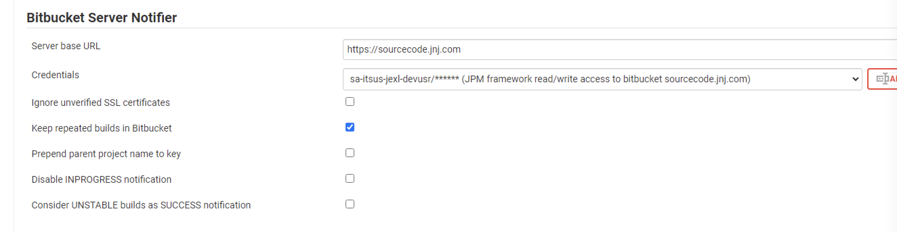

# How to configure Bitbucket project and connect it with Jenkins project

## Bitbucket

### Ensure you enable the following hooks in your Bitbucket project

- JnJ VPCx - Post Receive Repository Hook for SCM
- Webhook to Jenkins for Bitbucket Server

### JnJ VPCx - Post Receive Repository Hook for SCM

### Webhook to Jenkins for Bitbucket Server

#### Tab 1

#### Tab 2

#### Tab 3

### Enable the following Merge Checks

### Request access to taqy-docker for the project service account

Typically the service account created automatically is `sa-itsus-<PROJECT CODE>-devusr`.

Go to App Dev Tools and request access for that user, like so:

## Jenkins

### Ensure Bitbucket plugins were correctly configured

Navigate to Manage Jenkins -> Configure System and modify the following plugins:

### Create Multibranch pipeline project

At Home page -> "+ New Item":

### Configure branch sources

### Configure repo behaviors

### Set up build configuration and other items

## Jenkinsfile dependencies

You'll need a credential that stores the secrets used to connect to your Data Warehouse.

Create a new credential in the Jenkins Admin area. As of Aug. '23 those can be found in:

`Dashboard -> Credentials -> System -> Global Credentials (unrestricted)`

## Known issues

* When "pre hook declined" it could be due to JIRA issues configuration: from settings -> `Jira Issues` select "Use custom settings" and  be sure "Don't need a Jira issue key" is selected