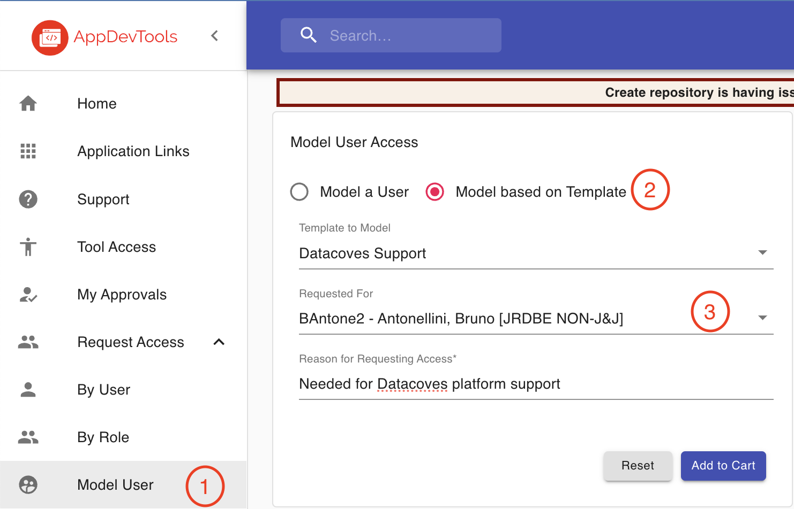

# Access Datacoves on JNJ clusters

## Requesting Roles

> **NOTE:** Please inform Martin Ryan before requesting appdevtools roles

In order to have access to all third-party tools (Bitbucket, Jenkins, Artifactory, etc.) you must request specific roles.

To do so, you must go to https://appdevtools.jnj.com and request the `Datacoves Support` Model User template.

Make sure to write `Needed for Datacoves platform support` as requesting reason.

## Datacoves Access

In order to get access as an admin and developer on the different JNJ clusters you need to request the following AD groups:

### Medical Devices

- JNJ-APP-HMD-DATACOVES-ADMIN
- JNJ-APP-HMD-DATACOVES-DEVELOPER

### Consumer Health / Kenvue

Go to iam.kenvue.com, search for `Datacoves`. There's one role for Admin and one per Environment. You need to request `ADMIN`, `*-DEVELOPER` and `*-SYSADMIN` roles. For example:

- ITS_APP_DATACOVES_ADMIN
- ITS_APP_DATACOVES_DEV_CBI_VMA_DEVELOPER
- ITS_APP_DATACOVES_DEV_CBI_VMA_SYSADMIN
- ITS_APP_DATACOVES_DEV_COMX_CUST_DEVELOPER
- ITS_APP_DATACOVES_DEV_COMX_CUST_SYSADMIN
- ITS_APP_DATACOVES_DEV_COMX_GLOBAL_DEVELOPER

### Ensemble

- JNJ-APP-PCE-DATACOVES-ADMIN
- JNJ-APP-PCE-DATACOVES-DEVELOPER

### R&D

- ITS-APP-DEV-JRDDATACOVES-ADMIN
- ITS-APP-DEV-JRDDATACOVES-DEVELOPER

## taqy Access

taqy is the docker repository used by all J&J instances.  Access to it is necessary in order to manage images on it.

To request access, use https://appdevtools.jnj.com

- Request Access, By User, Other
- Enter your username
- Tool: EAT Jenkins and Artifactory
- Team: taqy
- Reason for request: Access to CI images for DataCoves
- Grant these roles: ITS-ASx-TAQY-DEV-Executors, ITS-ASx-TAQY-DEV-Viewers

For reference, the main Ensemble Jenkins user is sa-itsus-jbfl-devusr

## Snowflake Access

As done with the groups above, you must also request `JNJ-APP-PCE-SNOWFLAKE-EMEA-DEVELOPER`

### How to request the groups?

Using the AWS workspace:

1. Navigate to https://iam.jnj.com
2. Click on `Start new request`
3. Type the group name on the `Find a service item` search box.
4. Click on `Request` button
5. In the popup, leave `Valid from` and `Valid until` empty, in the `reason` field type "Datacoves support team".
