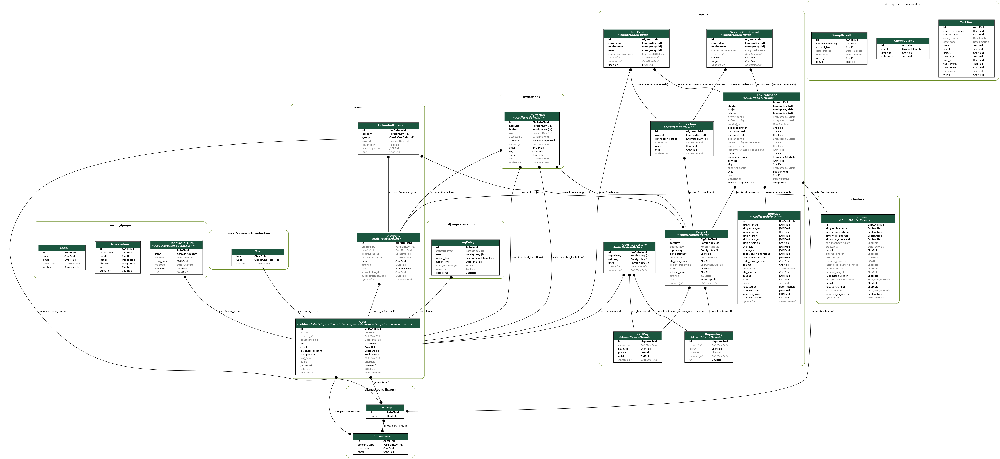

# How to create an entity relationship diagram

```bash
./cli.py pod-sh
apt install graphviz-dev
pip3 install pygraphviz
./manage.py graph_models -a -X *Mixin,Abstract*,ContentType,Session,Nonce,Partial,TokenProxy -g -o core-erd.png
```

Learn more at https://django-extensions.readthedocs.io/en/latest/graph_models.html


