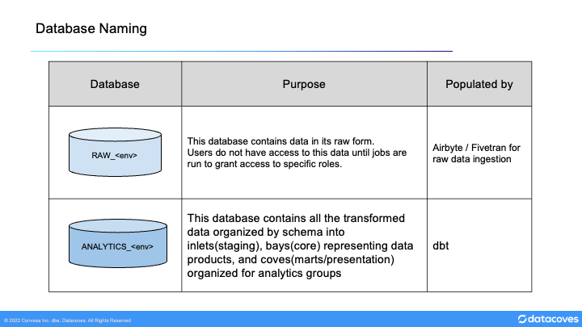
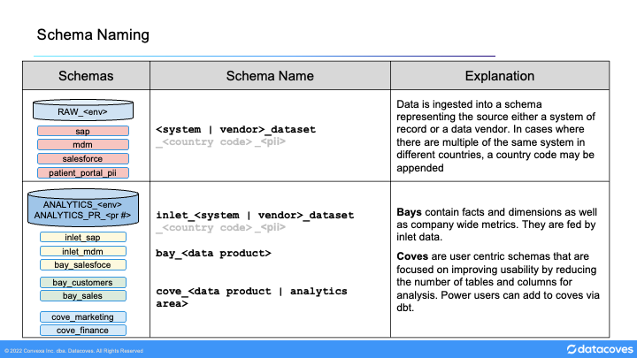
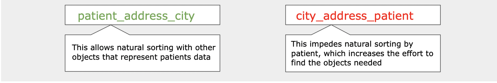

# Object naming standards

## General Database Relation Naming

As we build database objects for use across multiple areas, naming quickly emerges as the first (and arguably most important) method of documentation. It's an area of frustration for many developers, as it requires a context switch from "how do I make this code work" to thinking about future readers and how to make our models discoverable.

While case sensitive names can be used in some data warehouses like Snowflake, they require double quotes to use and using mixed case introduces potential for duplication (`fieldName` and `FieldName` are different objects). We recommend `snake_case` for a consistent structure throughout our Snowflake databases. Similarly, all models managed by dbt must have unique names to allow references to be driven by the name of the table or view.

As a general rule, names should use full words and increase in granularity left-right: `patient_address_city`. This assists with the sort order of our objects, grouping models and columns into obvious sections.

## Databases

The warehouse should be separated into two primary parts:
1. The **raw** database where data gets ingested and which is not exposed to most users.
2. The **analytics** database is where the transformed data exists. This is where dbt operates.

## Raw Data

### RAW - Source database

The **RAW_PRD** database is the landing area for integration tools such as Fivetran and Airbyte. A **RAW_DEV** database exists in parallel where new sources are added and tested before they are ready to be used in production.

Sensitive data is restricted at the column level throughout the system: if sensitive data exists, the schema in the **raw** database is given a suffix of _\_pii_ to give users a hint that there is sensitive data in this schema. A corresponding security role must be assigned to a dbt developer to be able to see this data.

Data flattening is managed with dbt in the /models/inlets/\<source_name\> folder of the dbt repository. Flattened models must be created by developers permitted to see the sensitive data. These developers will flatten data to create more useable columns and they will apply masking and row level security rules.

Developers can add new sources to **RAW_DEV** using Fivetran or AirByte. Any new data added to the raw database will not be immediately accessible by any user until proper permissions/roles created and granted. Only new and changed tables are created in **RAW_DEV**. All tables previously released to production will be available via dbt deferral from **RAW_PRD**.

## Transformed - Analytics Database

### ANALYTICS database

This dbt-managed database contains all transformed models (inlets, bays, and coves)  prepared for use by the business. Development and Test environments exist in parallel. **analytics_dev** is where new models are developed and **analytics_pr_\<pull request #\>>** is where the data is checked before changes are released to production.

Security from **RAW_PRD** is automatically assigned to any views in the **ANALYTICS** database; the release process ensures the same rules are applied to any created tables as part of deployment.

### ANALYTICS_DEV database

This database contains individual developer schemas where models are created and modified before they are ready to be deployed to production.

All models are created here by developers using dbt within Datacoves. Each developer will have a schema named with their username as defined in the dbt profiles.yml. All models will build into the developer's schema even overriding the custom schema used in production. dbt will only create a models that are added or changed if the deferral feature is used. All developer schemas may be dropped at the start of every week to ensure sensitive data is not retained longer than necessary to comply with GDPR and other regulations.

When creating models in Datacoves, any required data may be "deferred" from production: if the upstream models have not been changed, dbt can simply reference them from production rather than rebuilding them and increasing build time and duplication. This ensures that developers are always working on the freshest production data and reduces the likelihood of production failures.

### ANALYTICS_PR_\<pull request #\> databases

Every time a pull request is opened from a feature branch to a release branch or from a feature / release branch to the main branch, a new database is automatically created to run and test the changes in that branch. By leveraging dbt's deferral and Slim CI(`state:modified`) features, we only build changed models and their downstream dependencies. Deferral allows us to pull unchanged upstream models from production.

These databases are used for UAT as needed and act as "pre-release" for any manual review required to trust the new codebase before it is merged to the main branch.

## Data Flow

The general flow of data is from Raw schemas to Inlets then Bays, and finally Coves. These will be described in more detail below.

>[!NOTE]See [this page](explanation/best-practices/dbt/inlets-bays-coves) to learn more about Inlets, Bays, and Coves

## Raw Database Schemas

The **RAW_PRD** database is primarily populated directly from vendor / source system data, and exists as a mirror in place of direct connection to those sources. Schemas are named as follows: `<system/vendor name>_<dataset name>`. This can be configured in Fivetran / AirByte (Airbyte calls schemas Namespaces). Source tables keep the name given by the source system. In large implementations where a source is unique to a specific country, the schema should named as follows: `<country_code>_<system/vendor name>_<dataset name>` for clarity.

### Raw Database Tables

To account for schema drift, all data should be loaded into VARIANT (semi-structured) columns directly in the database. You should create additional tables for nested objects as follows: <schema name>_< source table name >[\_< nested object key > with columns matching the keys of the original source.

Schema name is included in order to avoid duplication where multiple source systems include identically-named tables ('User', 'Customer', etc). By keeping this source-driven convention, these can be created quickly by a technical team without needing to understand the subject matter.

### Source Connections

A source connection configuration should be given the name of the source itself allowing clear visibility of where the data comes from without the need to open a connection configuration screen.

## Transformed - Analytics Schemas

### Inlets

Inlet Schema names should match those in the RAW database for traceability.

The first step in making raw data usable is to flatten and do some basic cleanup of the data. In dbt we use the inlets folder and we mirror the schema name created in the raw database.

Here we do some basic transformation including:
- flattening
- aliasing columns for clarity
- casting
- cleansing (like converting all time stamps to UTC)

### Bays - Schemas

The Bay schemas in the ANALYTICS database are named for data domains / entities of the business. These are intended for reuse in many areas. They are developed by cross-functional teams responsible for their ongoing development, so time should be taken to understand the subject and potential use cases.

As the primary developers are still technical, there will be a natural leaning toward system-centric names - this should be challenged in code review, as this is our main chance to translate data from what a vendor cares about ("User") to what we actually care about ("Employee", "Customer", "Events").

Names should be:

1. verbose
2. generally increase in complexity left-right
3. un-repeating within a database → schema → model → column structure where practical

The primary goal is searchability; while the structure in _analytics.bay_customer.dim_customer.first_name_ breaks principles 2 and 3, renaming the dimension (dim_customer) or column (name_first) would make it harder to find and understand.

### Bays - Tables And Fields

All models in a Bay schema should describe their modelling style as the first segment of the name: dim\_, fct\_, ref\_ etc.

If any aggregation is required in a bay, this should be a suffix (fct_direct_sales_month) to group alongside other direct_sales facts. This immediately prepares the Cove developer (who are also technically skilled) with understanding of the join types they will need to query the object.

Any ephemeral or staging models which aren't intended for use outside the Bay should be prefixed int\_ to show their intermediate/internal nature.

Any static CSV data seeded from the dbt repository can be loaded directly to the appropriate name (e.g. dim_date).

### Coves

The Cove schemas in **ANALYTICS** are named for specific use cases and analytic areas. These are built with less focus on reuse and a much greater focus on the experience for the user that will be consuming the data.

All naming in a cove should be focused on use by less technically skilled users and tools, especially if the data is intended for self service. In many visualization tools it's easy to confuse _patients\.name_ with _products\.name_, so we must include the table name as patients.patient_name in models.

Where a modelling methodology has been used, prefixes should be used to describe models: dim\_, fct\_, etc.

Any single-table analyses should be prefixed mart\_ and any models not intended for ongoing use should be prefixed temp\_.

End users may create their own models in their respective cove. These models should be prefixed with the username of the person who created them if not intended for general use <username\>\_.

Any aggregation should be described in a suffix on the _model/column: customer_countries.customer_count.
