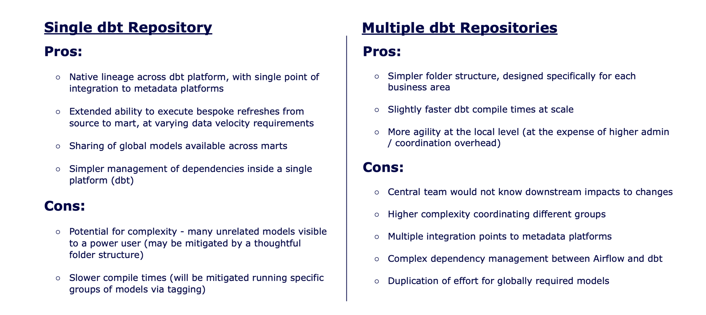
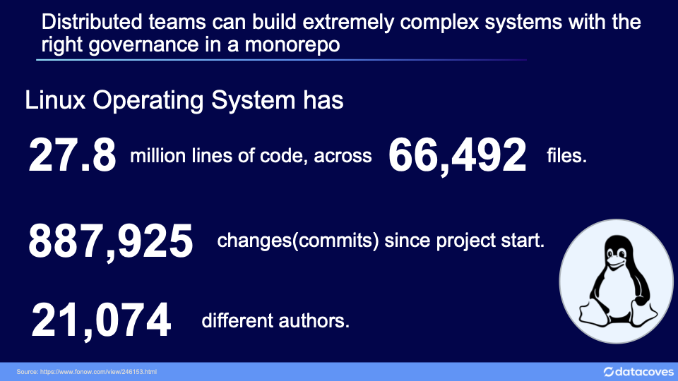

# Git Overview

While many see the advantage of dbt as a platform with unit testing, SQL for everything, and automatic documentation, these have all been available (to various extents) in data platforms for some time. The core innovation that dbt brought to DataOps is Context - the Transformation engine understands the relationship between models.

In the old world, we designed pipelines - once a specific task has finished, the next can start - all chained together manually with plenty of 'padding' between scheduled start times. With dbt, the transformation tool itself knows what is required before any individual task can begin; dynamically executing a unique run order on every execution as each task has its dependencies resolved and can begin to run.

This network of dependencies is the core competency of our platform, and allows several efficiencies: refreshing just what's needed on a data load, checking that downstream models ran as expected after a change, and reloading just what changed during a release.

To assemble this network of dependencies, the first step dbt performs is to parse all code and to determine relationships between models. This happens whether the models are stored in the current repository or imported via shared packages. The specific models that are executed in the database will change based on the command (and access rights of the user); but the tool is always aware of the whole ecosystem.

At end of sprint in a multiple-repository environment, code review and deployment must be synchronized: a raw database must be changed simultaneously with the downstream outputs. This becomes especially complex in the case of a hotfix to a well-used raw model, where every downstream Cove or area specific repository would need to be simultaneously released. The same models would run in either case; but a single repository allows a single review and merge process.

## Project Structure - Monorepo vs Multiple repositories

A single repository manages subject areas as a thoughtful folder structure, each containing the logic and metadata required to create and document its models. Code review occurs within a project team before merging to a release for logic and security review. A single set of permissions can be released and enforced across the ecosystem alongside changes to logic.

In a single-repository environment, security can be included alongside the logic itself, and is included as part of the codebase. This is more difficult in a multiple-repository environment, as there is no primary master (or if consolidating to one, it must be updated when any other environment changes)

Below we outline the pros and cons to having a single repo vs having multiple dbt repositories.

We recommend everyone start with a single repository based on the added complexity that having multiple repositories introduces. Only after careful consideration should you embark on managing multiple dbt repositories.

If anyone challenges the viability of using a single repo for your project, show them the image below of the Linux project.

## Security in a monorepo

While developers can view code across the wider organization, any attempts to execute that code to gain access to information are restricted by individual database permissions. Proposed changes to these objects or permissions are only executed with escalated permissions once the code has passed review; further protecting the environment from unauthorized access.

## Git Branching Strategy

The concepts of branching, merging, and pull requests can be initially hard to grasp. As developers, many of us learned to code by hacking together solo projects - the rigour of organizational source control can feel like hard work.

The speed of releases has gotten faster, but without proper care the environment can become very messy and untested code can break user trust in the data platform.

To strike a balance between trust and efficiency, we follow a Release plan as illustrated in the diagrammed below.

The Main branch stores the current version of the truth in our Production database and will always describe exactly what has been run to update the production database.

Data & Analytic Engineers complete analysis and explore potential new models by creating a *feature* branch off the *main* branch.

Feature branches are further developed and unit tests are added to ensure the output can be trusted by the business. Once the Product Owner is satisfied with the delivery, a pull request is created to a *release* branch.

In this pull request, the automated deployment process creates a fresh UAT database, and business users review the output against expectations before approving release of the candidate to the Release branch.

Once code is reviewed and UAT is approved, the merge request is completed to the *release* Branch. A final set of integration tests is run before the Release Manager performs a deployment/merged to Main.
