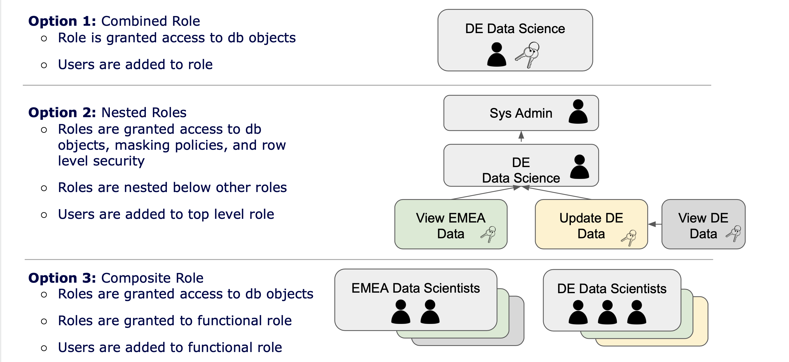
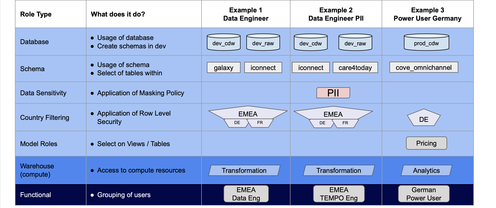

# Snowflake Security Model

## Overview

The right Security model is critical to ensuring sensitive data is protected.

While Snowflake allows convenient swapping between granted roles during a single user session, datasets must be accessible to the same role in order to analyze them together. To create a seamless user experience, the user should be able to access all data required to operate using a single role. That same role may be granted to others in a users' direct team, but will differ between teams across the organization: each allowing access to their required data and environments.

In Snowflake there are three options for how security is managed as seen in the image below.

*Option 1* combines the access and the users into a single role. This is what most tool documentation will tell you do to as it is "simple". You create one role and give it the permissions it needs then grant users that role.

The problem with this approach is that it is hard to scale and users either get too much or not enough access. You will find yourself repeating permissions across roles and when those permissions need to be updated you need to update them in many places. Simply put, this approach is not [DRY](https://en.wikipedia.org/wiki/Don%27t_repeat_yourself).

In *Option 2* we create more granular roles and create a hierarchical structure where Sysadmin in this case has access to everything.

While better than Option 1, this gives administrators access to data which they may not need to have. If a user needs to have access to data, they should have a role specifically for that, like an Analyst role.

*Option 3*

This is our recommended approach because this allows us to create granular permissions such as a role that unmasks masked data, or a role that gives access to a specific schema. We then combine those "Object" roles into "Functional" roles which are then granted to users. This allows us to have roles like _Analyst_ and _Analyst\_PII_ with the only difference being that the latter gets an additional role that unmasks data. More importantly, the role to unmask data is defined once and used many times.

As shown below we create granular object roles each allowing access to a single database, schema, warehouse (compute cluster), Data classification, and region/country. We then grant the full set of required object roles to a given functional role which are in turn granted to users to allow them to query the database.

This approach allows clear visibility of what a given user has access to: Production or Development environments, Raw or Processed schema, PII / Non-PII, etc. Any newly required permissions can be added for a team via its user role easily, by simply granting an additional object role.

These permissions are all defined in source files which are then leveraged by a tool called Permifrost. This adds traceability to the role management process and can be run as part of the DataOps process. This process will also retain a record of who made the change, when they changed it, and their justification for granting / revoking access.

## PII Access

In order to analyze our most secure data, we must first protect it - allowing access to those who have been appropriately trained to meet our compliance and quality standards.

While Snowflake allows many complex access policies, we take care to apply what is needed to meet our compliance obligations while retaining the ability to understand the data and create value for our users.

PII data is protected within marked columns by using Dynamic Masking policies: predetermined methods for protecting all or part of the data unless a certain access role is granted, which can be applied to any column in the database. This protection may be complete masking ('\*\*\*\*') or partial masking ('\*\*\*\*\*@gmail.com', 'Martin \*\*\*\*\*\*'), and can use any SQL methods to determine the content of masked data to a given role.

In this implementation, we can mask PII data and have the ability to expand this to other sensitive data over time as required. PII and other sensitive data are then only accessible by users with a role that can unmask this data.

As developers work in their own dev schemas, any data saved to a table in their schema will contain only the level of information they are permitted access to; and will only be accessible by users of the same role. Before release of their newly developed feature, any created tables are expected to be given security configuration, protecting any derived data to the same standard as its source.
