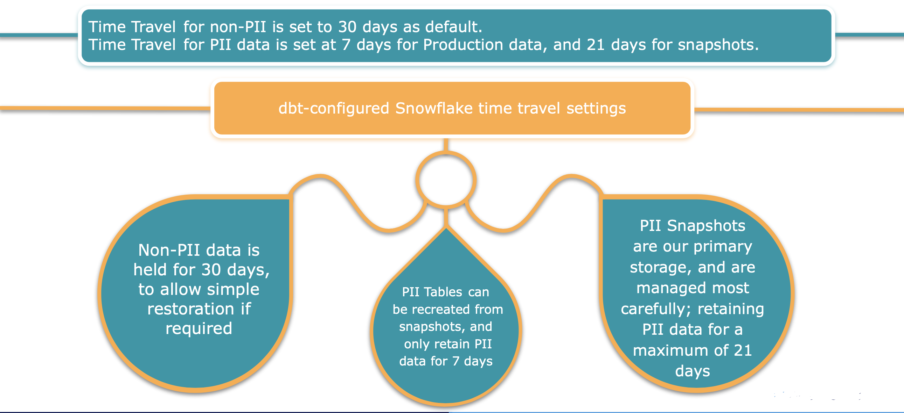

# Snowflake Time travel & GDPR

In order to comply with GDPRs right to be forgotten, Time Travel for PII data is set at 7 days for Production data, and 21 days for snapshots. Time Travel for non-PII is set to 30 days as default.



Production retention period is set up as part of our initial database creation and is implemented with the below settings:

- **ANALYTICS** database:
``` sql
alter database analytics set data_retention_time_in_days = 30
```

- **ANALYTICS_DEV** database:
``` sql
alter database analytics_dev set data_retention_time_in_days = 7
```


- Macro created to run on-run-end: This loops through all models in database at the end of every production run, and checks for the pii metadata flag.

  - If found:
    - for snapshots:
      `set alter table < table name > set data_retention_time_in_days = 21`
    - for pii tables
      `set alter table < table name > set data_retention_time_in_days = 7`

The default table materialization causes issues for Time Travel by dropping the table on every refresh. You will need to create a Time Travel specific table materialization that only recreates the table when the columns have changed. This Time Travel table materialization should be used in place of table materialization throughout the environment.

>[!TIP]Example materialization can be found [here](https://github.com/edx/snowflake_timetravel_table/blob/main/macros/snowflake_timetravel_table.sql)

## Time Travel Data Lifecycle

When a request for a person "to be forgotten" from the database comes in, the following set of events occur.

1. 5 days are given for request to make it to the appropriate team so they can remove the record from the **RAW* database
2. The production **ANALYTICS** database is refreshed on the next daily dbt run clearing out offending records. This database has a 7 day retention period on PII tables, so that history will be removed at that time.
3. Non-PII data will not be impacted and remain in the system with the standard 30 day retention period.
4. Since developers may have PII data in their schemas, developers schemas are dropped every 7 days and their retention period is set to 7.


