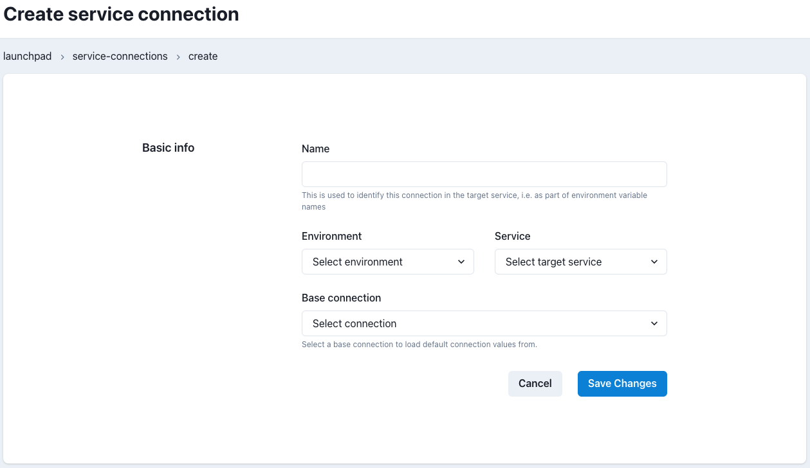
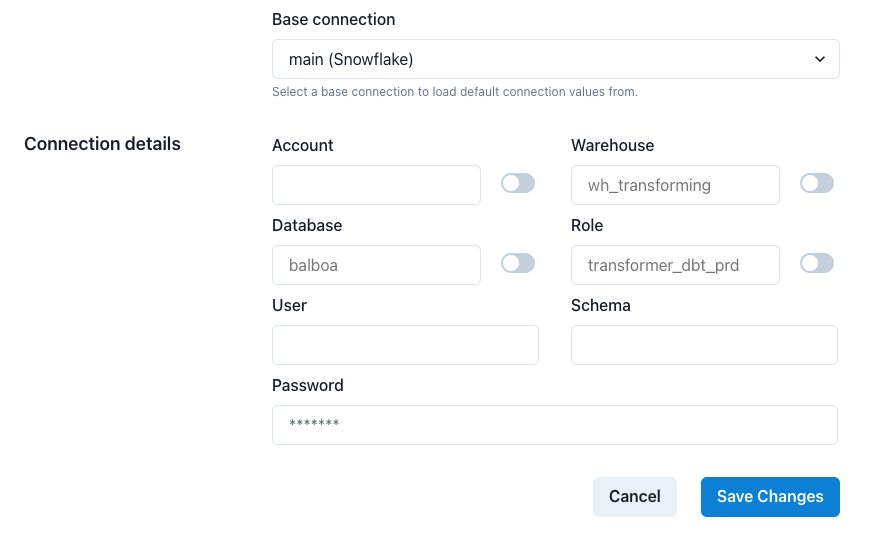
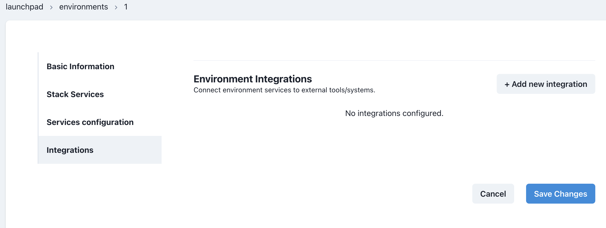

# dbt Airflow Configurations

Now that Airflow is up and running we have some configuration to do to. This guide will walk you through all the pieces

## Set up your service connection
**Step 1:** Navigate to the Service Connection page


**Step 2:** Click the `New Connection` button.

**Step 3:** Select the environment you wish to configure. In this case `Development`



**Step 4:** Fill out the following fields:

- **Name** Defines how the connection will be referred to by the automated service. Should be called `main` and will be included in the name of the environment variables seen below. 
- **Environment** The Datacoves environment associated with this service connection.
- **Service** The Datacoves stack service where this connection should be made available e.g. Airflow
- **Connection Template** The connection template to base this service connection on(i.e. the defaults)
  Depending on the template selected, additional fields will be displayed with the default values entered in the connection template. These default values can be overridden by toggling the indicator next to the given value. Enter the appropriate user, schema, and password. **This should be a service account. Be sure to configure your deployment (production) credentials by overriding the values. ie) prod warehouse, prod database ect.**




## Update your repository with your profiles.yml

Now that you have setup your service connection you must create your profiles.yml to make use of the environment variables for your warehouse created from the service connection.

**Step 1:** Head back to the Launch pad by clicking on the Datacoves logo on the top left and open your development environment by selecting `Open` 

**Step 2:** Select the `Transform Tab` and create the `automate` folder at the root of your project

**Step 3** Create the `dbt` folder inside the `automate` folder 

**Step 4:** Create the `profiles.yml` inside of your `automate` folder. ie) `automate/dbt/profiles.yml`. 

**Step 5:** Copy the following configuration into your `profiles.yml` based on your warehouse

### Snowflake
``` yaml
default:
  target: default_target
  outputs:
    default_target:
      type: snowflake
      threads: 8
      client_session_keep_alive: true

      account: "{{ env_var('DATACOVES__MAIN__ACCOUNT') }}"
      database: "{{ env_var('DATACOVES__MAIN__DATABASE') }}"
      schema: "{{ env_var('DATACOVES__MAIN__SCHEMA') }}"
      user: "{{ env_var('DATACOVES__MAIN__USER') }}"
      password: "{{ env_var('DATACOVES__MAIN__PASSWORD') }}"
      role: "{{ env_var('DATACOVES__MAIN__ROLE') }}"
      warehouse: "{{ env_var('DATACOVES__MAIN__WAREHOUSE') }}"
```
### Redshift 
```yaml
company-name:
  target: dev
  outputs:
    dev:
      type: redshift
      host: "{{ env_var('DATACOVES__MAIN__HOST') }}"
      user: "{{ env_var('DATACOVES__MAIN__USER') }}"
      password: "{{ env_var('DATACOVES__MAIN__PASSWORD') }}"
      dbname: "{{ env_var('DATACOVES__MAIN__DATABASE') }}"
      schema: analytics
      port: 5439
      
      # Optional Redshift configs:
      sslmode: prefer
      role: None
      ra3_node: true 
      autocommit: true 
      threads: 4
      connect_timeout: None
```
### BigQuery
```yaml
my-bigquery-db:
  target: dev
  outputs:
    dev:
      type: bigquery
      method: service-account
      project: GCP_PROJECT_ID
      dataset:  "{{ env_var('DATACOVES__MAIN__DATASET') }}"
      threads: 4 # Must be a value of 1 or greater
      keyfile:  "{{ env_var('DATACOVES__MAIN__KEYFILE_JSON') }}"
```
### Databricks
```yaml
your_profile_name:
  target: dev
  outputs:
    dev:
      type: databricks
      catalog: [optional catalog name if you are using Unity Catalog]
      schema: "{{ env_var('DATACOVES__MAIN__SCHEMA') }}" # Required
      host: "{{ env_var('DATACOVES__MAIN__HOST') }}" # Required
      http_path: "{{ env_var('DATACOVES__MAIN__HTTP_PATH') }}" # Required
      token: "{{ env_var('DATACOVES__MAIN__TOKEN') }}" # Required Personal Access Token (PAT) if using token-based authentication
      threads: [1 or more]  # Optional, default 1
```

## Add email notifications 

When Airflow jobs run you may want to receive notifications. We have a few ways to send notifications in Datacoves but for this migration we will be setting up email notifications.

>[!NOTE]Before using our tool with SMTP, ensure that your email account is configured to allow SMTP access.

**Step 1:** Head back to the Launch pad by clicking on the Datacoves logo on the top left 

**Step 2:** Create a new integration of type `SMTP` by navigating to the Integrations Admin.


**Step 3:** Click on the `+ New integration` button and fill out the following fields:

- **Name:** Provide a descriptive name such as `Mail Service `

- **Type:** Select `SMTP`

- **Host:** Enter the smtp server for your domain. 

|**SMTP Provider**| **URL**     | **SMTP Settings**         |
|---------------|----------------|---------------------------|
| AOL           | aol.com        | smtp.aol.com              |
| AT&T          | att.net        | smtp.mail.att.net         |
| Comcast       | comcast.net    | smtp.comcast.net          |
| iCloud        | icloud.com/mail| smtp.mail.me.com          |
| Gmail         | gmail.com      | smtp.gmail.com            |
| Outlook       | outlook.com    | smtp-mail.outlook.com     |
| Yahoo!        | mail.yahoo.com | smtp.mail.yahoo.com       |

- **Port:** TLS encryption on port 587. If you’d like to implement SSL encryption, use port 465. 

- **From Address:** This is the address that you have configured for smtp

- **User:** Same address as the `From Address` 

- **Password:** Password that you have configured for smtp


**Step 4:** Click `Save Changes`

## Configure integration in your environment 

Once you created the `SMTP` integration, it's time to add it to the Airflow service in an environment.

**Step 1:** Go to the `Environments` admin.


**Step 2:** Select the Edit icon for the environment that has the Airflow service you want to configure, and then click on the `Integrations` tab.



**Step 3:** Click on the `+ Add new integration` button, and then, select the integration you created previously. In the second dropdown select `Airflow` as service.


**Step 4:** Click `Save Changes`. 

## Update your repository to start creating DAGs

You are almost ready to write your first Airflow DAG in Datacoves. However, in order for our DAGs to be picked up by Airflow like we have configured, we must create the folder structure needed. 

**Step 1:** Head back to the Launch pad by clicking on the Datacoves logo on the top left and open your development environment by selecting `Open` 

**Step 2:** Create a folder named `orchestrate` 

**Step 3:** Create folder inside `orchestrate` named `dags`. 

`orchestrate/dags` was the path we defined earlier in our Airflow settings with the  `Python DAGs path` field. This is where you will be placing your DAGs in the next step. 🚀

## Next Steps

Thats it! You are ready to [migrate your dbt Cloud Jobs](getting-started/dbt-cloud-migration/deploy-dbt-airflow.md) to Airflow in Datacoves.

