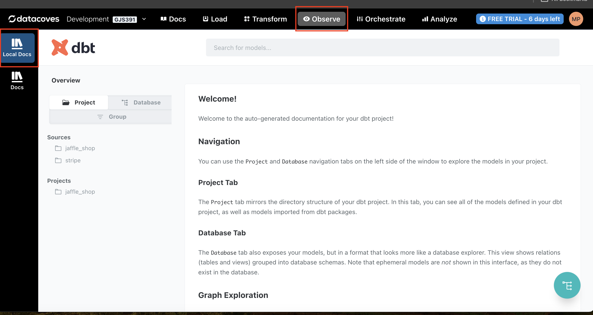
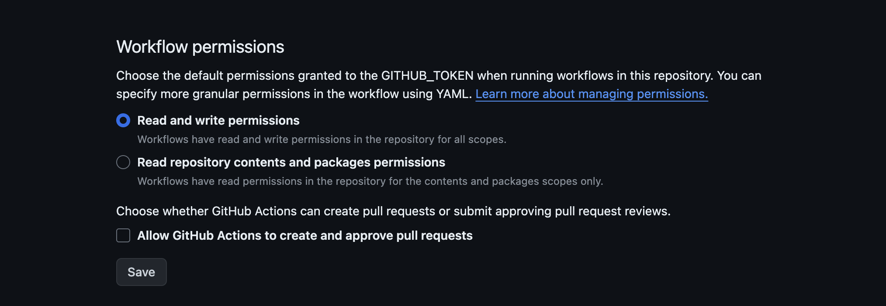
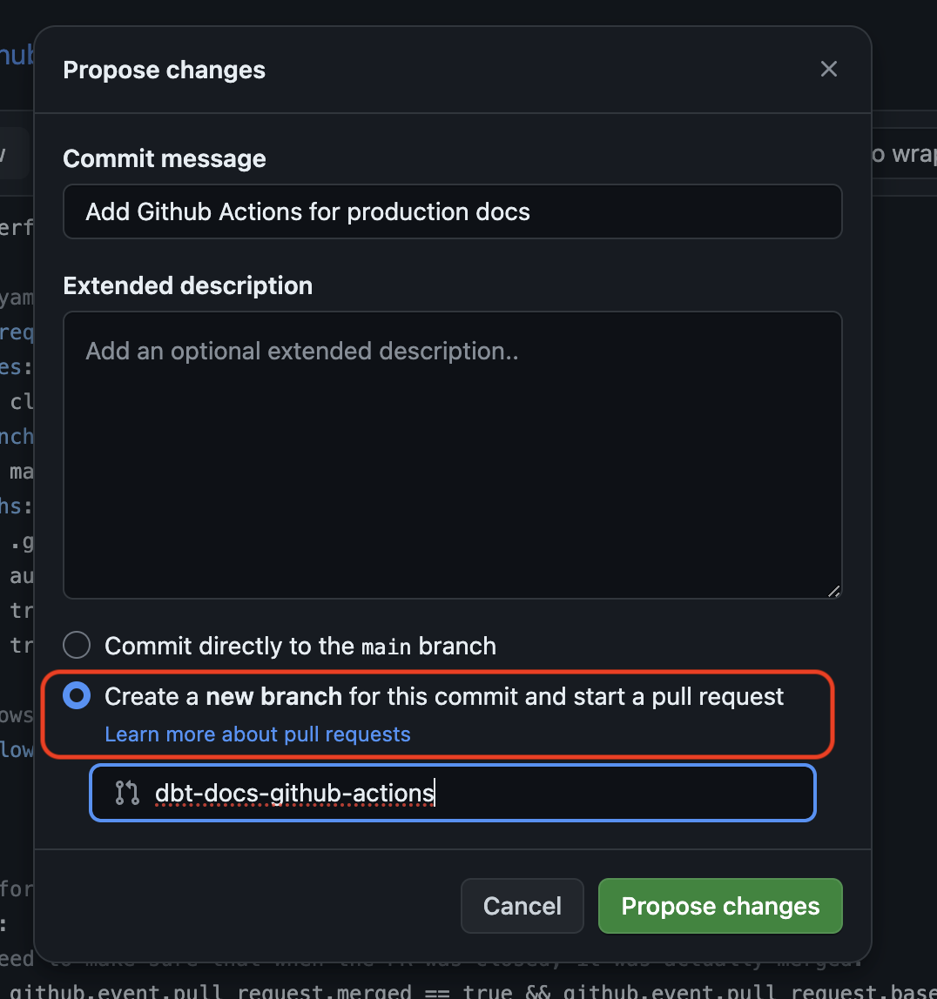
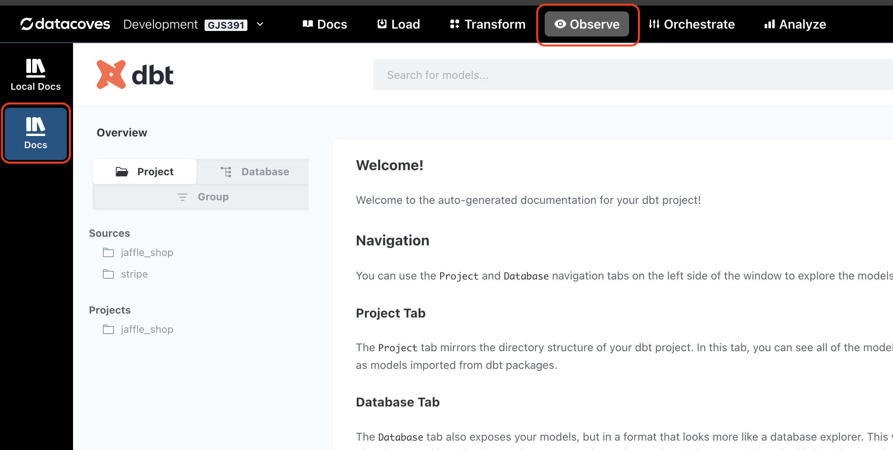

# Deploy your dbt Docs

## Local Docs 📖
1. Simply run `dbt docs generate` in your terminal 
   


2. Click on the the Observe tab and view local docs
   


## Production dbt Docs 

Datacoves hosts your production docs and they are deployed via a CI/CD process with github actions. 

To configure this functionality:

**Step 1:** Head to your Environment Settings 


**Step 2:** Click `Stack Service` and turn on the `Observe > Local Docs Tab`. This will populate the `Docs settings` as seen below.


Your designated docs branch has been set to `dbt-docs` for you. 


**Step 3:** Head to Github and create a branch in your repo named `dbt-docs`. 
The service will not be available until you complete this step as seen in the image below.


**Step 4:** In Github, head to `repo settings > Actions > General` to ensure that Github Actions has Read and Write permission configured. This is needed to write to the dbt-docs branch. 



**Step 5:** In Github, head to the `repo settings > Secrets and Variables > Actions` to add the following variables and secrets for your data warehouse credentials for production. These should be set for the repository not the environment.

| Type     | Name                               |
|----------|------------------------------------|
| variable | DATACOVES__MAIN__ACCOUNT           |
| variable | DATACOVES__MAIN__DATABASE          |
| variable | DATACOVES__MAIN__SCHEMA            |
| variable | DATACOVES__MAIN__ROLE              |
| variable | DATACOVES__MAIN__WAREHOUSE         |
| variable | DATACOVES__MAIN__USER              |
| secret   | DATACOVES__MAIN__PASSWORD          |

**Step 6:** In your main branch, add a file at the root and type `.github/workflows/deploy-to-main.yml`. This will create the `deploy-to-main.yml` file inside of the `.github/workflows` folders. If your repository doesn't have a `.github/workflows`directory, go to the main page of the repository on GitHub, click Add file, then click Create new file, and name the file `.github/workflows/deploy-to-main.yml`. This creates the `.github` and `workflows` directories and the `deploy-to-main.yml` file in a single step.

**Step 7:** Copy the following code into the `deploy-to-main.yml` file:

```yml
name: Perform deployment to production

on:  # yamllint disable-line rule:truthy
  pull_request:
    types:
      - closed
    branches:
      - main
    paths:
      - .github/workflows/*
      - automate/*
      - transform/* # Not needed if dbt project is at the root
      - transform/**/* # Not needed if dbt project is at the root

  # Allows you to run this workflow manually from the Actions tab
  workflow_dispatch:

jobs:

  # Perform the deployment to Prod
  build:
    # Need to make sure that when the PR was closed, it was actually merged.
    if: github.event.pull_request.merged == true && github.event.pull_request.base.ref == 'main'

    name: Deployment Script
    runs-on: ubuntu-latest

    # Set environment variables in
    # https://github.com//<your org>/<your repo>/settings/variables/actions
    #
    # Alternatively, You can define multiple ENV for different workflows.
    # https://github.com/<org>/<repo>/settings/environments
    # environment: PR_ENV
    container: datacoves/ci-basic-dbt-snowflake:2.2

    defaults:
      run:
        # If your dbt project is at the root.
        working-directory: /__w/${{ github.event.repository.name }}/${{ github.event.repository.name }} 

        # # If your dbt project is inside a transform directory.
        # working-directory: /__w/${{ github.event.repository.name }}/${{ github.event.repository.name }}/transform 

    env:
      DBT_PROFILES_DIR: /__w/${{ github.event.repository.name }}/${{ github.event.repository.name }}/automate/dbt
      # If your dbt project is at the root.
      DATACOVES__DBT_HOME: /__w/${{ github.event.repository.name }}/${{ github.event.repository.name }} 
      # # If your dbt project is inside a transform directory.
    #   DATACOVES__DBT_HOME: /__w/${{ github.event.repository.name }}/${{ github.event.repository.name }}/transform 

      DATACOVES__MAIN__ACCOUNT:   ${{ vars.DATACOVES__MAIN__ACCOUNT }}

      DATACOVES__MAIN__DATABASE:  ${{ vars.DATACOVES__MAIN__DATABASE }}
      DATACOVES__MAIN__SCHEMA:    ${{ vars.DATACOVES__MAIN__SCHEMA }}

      DATACOVES__MAIN__ROLE:      ${{ vars.DATACOVES__MAIN__ROLE }}
      DATACOVES__MAIN__WAREHOUSE: ${{ vars.DATACOVES__MAIN__WAREHOUSE }}

      DATACOVES__MAIN__USER:      ${{ vars.DATACOVES__MAIN__USER }}
      DATACOVES__MAIN__PASSWORD:  ${{ secrets.DATACOVES__MAIN__PASSWORD }}

    steps:
      - name: Checkout branch
        uses: actions/checkout@v2
        with:
          ref: ${{ github.event.push.head.sha }}
          fetch-depth: 0

      - name: Set Secure Directory
        run: git config --global --add safe.directory /__w/${{ github.event.repository.name }}/${{ github.event.repository.name }}

      - name: Install dbt packages
        run: "dbt deps"

      - name: Generate dbt documentation
        run: "dbt docs generate"

      - name: Deploy docs 🚀
        uses: JamesIves/github-pages-deploy-action@4.1.4
        with:
          branch: dbt-docs
          folder: /target

      - name: Push version changes
        uses: ad-m/github-push-action@v0.6.0
        with:
          github_token: ${{ secrets.GITHUB_TOKEN }}
          branch: ${{ github.ref_name }}
          tags: true
```
**Step 8:** Commit this change and select "Create a new branch and start a Pull request" and merge the pull request. This will trigger the action you just committed because it is set to run upon a closed PR to main. 



**Step 8:** View your production docs in the Datacoves UI. Click `Open > Observe > Docs`


