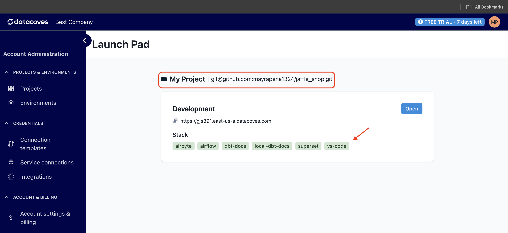

# Datacoves Launchpad

After you have completed the wizard, you will see your project in the launch pad. 

At this point you may notice that some of your tools in the Launchpad are red. This just means they need to be configured. You can hover over them to get helpful messages, however, by the end of this migration guide they should be all green as seen in the image below 🎉

Your **project** has been associated to your **repo** during the wizard setup as seen in the red box below.

All other environment settings have been configured for you during the setup Wizard step. 

## Next Steps

You are now ready to [configure Airflow](getting-started/dbt-cloud-migration/dbt-airflow-config.md)