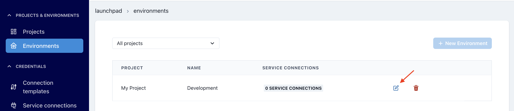

# Set up your user environment

After you have completed the wizard, you will see your project in the launch pad. 

Your project has been associated to your repo during the wizard setup.

## Environment Settings

- Head into your environment settings

- Edit your environment by selecting the pencil icon

 

- Select Stack Services and turn on OBSERVE > Docs. (We will need this later to deploy our docs)
  
>[!NOTE]For this migration guide we will not covering the configuration for LOAD and ANALYZE.
  

  
- Click Save

All other environment settings have been configured for you during the setup Wizard step. 

## Next Steps

You are now ready to [configure Airflow](getting-started/dbt-cloud-migration/dbt-airflow-config.md)