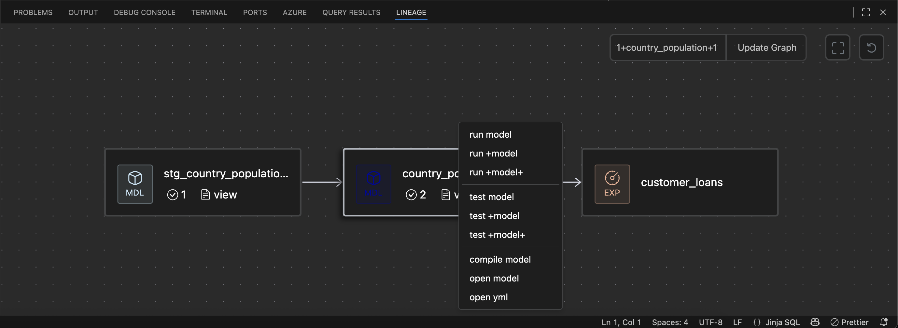

# Lineage View 

The **Lineage View** panel is a feature of the Datacoves VSCode extension that provides a visual representation of the lineage of your project. This tool helps you quickly understand how data flows between models, sources, and downstream dependencies within your dbt project.

## What is the Lineage View?

The Lineage View displays a graph of your dbt model's relationships, showing both upstream and downstream dependencies. This visualization makes it easy to:

- See which sources and models feed into your current model
- Identify all models and reports that depend on your current model
- Understand the impact of changes to a model across your project

## Usage

The basic usage of Lineage View consists of the following steps:

1. **Open a dbt model or yml file** in your VSCode workspace.
2. Locate the **Lineage View** panel, typically found in the lower panel (alongside Terminal, Output, Datacoves)
3. The panel will automatically display the lineage graph for the currently sql or yml file.

### Additional features

In addition to seeing your model(s) lineage, you can also:

- **Single-click** on a node to open the SQL file.
- **Double-click** on a node to open the YML file.
- **Right click** a node and perform a dbt action(run, test, compile, open files, etc)

You can also look up other dbt models and change the parent and child nodes displayed using one of the following:
  -  `{n}+my_model`
  -  `my_model+{n}`
  -  `{n}+my_model+{n}`

## Configuration

Lineage Panel has 3 configurable settings. As with any VSCode setting, these can be [overridden](/how-tos/vscode/override) in the `settings.json` file located in `workspace/.vscode/settings.json`:

- Default Expansion (`dbt.lineage.defaultExpansion`: number): How many nodes should expand by default for the currently-opened model.
