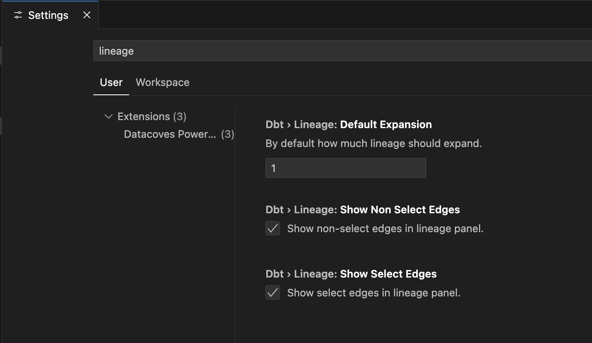

# Lineage View 

The **Lineage View** panel is a feature of the Datacoves Power User VSCode extension that provides a visual representation of the lineage of your project. This tool helps you quickly understand how data flows between models, sources, and downstream dependencies within your dbt project.

## What is the Lineage View?

The Lineage View displays a graph of your dbt model's relationships, showing both upstream and downstream dependencies. This visualization makes it easy to:

- See which sources and models feed into your current model
- Identify all models and reports that depend on your current model
- Understand the impact of changes to a model across your project

## Usage

The basic usage of Lineage View consists of the following steps:

1. **Open a dbt model file** in your VSCode workspace.
2. Locate the **Lineage View** panel, typically found in the lower panel (alongside Terminal, Output, Datacoves)
3. The panel will automatically display the lineage graph for the currently active model file.

### Extra features

Some of the extra features, apart from seeing your model(s) lineage, include:

- Single-click on a node: open SQL file.
- Double-click on a node: open YML file.
- Write your own lookup query, in the format of:
  -  `{n}+model`
  -  `model+{n}`
  -  `{n}+model+{n}`
- Right click a node: a dropdown of actions can be performed on each dbt object depending it's type (run, test, compile, open files, etc)

## Configuration

Lineage Panel has 3 configurable settings. As with any VSCode setting, these can be configured in the Settings UI or written to a traditional `settings.json` file:

- Default Expansion (`dbt.lineage.defaultExpansion`: number): How much Lineage should expand by default to each side of the currently-opened model.
- Show Non Selected Edges (`dbt.lineage.showNonSelectEdges`: boolean): Show non-selected edges
- Show Selected Edges (`dbt.lineage.showSelectEdges`: boolean): Show selected edges.

