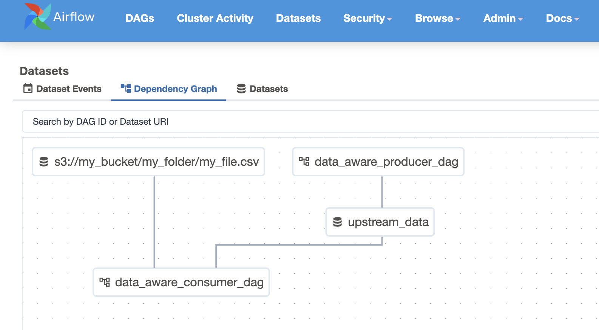

# How to Trigger a DAG using Datasets

## Overview
This guide explains how to trigger Airflow DAGs with Datasets. DAGs can be triggered by another DAG using datasets or by an external process that sends a dataset event using the Airflow API.

## Producer DAG

Airflow enables DAGs to be triggered dynamically based on dataset updates. A producer DAG updates a dataset, automatically triggering any consumer DAGs subscribed to it.

To implement this, start by creating a DAG and defining the dataset it will update.

```python
# data_aware_producer_dag.py
import datetime

from airflow.decorators import dag, task
from airflow.datasets import Dataset


# A dataset can be anything, it will be a poiner in the Airflow db.
# If you need to access url like s3://my_bucket/my_file.txt then you can set
# it with the proper path for reuse.
DAG_UPDATED_DATASET = Dataset("upstream_data")

@dag(
    default_args={
        "start_date": datetime.datetime(2024, 1, 1, 0, 0),
        "owner": "Noel Gomez",
        "email": "gomezn@example.com",
        "retries": 3
    },
    description="Sample Producer DAG",
    schedule="0 0 1 */12 *",
    tags=["extract_and_load"],
    catchup=False,
)
def data_aware_producer_dag():
    @task(outlets=[DAG_UPDATED_DATASET])
    def extract_and_load_dlt():
        print("I'm the producer")

    extract_and_load_dlt()


dag = data_aware_producer_dag()
```

Thats it, now you are ready to create your [Consumer DAG](#setting-up-the-airflow-dag)

## Lambda Function

Alternatively, you can trigger a DAG externally using the [Airflow API](how-tos/airflow/use-airflow-api.md). In this example we will be using an AWS Lambda Function to trigger your DAG once data lands in an S3 Bucket.

### Creating your zip files

To run your python script in a lambda function you need to upload the `requests` library
along with your `lambda_function.py` file.

- Create a python file locally and write out your function. Below is an example function. 

**Example Lambda function:**

```python
import requests
import os
import json

# In Lambda, environment variables are set in the Lambda configuration
# rather than using dotenv
API_URL = os.environ.get("AIRFLOW_API_URL")
API_KEY = os.environ.get("DATACOVES_API_KEY")

def update_dataset(dataset_name):
    url = f"{API_URL}/datasets/events"

    response = requests.post(
        url=url,
        headers={
            "Authorization": f"Token {API_KEY}",
        },
        json={"dataset_uri": dataset_name,}
    )

    try:
        return response.json()
    except ValueError:
        return response.text

def print_response(response):
    if response:
        msg = json.dumps(response, indent=2)
        print(f"Event posted successfully:\n{'='*30}\n\n {msg}")

def lambda_handler(event, context):
    print("Lambda execution started")

    try:
        print(f"Environment variables: API_URL={API_URL is not None}, API_KEY={API_KEY is not None}")

        # Extract S3 information
        bucket = event['Records'][0]['s3']['bucket']['name']
        key = event['Records'][0]['s3']['object']['key']
        print(f"S3 event details: bucket={bucket}, key={key}")

        print(f"File uploaded: {bucket}/{key}")

        # Airflow Dataset name must be static so if filename changes, that would have to
        # be addressed above
        dataset_name = f"s3://{bucket}/{key}"

        response = update_dataset(dataset_name)
        print_response(response)

        return {
            'statusCode': 200,
            'body': 'Successfully processed S3 event'
        }
    except Exception as e:
        print(f"ERROR: {str(e)}")
        import traceback
        print(traceback.format_exc())
        return {
            'statusCode': 500,
            'body': f'Error: {str(e)}'
        }
```

- Run the following commands locally to prepare a zip file with everything you need. 

```bash
pip install --target ./package requests
cd package
zip -r ../deployment-package.zip .
cd ..
zip -g deployment-package.zip lambda_function.py
```

### Create a Lambda Function

- Create a new AWS lambda function.
- Set the runtime to Python 3.10.
- Create an IAM role and add the following policy:
    - AmazonS3ReadOnlyAccess to bucket
- Upload `deployment-package.zip` from the earlier step into the Lambda function.

### Set Environment Variables

- Gather your [API credentials](how-tos/airflow/use-airflow-api.md#step-1-navigate-to-your-target-environment) Configure the following environment variables in the Lambda Function's Configuration:

     - `AIRFLOW_API_URL` (the API URL for Airflow)
     - `AIRFLOW_API_KEY` (the API key for authentication)

## Configuring the S3 Event Notification

1. **Go to S3 and Open the Target Bucket**
2. **Create a New Event Notification under the bucket's properties**
   - **Event Name:** `TriggerAirflowDAG`
   - **Prefix (Optional):** Specify a subfolder if needed.
   - **Suffix (Optional)** If you would like to trigger specific files ie) .csv
   - **Event Type:** Select `All object create events`
   - **Destination:** Select **AWS Lambda** and choose the function created earlier.

Now you are ready to set up your Consumer DAG.

## Setting Up the Airflow DAG

Whether you decide to use a producer DAG or the Airflow API, the last step is to create an Airflow DAG that is triggered by a dataset event rather than a schedule. This particular example can be triggered with either a `LAMBDA_UPDATED_DATASET` or `DAG_UPDATED_DATASET`.



### Example DAG

```python
import datetime

from airflow.decorators import dag, task
from airflow.datasets import Dataset

LAMBDA_UPDATED_DATASET = Dataset("s3://my_bucket/my_folder/my_file.csv")
DAG_UPDATED_DATASET = Dataset("upstream_data")

@dag(
    default_args={
        "start_date": datetime.datetime(2024, 1, 1, 0, 0),
        "owner": "Noel Gomez",
        "email": "gomezn@example.com",
        "retries": 1
    },
    description="Sample Producer DAG",
    schedule=(LAMBDA_UPDATED_DATASET | DAG_UPDATED_DATASET),
    tags=["transform"],
    catchup=False,
)
def data_aware_consumer_dag():
    @task
    def run_consumer():
        print("I'm the consumer")

    run_consumer()


dag = data_aware_consumer_dag()
```


>[!NOTE] Ensure the Dataset you are sending an event to exists in Airflow. It will be created automatically when a DAG is created. If a dataset does not exist when the API event is sent, the API call will fail.


