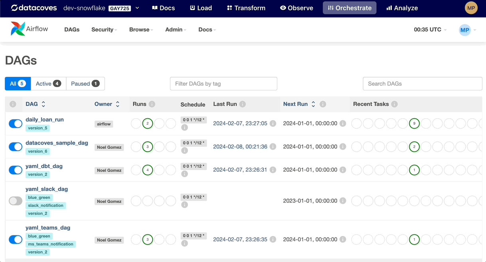

# How to Add Docs at the DAG Level in Airflow

## Overview
The `dag.doc_md` attribute allows DAG authors to add markdown-formatted documentation directly to their DAGs. This documentation is visible in the Airflow web interface, offering a convenient way to describe the DAG's purpose, its dependencies, the tasks it includes, and any other relevant information. This feature enhances readability and maintainability, making it easier for teams to understand and collaborate on Airflow DAGs.

1. Start by writing a multi-line docstring at the beginning of your DAG file. This docstring may provide a detailed explanation of the DAG's functionality, its schedule, and any important considerations. You can use Markdown syntax for formatting.
   
2. After defining your DAG, assign the module's docstring (__doc__) to the doc_md variable. This makes the documentation written in the docstring visible in the Airflow UI.
   
3. Once your DAG is deployed, you can view the documentation by navigating to the DAG's details page in the Airflow web interface. The markdown-formatted documentation will be displayed under the DAG Details tab.



### Example: 
```python
"""
# Example DAG

This DAG demonstrates how to use the `dag.doc_md` feature in Airflow.
It includes tasks for demonstration purposes.

## Schedule

- **Frequency**: Runs daily at midnight.
- **Catch Up**: False

## Tasks

1. **task_1**: Description of task 1.
2. **task_2**: Description of task 2.
"""

from airflow.decorators import dag, task
from pendulum import datetime
...
@dag(
    # This is used to display the markdown docs at the top of this file in the Airflow UI when viewing a DAG
    doc_md = __doc__,
 ...
# Invoke Dag
datacoves_sample_dag()

```

## Best Practices
**Clarity and Conciseness**: Write clear and concise documentation. Aim to provide enough detail for someone unfamiliar with the DAG to understand its purpose and operation.

**Use Markdown for Formatting**: Leverage Markdown syntax to format your documentation. Use headings, lists, code blocks, and links to make your documentation easy to read and navigate. See <a href="https://docs.github.com/en/get-started/writing-on-github/getting-started-with-writing-and-formatting-on-github/basic-writing-and-formatting-syntax" target="_blank" rel="noopener">Github's Basic writing and formatting syntax</a> for more information.

**Update Documentation as Necessary**: Keep the documentation up to date with changes to the DAG. This ensures that the documentation remains a reliable source of information for the DAG.