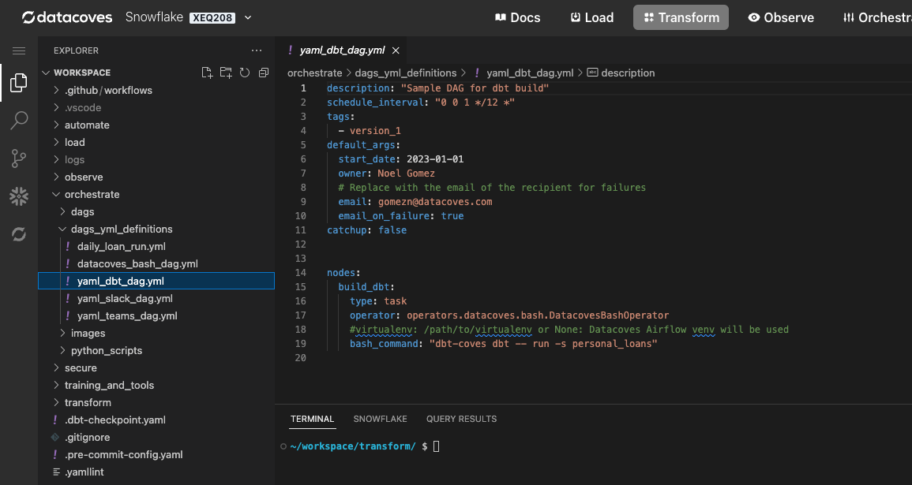
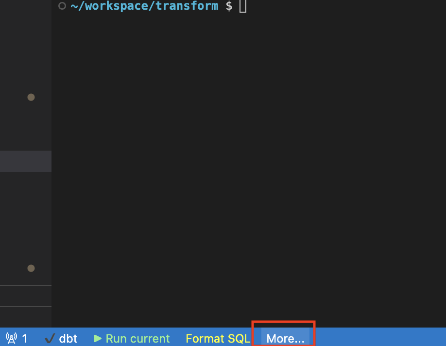
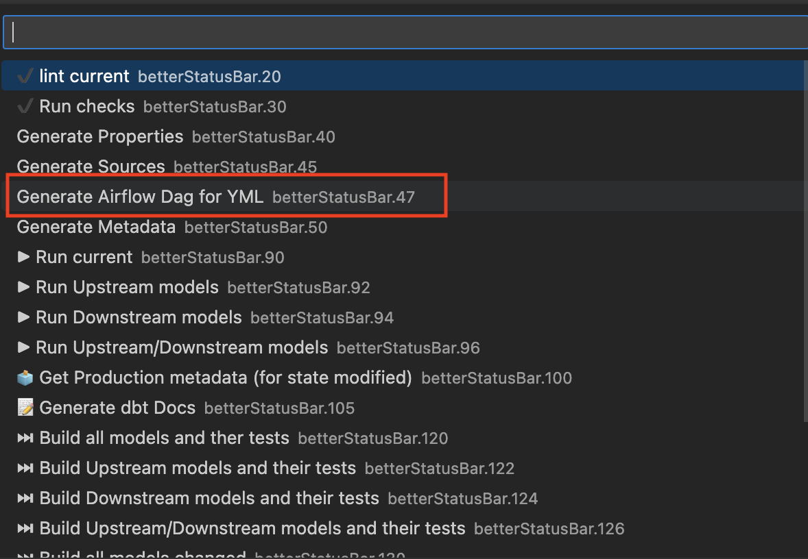

# Generate DAGs from yml
 
You have the option to write out your DAGs in python or you can write them using yml and then have dbt-coves generate the python DAG for you.

?>If using an Extract and Load tool in your DAG, ensure that you have configured it properly in `transform/.dbt-coves/config.yml`. See [Airbyte](how-tos/airflow/run-airbyte-sync-jobs.md#transformdbt-covesconfigyml) and [Fivetran](how-tos/airflow/run-fivetran-sync-jobs.md#transformdbt-covesconfigyml)

## Create the yml
In `dags/dag_yml_definitions` directory create your yml file. 
 
The name of the file will be the name of the DAG. 
 
eg) `yml_dbt_dag.yml`

## Generate your python file from your yml file
To generate your DAG, be sure you have the yml you wish to generate a DAG from open. Select `more` in the bottom bar

Select `Generate Airflow Dag for YML`. This will run the command to generate the individual yml.

## Generate all your python files

To generate all of the DAGS from your `dags/dag_yml_definitions` directory

- Run `dbt-coves generate-airflow` in your terminal.

All generated python DAGs will be placed in the `orchestrate/dags`
