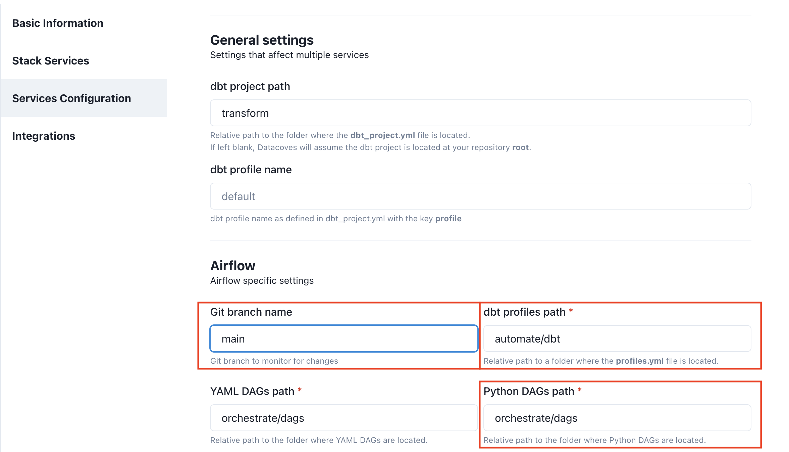

# How to set up Airflow for the first time

## Turn on Airflow

Go to the `Environments` admin screen.

Edit the desired environment and click on the `Stack Services` tab. Ensure that you turned on `ORCHESTRATE`.

## Airflow setup

Once you enabled Airflow, click on the `Services configuration` tab and configure each of the following fields accordingly:

### Git branch name

Git branch that Airflow will monitor for changes, typically `main` or `master` for production runs.

### dbt profiles path
>[!ATTENTION]Changes may need to be made in your repository. The path examples seen below follow our folder structure pattern. Please see the required [folder structure](explanation/best-practices/datacoves/folder-structure.md).

Relative path to a folder where a profiles.yml file is located, used to run `dbt` commands. This should be `automate/dbt/profiles.yml`. Please refer to our example [profiles.yml](https://github.com/datacoves/balboa/blob/main/automate/dbt/profiles.yml) in our [Sample Analytics project](https://github.com/datacoves/balboa).

### Python DAGs path

Relative path to the folder where Python DAGs are located. This should be `orchestrate/dags`. 

