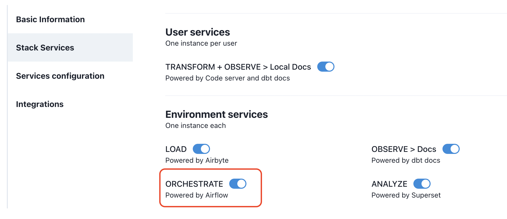
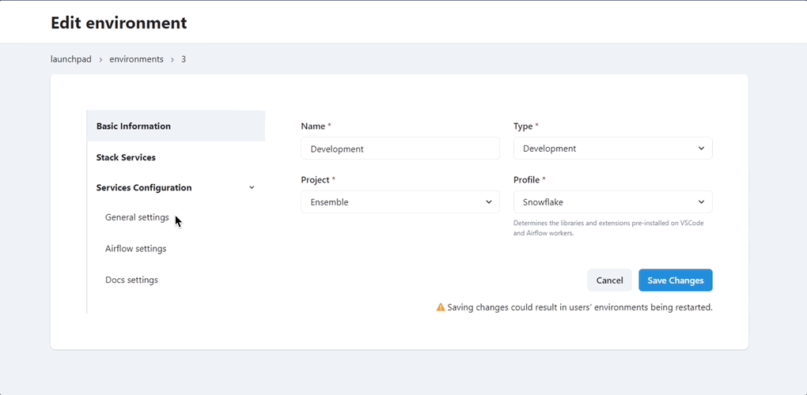

# How to configure Airflow in Datacoves

## Turn on Airflow

Go to the `Environments` admin screen.

Edit the desired environment and click on the `Stack Services` tab. Ensure that you turned on `ORCHESTRATE`.

## Airflow Configurations

>[!ATTENTION] You will need to add folders to your project repository in order to match the folder defaults for Airflow; These folders are `orchestrate/dags` and `orchestrate/dags_yml_definitions`. Please see the recommended [folder structure](explanation/best-practices/datacoves/folder-structure.md) for all folder structure recommendations.

Once you enabled Airflow, click on the `Services configuration > Airflow Settings` tab and configure each of the following fields accordingly:

### Fields Reference: 

- **Python DAGs path** Relative path to the folder where Python DAGs are located. The default is `orchestrate/dags`. 
- **YAML DAG Path** Relative path to the folder where YAML DAGs for dbt-coves `generate airflow-dags` command are located. The default is `orchestrate/dags_yml_definitions`. 
- **dbt profiles path** Relative path to a folder where a dbt profiles.yml file is located, used to run `dbt` commands. This file should use Environment variables and  should be placed in the recommended folder `automate/dbt/profiles.yml`. Please refer to our example [profiles.yml](https://github.com/datacoves/balboa/blob/main/automate/dbt/profiles.yml) in our [Sample Analytics project](https://github.com/datacoves/balboa).

  

### DAGs Sync Configuration

There are **2 options** to choose from for your DAGs sync: **Git Sync** and **S3 Sync**. 
Each requires specific information to be provided during configuration. Our recommended default is Git Sync.

**Git Sync**

- **Provider** Select `Git`
- **Git branch name** The branch airflow will monitor for changes. If you have more than 1 environment (Development and Production), we suggest `airflow_development` for the development environment and `main` for the production environment. Note: You would need to create an  `airflow_development` branch in your repo. If only have 1 environment, then the `Git branch name` should be `main`. 

>[!TIP]We recommend combining your dbt transformations in the same project as your Airflow orchestration. However, you may wish to separate orchestration from transformation into different git projects. In Datacoves you can achieve this by having two projects. Each project will be associated with one git repo. Find out how to configure a [project](how-tos/datacoves/how_to_projects.md).
        
**S3 Sync** 

You must create the s3 bucket and IAM user before this step.

- **Provider** Select `S3`
- **Bucket Path** The bucket and path that airflow will monitor and sync to the Airflow file system.
- **Auth Mechanism** Choose the auth method. Below you will see the fields required.
  - **IAM User**
    - **Access Key and Secret Key**
  - **IAM Role**
    - **Role ARN**

Once configured, you will need to configure your CI/CD process to clone your project into the S3 bucket.

### Logs Configuration - Private Deployment ONLY. Not applicable in SaaS.

>[!ATTENTION] Log Storage limit: 15 days. Airflow logs are not stored indefinitely and will be deleted after 15 days. 

There are **2 options** for logs - **EFS** and **S3**. Below you will see the fields required for each:

- **EFS**
  - **Volume Handle**
- **S3**
  - **Bucket Path**
  - **Access Key**
  - **Secret Key**

## Getting Started Next Steps 
[Setup Service Connection](how-tos/datacoves/how_to_service_connections.md)