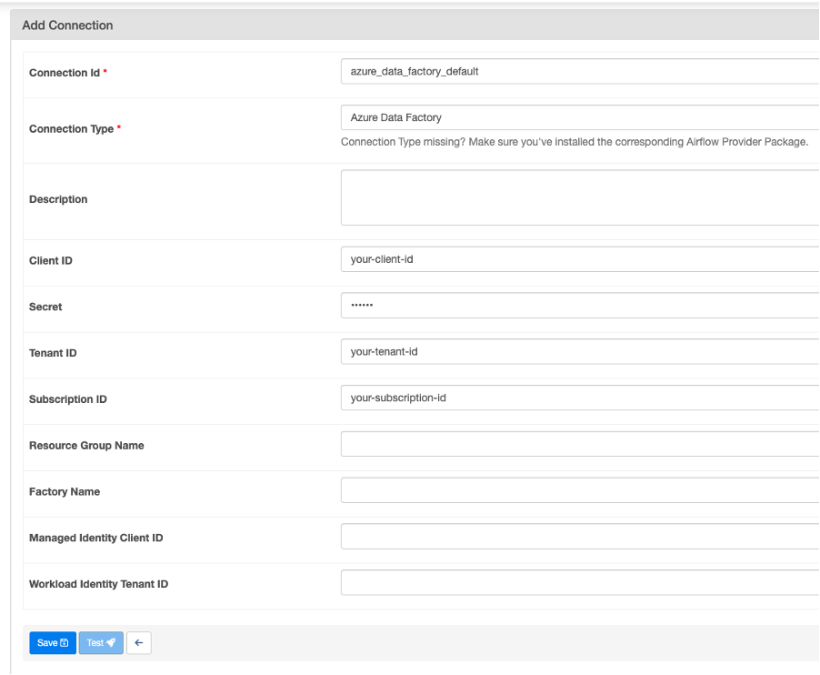

# Use Microsoft Azure Data Factory Operators 

You can use Airflow in Datacoves to trigger a Microsoft Azure Data Factory pipeline. This guide will walk you through this process. 

## Prerequisites 

-  You will need to set up a [Microsoft Entra Application](https://learn.microsoft.com/en-us/entra/identity-platform/howto-create-service-principal-portal).
-  Assign the `Data Factory Contributor` role to your Microsoft Entra Application. You can do this by heading into Resource Groups and then following [these instructions](https://learn.microsoft.com/en-us/entra/identity-platform/howto-create-service-principal-portal#assign-a-role-to-the-application).
-  Collect the following values from your ADF account, more information on where to find these items in the next section:
   -  `DATA_FACTORY_NAME`
   -  `RESOURCE_GROUP_NAME`
   -  `SUBSCRIPTION_ID`
   -  `APPLICATION_CLIENT_ID`
   -  `TENANT_ID`
   -  `CLIENT_SECRET`

### How to get the ADF information 

**Step 1:**  Login to your Microsoft Azure console and navigate to the [Data Factories service](https://portal.azure.com/#view/HubsExtension/BrowseResource/resourceType/Microsoft.DataFactory%2FdataFactories).

**Step 2:** Copy the`DATA_FACTORY_NAME` for the factory which holds your data pipeline.

**Step 3:** Open the factory and copy the `RESOURCE_GROUP_NAME`, and the `SUBSCRIPTION_ID` from the Overview tab 

**Step 4:** Navigate to the Azure Entra ID service, click on number next to *Applicaitons* on the Overview tab. Next click the *All Applications* tab, open the application or register a new application then open it and copy the `APPLICATION_CLIENT_ID` and Directory`TENANT_ID`.

**Step 5:** Click on *Certificates and Secrets* and generate a new secret for your Microsoft Entra Application and copy the *Value*. This is the `CLIENT_SECRET`.

## Create a Microsoft Azure Data Factory Connection in Airflow 

**Step 1:** In Datacoves, a user with the `securityadmin` role must go to the `Airflow Admin -> Connection` menu.

 

**Step 2:** Create a new connection using the following details.

- **Connection Id:** `azure_data_factory_default` <- this name will be used in the Airflow DAG and is the default name used by the ADF Operator

- **Connection Type:** `Azure Data Factory` 

- **Client ID:** Your `APPLICATION_CLIENT_ID` 

- **Secret:**  Your `CLIENT_SECRET` 

- **Tenant ID:** Your `TENANT_ID` 

- **Factory Name**: Your `DATA_FACTORY_NAME`

- **Resource Group Name**: Your `RESOURCE_GROUP_NAME`
  
- **Subscription ID:** Your `SUBSCRIPTION_ID` 

>[!NOTE] Replace the values in the screenshot below with the actual values found above.


 
## Example DAG 
>[!NOTE] You will need to find your pipeline name in the Azure Data Factory Studio and update the `pipeline_name` argument below with the correct name.

Once you have configured your Databricks connection and variables, you are ready to create your DAG. Head into the `Transform` tab to begin writing your DAG inside `orchestrate/dags`.

```python
# adf_example_run.py

"""Example Airflow Azure Data Factory DAG."""

from datetime import datetime
from airflow.decorators import dag
from airflow.providers.microsoft.azure.operators.data_factory import (
    AzureDataFactoryRunPipelineOperator)

@dag (
schedule="@daily",
start_date=datetime (2024, 1, 1),
tags= ["version_1"],
catchup=False
)

def adf_example_run():
    """Run an Azure Data Factory pipeline."""

    AzureDataFactoryRunPipelineOperator(
        task_id="run_pipeline",
        pipeline_name="myTestPipeline", # Replace with the ADF Pipeline you wish to trigger
        parameters={"myParam": "value"}, # Pass any paramenters needed by your pipeline
    )

DAG = adf_example_run()
```
 
## Understanding the Airflow DAG 

- The DAG makes use of the [`AzureDataFactoryRunPipelineOperator`](https://airflow.apache.org/docs/apache-airflow-providers-microsoft-azure/stable/operators/adf_run_pipeline.html) to run an Azure Data Factory pipeline. It also shows how it’s possible to pass parameters that can be used in the pipeline. 

 

 

 