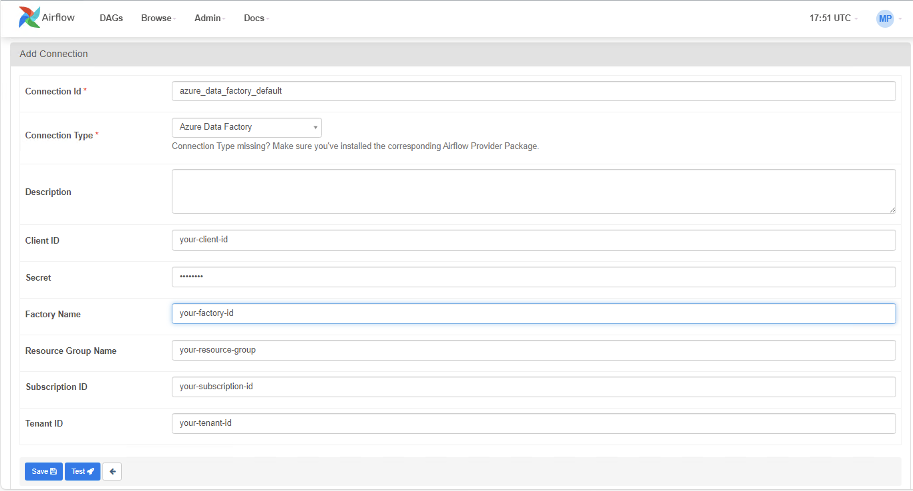

# Use Microsoft Azure Data Factory Operators 

Using Airflow in Datacoves you can use Microsoft Azure Data Factory Operators to run operations such as running a Data Factory pipeline. This guide will walk you through this process. 

## Prerequisites 

-  You will need to set up a [Microsoft Entra Application](https://learn.microsoft.com/en-us/entra/identity-platform/howto-create-service-principal-portal).
-  Assign the `Data Factory Contributor` role to your Microsoft Entra Application. You can do this by heading into Resource Groups and then following [these instructions](https://learn.microsoft.com/en-us/entra/identity-platform/howto-create-service-principal-portal#assign-a-role-to-the-application).

### How to get the connection information 

**Step 1:**  Login to your Microsoft Azure console and navigate to the [data factories section](https://portal.azure.com/#view/HubsExtension/BrowseResource/resourceType/Microsoft.DataFactory%2FdataFactories).

**Step 2:** Copy both the`DATA_FACTORY_NAME` and the `RESOURCE_GROUP_NAME`.

**Step 3:** Click into your data factory and copy the `SUBSCRIPTION_ID`.

**Step 4:** Navigate to the overview tab of your chosen Microsoft Entra Application and copy the `APPLICATION_CLIENT_ID` and `TENANT_ID`.

**Step 5:** Generate a new secret for your Microsoft Entra Application and copy the value which is the `CLIENT_SECRET`.

## Create a Microsoft Azure Data Factory Connection in Airflow 

**Step 1:** A user with Airflow admin privileges must go to the `Airflow Admin -> Connection` menu.

 

**Step 2:** Create a new connection using the following details.

- **Connection Id:** `azure_data_factory_default` 

- **Connection Type:** `Azure Data Factory` 

- **Client ID:** Your `APPLICATION_CLIENT_ID` 

- **Secret:**  Your `CLIENT_SECRET` 

- **Tenant ID:** Your `TENANT_ID` 

- **Subscription ID:** Your `SUBSCRIPTION_ID` 



>[!NOTE]`RESOURCE_GROUP_NAME` and `DATA_FACTORY_NAME` are blank because these must be set as variables as they are required parameters in the AzureDataFactoryRunPipelineOperator. 


## Handling ADF variables in Airflow 

**Step 1:** A user with Airflow admin privileges must go to the `Airflow Admin -> Connection` menu and set the following variables.

- **ADF_RESOURCE_GROUP_NAME:** Your `RESOURCE_GROUP_NAME`

- **ADF_DATA_FACTORY_NAME:** Your `DATA_FACTORY_NAME`
  

 
## Example DAG 
>[!NOTE] You will need to find your pipeline name in the Azure Data Factory Studio and update the `pipeline_name` argument below with the correct name.

```python
"""Example Airflow Azure Data Factory DAG."""

from datetime import datetime
from airflow.models import Variable
from airflow.decorators import dag
from airflow.providers.microsoft.azure.operators.data_factory import (
    AzureDataFactoryRunPipelineOperator)

@dag (
schedule="@daily",
start_date=datetime (2024, 1, 1),
tags= ["version_1"],
catchup=False
)

def adf_example_run():
    """Run an Azure Data Factory pipeline."""

    AzureDataFactoryRunPipelineOperator(
        task_id="run_pipeline",
        pipeline_name="myTestPipeline", # Rename to your Pipeline name
        parameters={"myParam": "value"},
        resource_group_name=Variable.get ("ADF_RESOURCE_GROUP_NAME"),
        factory_name=Variable.get ("ADF_DATA_FACTORY_NAME"),
    )

DAG = adf_example_run()
```
 
## Understanding the Airflow DAG 

- The DAG makes use of the [`AzureDataFactoryRunPipelineOperator`](https://airflow.apache.org/docs/apache-airflow-providers-microsoft-azure/stable/operators/adf_run_pipeline.html) to run an Azure Data Factory pipeline. It also shows how it’s possible to pass parameters that can be used in the pipeline. 

 

 

 