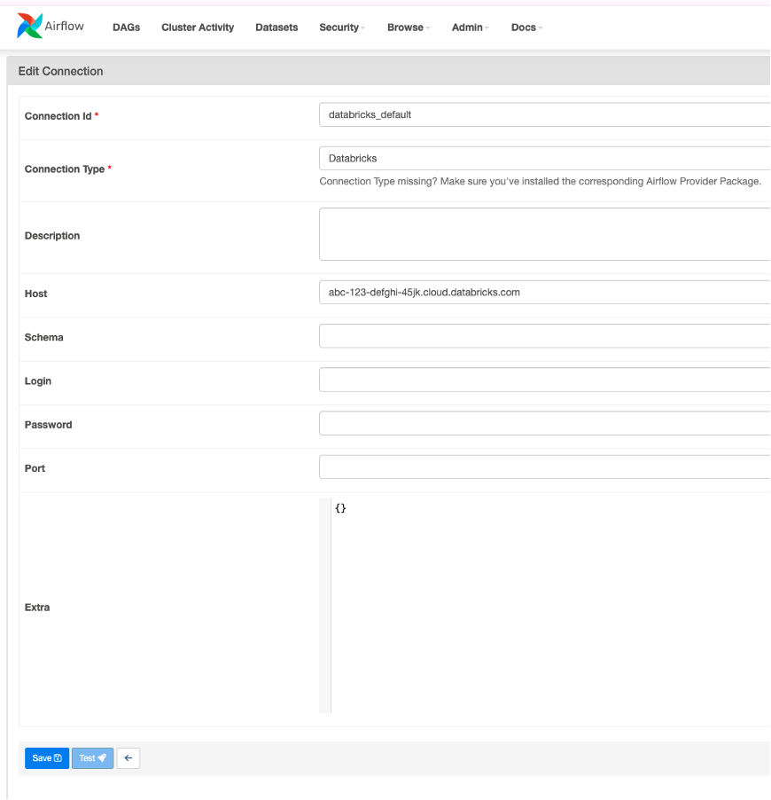
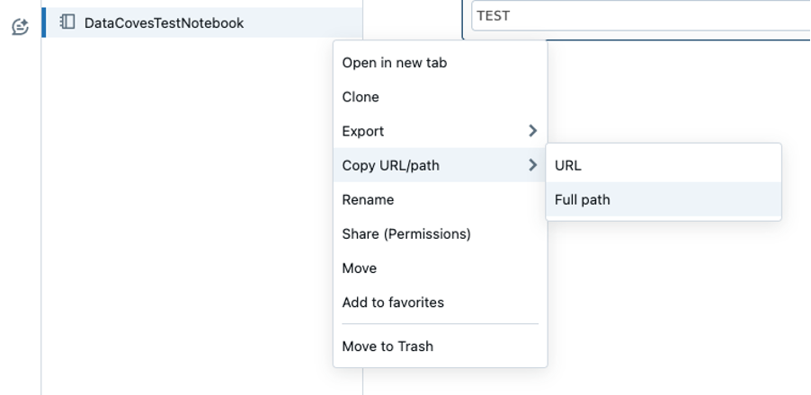
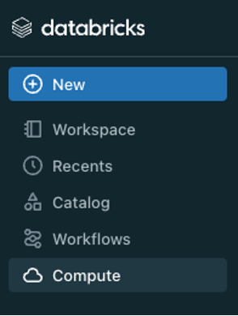
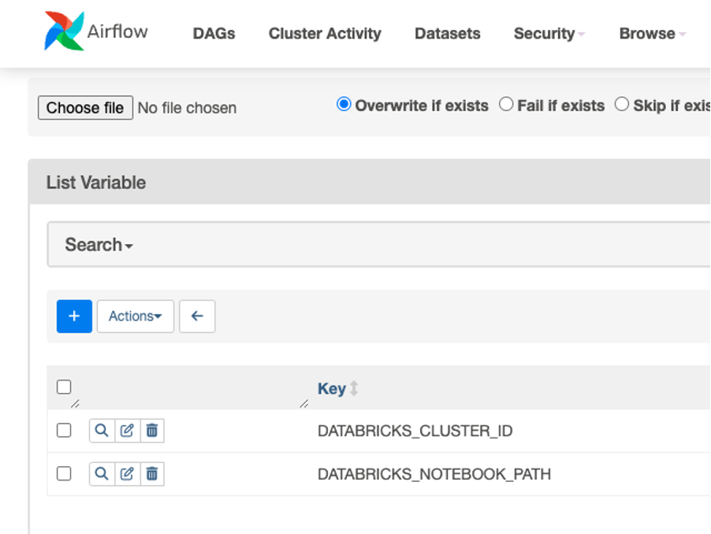

# Run Databricks Notebooks 

Using Airflow in Datacoves, you can trigger a Databricks job to run code that you have in a Databricks notebook. This guide will walk you through this process.

## Prerequisites 

- **Databricks Account:** Ensure you have access to your Databricks account.
- **API Token:** If you do not have admin privileges, work with an admin to get the token. Follow the [Databricks documentation here](https://docs.databricks.com/en/dev-tools/auth/pat.html).

### How to get DATABRICKS_HOST 

Sign into your Databricks account and look at the URL. The host value is the bit after `https://` up until `.com` and it will look something like this: `abc-123-defghi-45jk.cloud.databricks.com`

### How to get DATABRICKS_TOKEN 

If you do not have admin privileges, work with an admin to get the token. Follow the [Databricks documentation here](https://docs.databricks.com/en/dev-tools/auth/pat.html).

## Create a Databricks Connection in Airflow

**Step 1:** A user with Airflow admin privileges must go to the `Airflow Admin -> Connection` menu.


**Step 2:** Create a new connection using the following details:

- **Connection Id:** `databricks_default`
- **Connection Type:** `Databricks`
- **Host:** Your Databricks host. Ex) `abc-123-defghi-45jk.cloud.databricks.com`
- **Password:** Enter your `DATABRICKS_TOKEN`



**Step 3:** Click `Save`.

## Handling Databricks Variables in Airflow

It is best practice to use Airflow variables for values that may need to change in your Airflow DAG. This allows for easy updates without redeployment of your Airflow code.

- **DATABRICKS_CLUSTER_ID**
- **DATABRICKS_NOTEBOOK_PATH**

> [!NOTE] It is possible to hardcode these two variables in your DAG if you don’t see them needing to be changed.

### How to get DATABRICKS_NOTEBOOK_PATH 

**Step 1:** Navigate to your notebook in the Databricks user interface.

**Step 2:** To the right of the notebook name, there will be three little dots. Click on this and select the option to copy the full path to your clipboard.



### How to get DATABRICKS_CLUSTER_ID 

**Step 1:** Navigate to the compute section in the Databricks user interface.



**Step 2:** Click on the cluster that you wish to use to run your Databricks notebook.

**Step 3:** Look at the URL bar and copy the value after `/clusters/` and before the `?` character. It will look something like this: `0123-5678910-abcdefghijk`.

### Adding Variables to Airflow 

**Step 1:** A user with Airflow admin privileges must go to the Airflow `Admin -> Variables` menu and add the variables and their values.



## Example DAG 

Once you have configured your Databricks connection and variables, you are ready to create your DAG. Head into the `Transform` tab to begin writing your DAG inside `orchestrate/dags`.

```python
# databricks_example_run.py

import os
from datetime import datetime
from airflow.models import Variable
from airflow.decorators import dag
from airflow.providers.databricks.operators.databricks import DatabricksSubmitRunOperator

DATABRICKS_CLUSTER_ID = Variable.get("DATABRICKS_CLUSTER_ID")
DATABRICKS_NOTEBOOK_PATH = Variable.get("DATABRICKS_NOTEBOOK_PATH")

@dag(
    schedule="@daily",
    start_date=datetime(2024, 1, 1),
    tags=["version_1"],
    catchup=False
)
def databricks_example_run():

    notebook_task_params = {
        "task_key": "unique-task-key",
        "notebook_task": {
            "notebook_path": DATABRICKS_NOTEBOOK_PATH,
        },
        "source": "WORKSPACE",
        "existing_cluster_id": DATABRICKS_CLUSTER_ID,
        "run_name": "your-run-name",  # Update with a unique name
    }

    DatabricksSubmitRunOperator(
        task_id="notebook_task",  # Rename with appropriate name
        json=notebook_task_params,
        databricks_conn_id="databricks_default"  # Must match databricks connection id
    )

dag = databricks_example_run()
```

## Understanding the Airflow DAG 

- The DAG makes use of the [`DatabricksSubmitRunOperator`](https://airflow.apache.org/docs/apache-airflow-providers-databricks/1.0.0/operators.html) which uses the [jobs/runs/submit](https://docs.databricks.com/api/workspace/jobs/submit) endpoint of the Databricks API. You can see the full list of options available by looking at the previous two links. 
 
- We’re passing it a [Notebook task object](https://docs.databricks.com/api/workspace/jobs/submit#notebook_task) with a source set to `WORKSPACE` meaning the notebook will be retrieved from the local Databricks workspace. It is possible to set this to GIT and pull the notebook code from a version controlled git repository instead. This is the better option as it is less prone to someone simply changing the code in the workspace. 

- And lastly, we have customized the `run_name`. In a non-example DAG, you would want this to be unique so you can better identify the runs in Airflow and Databricks. 
