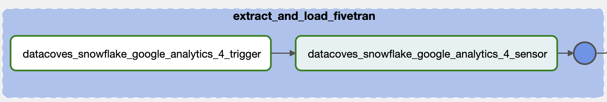

# Run Fivetran sync jobs

In Addition to triggering Airbyte loads jobs [run Airbyte sync jobs](/how-tos/airflow/run-airbyte-sync-jobs) you can also trigger Fivetran jobs from your Airflow DAG.

## Before you start

### Ensure your Airflow environment is properly configured

Follow this guide on [How to set up Airflow](/how-tos/airflow/initial-setup)'s environment.

### Fivetran connection

Airflow needs to be connected to your Fivetran account to both read and trigger your Connectors, so first you need to set up a connection.

A user with Airflow admin privileges must go to the Airflow `Admin -> Connections` menu.


Create a new connection using the following details:


>[!TIP]Once your Fivetran API key and secret have been generated, for security reasons, the secret cannot be viewed again through the Fivetran interface. If you lose or forget your API secret, you will need to generate a new API key and secret pair so be sure to store them somewhere secure for reference later. See <a href="https://fivetran.com/docs/rest-api/getting-started" target="_blank" rel="noopener">Fivetran Documentation</a> on how to generate your Fivetran `API Key` and `API Secret`. 

### Configure your transform/.dbt-coves/config.yml file

By default, dbt-coves cannot query the necessary information for Fivetran connections. You will need to configure these in your yml DAG manually, or contact us to configure Datacoves with the necessary information.
Below are the configurations in for dbt-coves airflow-dags. You will need to configure these if using dbt-coves to generate DAGs from YML

### Field reference:
- **yml_path**: Relative path to dbt project where yml to generate python DAGs will be stored
- **dags_path**: Relative path to dbt project where generated python DAGs will be stored

>[!TIP]We make use of environment variables that we have configured for you upon set up. For more information on these variables please see [Datacoves Environment Variables](reference/vscode/datacoves-env-vars.md)

```yaml
generate:
...
  airflow_dags:
    # source location for yml files
    yml_path: "/config/workspace/{{ env_var('DATACOVES__AIRFLOW_DAGS_YML_PATH') }}"

    # destination for generated python dags
    dags_path: "/config/workspace/{{ env_var('DATACOVES__AIRFLOW_DAGS_PATH') }}"
```

## Example DAG

### Python version

```python
from pendulum import datetime
from airflow.decorators import dag, task, task_group
from fivetran_provider_async.operators import FivetranOperator
from fivetran_provider_async.sensors import FivetranSensor

@dag(
    default_args={"start_date": datetime(2024, 1, 1)},
    description="Loan Run",
    schedule="0 0 1 */12 *",
    tags=["version_1"],
    catchup=False,
)
def daily_loan_run():

    @task_group(
        group_id="extract_and_load_fivetran",
        tooltip="Fivetran Extract and Load"
    )
    def extract_and_load_fivetran():

        fivetran_trigger = FivetranOperator(
            task_id="datacoves_snowflake_google_analytics_4_trigger",
            connector_id="speak_menial",
            do_xcom_push=True,
            fivetran_conn_id="fivetran_connection",
        )

        fivetran_sensor = FivetranSensor(
            task_id="datacoves_snowflake_google_analytics_4_sensor",
            connector_id="speak_menial",
            poke_interval=60,
            fivetran_conn_id="fivetran_connection",
        )

        fivetran_trigger >> fivetran_sensor  # Ensure proper task execution order

    tg_extract_and_load_fivetran = extract_and_load_fivetran()

    @task.datacoves_dbt(connection_id="main")
    def transform():
        return "dbt build -s 'tag:daily_run_fivetran+'"

    transform_task = transform()
    transform_task.set_upstream([tg_extract_and_load_fivetran])

dag = daily_loan_run()
```

### Fields reference

- **extract_and_load_fivetran**: The name of the task group. This can be named whatever you like and will show up in airflow.

- **tooltip**: The tooltip argument allows you to provide explanatory text or helpful hints about specific elements in the Airflow UI
- **tasks**: Define all of your tasks within the task group.

You will need to define two operators: `fivetran_provider.operators.fivetran.FivetranOperator` and `fivetran_provider.sensors.fivetran.FivetranSensor`

- **example_task_trigger**: Name your trigger task accordingly and define arguments below.
  - **operator**: `fivetran_provider.operators.fivetran.FivetranOperator`
  - **connector_id**: Find in Fivetran UI. Select your desired source. Click into `Setup` and locate the `Fivetran Connector ID`

  

  - **do_xcom_push**:  Indicate that the output of the task should be sent to XCom, making it available for other tasks to use.
  - **fivetran_conn_id**: This is the `connection_id` that was configured above in the Fivetran UI as seen [above](#id=fivetran-connection).
- **example_task_sensor**: Name your Sensor task accordingly and define arguments below.
  -  **operator**: `fivetran_provider.sensors.fivetran.FivetranSensor`
  -  **connector_id**: Find in Fivetran UI.
  -  **poke_interval**: The poke interval is the time in seconds that the sensor waits before rechecking if the connector is done loading data. Defaults to 60.
  - **fivetran_conn_id**: This is the `connection_id` that was configured above in the Fivetran UI as seen [above](#id=fivetran-connection).
  - **dependencies**: A list of tasks this task depends on.
  
### YAML version

```yaml
description: "Loan Run"
schedule: "0 0 1 */12 *"
tags:
  - version_1
default_args:
  start_date: 2024-01-01
catchup: false

# DAG Tasks
nodes:
  # The name of the task group. Will populate in Airflow DAG
  extract_and_load_fivetran:
    type: task_group
    # Change to fit your use case
    tooltip: "Fivetran Extract and Load"
    tasks:
      # Rename with your desired task name. We recommend the suffix _trigger
      datacoves_snowflake_google_analytics_4_trigger:
        operator: fivetran_provider_async.operators.FivetranOperator
        # Change this to your specific connector ID 
        connector_id: speak_menial
        do_xcom_push: true
        fivetran_conn_id: fivetran_connection
      # Rename with your desired task name. We recommend the suffix _sensor
      datacoves_snowflake_google_analytics_4_sensor:
        operator:fivetran_provider_async.sensors.FivetranSensor
        # Change this to your specific connector ID 
        connector_id: speak_menial
        # Set your desired poke interval. Defaults to 60.
        poke_interval: 60
        fivetran_conn_id: fivetran_connection
        # Set your dependencies for tasks. This task depends on datacoves_snowflake_google_analytics_4_trigger
        dependencies:
          - datacoves_snowflake_google_analytics_4_trigger

  transform:
    operator: operators.datacoves.dbt.DatacovesDbtOperator
    type: task
    # The daily_run_fivetran tag must be set in the source.yml
    bash_command: "dbt build -s 'tag:daily_run_fivetran+'"

    dependencies: ["extract_and_load_fivetran"]
```
