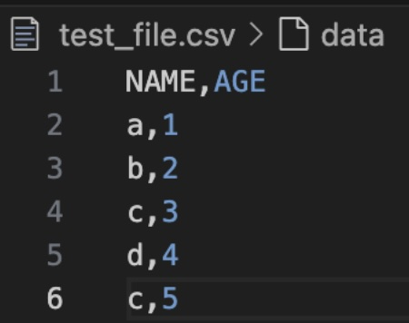
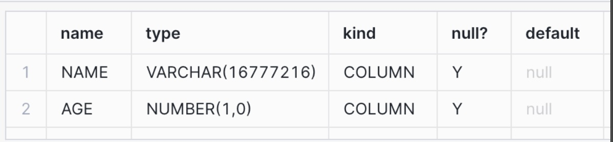
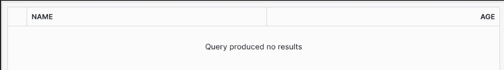
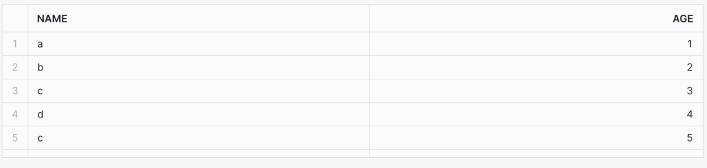
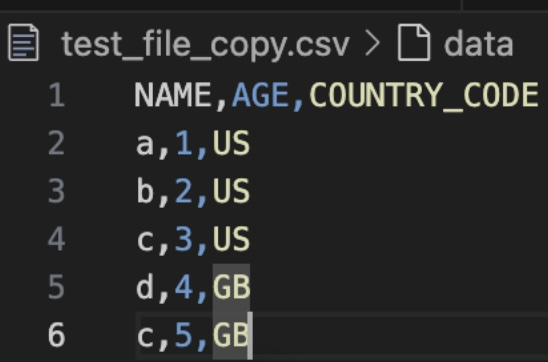
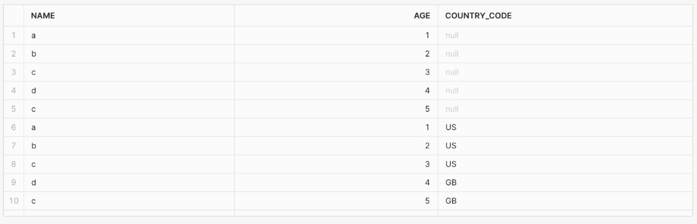
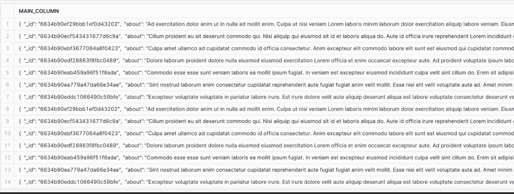

# Loading S3 Files into Snowflake 

## Schema Evolution 

Snowflake has a built-in feature for [schema evolution](https://docs.snowflake.com/en/user-guide/data-load-schema-evolution). It allows us to create the initial table using a file as a template and then it will automatically handle any changes to the schema going forward. 

### Caveats and limitations

Schema evolution is [limited to a change that adds a maximum of 10 columns or evolving no more than 1 schema per COPY operation](https://docs.snowflake.com/en/user-guide/data-load-schema-evolution#usage-notes)

You cannot go from a column containing `NUMBER` values to `VARCHAR`, but you can go from `VARCHAR` to `NUMBER` as it will insert it as `VARCHAR`.  

**Step 1:** In a Snowflake SQL worksheet Navigate to the database and schema where you will be loading the data to. 

**Step 2:** Create a custom file format for the data that you are planning to load. In this example we are using a custom CSV file format. 

```sql
CREATE OR REPLACE FILE FORMAT MY_CSV_FORMAT
TYPE = 'CSV' 
PARSE_HEADER = TRUE
ERROR_ON_COLUMN_COUNT_MISMATCH = FALSE;
```
**Step 3:** Now we will create a Snowflake stage and link our custom file format to it. 
```sql
CREATE OR REPLACE STAGE TEST_STAGE
    FILE_FORMAT = MY_CSV_FORMAT;
```

**Step 4:** We are now going to upload a csv file to this Snowflake stage that we will use as a template to create the table where data will be loaded. You can do this via the Snowflake UI or by using the SnowSQL command line tool.  

This example will use SnowSQL and our data looks like this: 



The SnowSQL command to upload the file to the Snowflake stage is below: 
```
PUT file://test_file.csv @TEST_STAGE;
```

Where test_file.csv is in the same folder from where we are running the SnowSQL command. 

**Step 5:** Once the file has been uploaded to the test stage, we create the initial table using it as a template and enabling schema evolution. 

```sql
CREATE OR REPLACE TABLE TEST_TABLE
    ENABLE_SCHEMA_EVOLUTION== TRUE
    USING TEMPLATE (
        SELECT ARRAY_AGG(OBJECT_CONSTRUCT(*))
            FROM TABLE(
                INFER_SCHEMA(
                    LOCATION->'@TEST_STAGE/test_file.csv.gz,
                    FILE_FORMAT=>'my_csv_format'
                )
            )
    );
```

The TEST_TABLE schema now looks like this: 



However, the table does not have any data loaded into it. 



**Step 6:** To load the data from the file we used as a template we use the following COPY INTO SQL. 

```sql
COPY INTO TEST_TABLE
    FROM '@TEST_STAGE/test_file.csv.gz'
    FILE_FORMAT =  'my_csv_format'
    MATCH_BY_COLUMN_NAME = CASE_INSENSITIVE;
```

And we can now see the data in the table: 



**Step 7:** Now we’re going to load another file into TEST_TABLE that has an additional column. 



Again, we will use the SnowSQL PUT command seen below: 

```
PUT files://test_file_copy.csv @TEST_STAGE;
```

**Step 8:** Now we can run another COPY INTO statement that references the new file. 
```sql
COPY INTO TEST_TABLE
    FROM '@TEST_STAGE/test_file_copy.csv.gz'
    FILE_FORMAT = 'my_csv_format'
    MATCH_BY_COLUMN_NAME = CASE_INSENSITIVE;
```

And now the table has an additional column called COUNTRY_CODE: 



## Loading JSON data into a variant column 

If the data that you want to load is in JSON format and the schema is likely to change then a recommended pattern is to load the JSON into a single Snowflake variant column. This allows you to parse out and model the data downstream without having to worry about the change in schema. 

**Step 1:** 1. Create a Snowflake table with a single variant column. 

```sql
CREATE OR REPLACE TABLE VARIABLE_TABLE (MAIN_COLUMN VARIANT);
```

**Step 2:**  Now create a custom file format for the JSON data.

```sql
CREATE OR REPLACE FILE FORMAT MY_JSON_FORMAT
    TYPE = 'JSON'
    STRIP_OUTER_ARRAY = TRUE;
```

**Step 3:** After this we create a Snowflake stage that uses the JSON custom file format. 

```sql
CREATE OR REPLACE STAGE JSON_STAGE
    FILE_FORMAT = MY_JSON_FORMAT;
```

**Step 4:** We can now load JSON files that have been staged using the following COPY INTO command. 

```sql
COPY INTO VARIANT_TABLE 
    FROM @JSON_STAGE
```

Our variant table now looks like this: 



