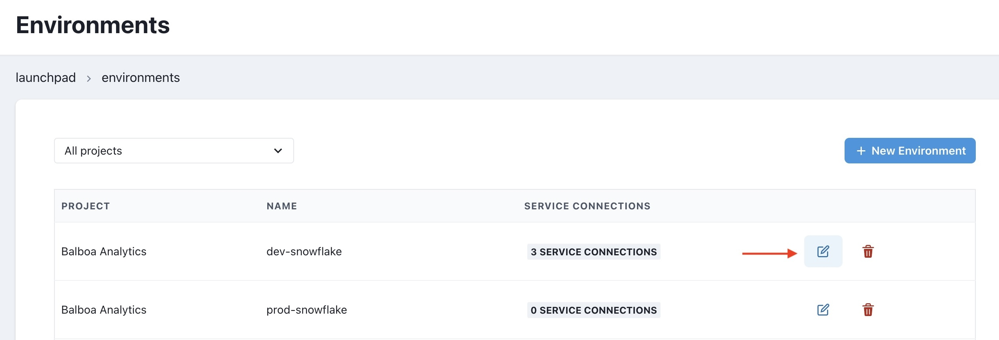
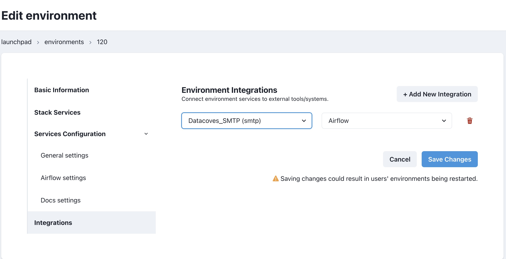

# How to send email notifications on DAG's failure

Getting notifications when there is a failure is critical for data teams and Airflow allows multiple ways to keep users informed about the status of a DAG.

This page will show you how to:
- Use the Datacoves default SMTP 
- Add the integration to your environment
- Create a custom smtp Integration for Airflow (optional)
- Create a DAG that makes use of the notification integration
- Bonus: DRY default_args

After completing these steps you will be able to receive email notifications upon DAG failure. 

Let's get started! 

## Configure SMTP integration in Environment

Datacoves provides a **pre-configured SMTP** connection which will send out a failure email from `hey@datacoves.com` to email recipients you configure in your DAGs.
In Datacoves 3.3 and up, the Datacoves_SMTP will be automatically added to your environment upon creation. If you created your environment before Datacoves 3.3 follow these instructions to configure the default SMTP.

- First, go to the `Environments` admin.


- Click the Edit icon for the environment containing the Airflow service you want to configure, then navigate to the `Integrations` tab.



- Click on the `+ Add new integration` button. 


- Select `Datacoves_SMTP`. In the second dropdown select `Airflow` as service. 



- Click `Save Changes`. 

Viola!🎉 The Airflow service will be restarted shortly and will now include the SMTP configuration required to send emails.

>[!NOTE] **Getting Started Guide:** If you are making your way through our [getting started guide](/getting-started/Admin/README.md), please continue on to [developing DAGs](getting-started/Admin/creating-airflow-dags.md).

## Set up a custom SMTP (Optional)

If you do not wish to use the default SMTP server, you can configure your own.
First, create a new integration of type `SMTP` by navigating to the Integrations Admin.


Click on the `+ New integration` button. **Fill out the fields as seen below:**

- **Name:** Provide a descriptive name such as `Mail Service `

- **Type:** Select `SMTP`

- **Host:** Enter the smtp server for your domain. 

- **Port:** TLS encryption on port 587. If you’d like to implement SSL encryption, use port 465. 

- **From Address:** This is the address that you have configured for smtp

- **User:** Same address as the `From Address` 

- **Password:** Password that you have configured for smtp


Click `Save Changes`

## Add integration to an Environment

Once you created the `SMTP` integration, it's time to add it to the Airflow service in an environment.

- First, go to the `Environments` admin.


- Select the Edit icon for the environment that has the Airflow service you want to configure, and then click on the `Integrations` tab.


- Click on the `+ Add new integration` button, and then, select the integration you created previously. 
- In the second dropdown select `Airflow` as service.


- Click `Save Changes`. 

## Implement in a DAG

If you have already created a DAG it's time to modify your DAG to make use of our newly set up SMTP integration on Airflow. 

Simply provide a `default_args` dict like so:

>[!TIP]You can add as many email recipients needed by passing a list into the email field. eg) `email: ["gomezn@example.com", "mayra@example.com", "walter@example.com"]` 

### Python version

```python
import datetime
from airflow.decorators import dag, task

@dag(
    default_args={
        "start_date": datetime.datetime(2023, 1, 1, 0, 0),
        "owner": "Noel Gomez",  # Replace with your name
        "email": ["gomezn@example.com", "mayra@example.com", "walter@example.com"], 
        "email_on_failure": True,
        "email_on_retry": False,
    },
    description="Sample DAG for dbt build",
    schedule="0 0 1 */12 *",
    tags=["version_1"],
    catchup=False,
)
def dbt_run():

    @task.datacoves_dbt(connection_id="main")  
    def build_dbt():
        return "dbt run -s personal_loans"

    build_dbt()  

dag = dbt_run()
```

### YAML version

```yaml
description: "Sample DAG for dbt run"
schedule: "0 0 1 */12 *"
tags:
  - version_1
default_args:
  start_date: 2023-01-01
  owner: Noel Gomez
  # Replace with the email of the recipient for failures
  email: 
    - gomezn@example.com
    - mayra@example.com 
    - walter@example.com
  email_on_failure: true
  email_on_retry: false
  catchup: false

nodes:
  build_dbt:
    type: task
    operator: operators.datacoves.dbt.DatacovesDbtOperator
    bash_command: "dbt run -s personal_loans" # Replace the name of the model
```

## DRY default_args 
>[!TIP]We recommend placing your default_args in its own file and importing it for reusability. In the example below we created a file inside of orchestrate/utils/

```python
# orchestrate/utils/default_args.py
from datetime import datetime, timedelta

default_args = {
    'owner': 'mayra@example.com',
    'email_on_failure': False,
    'email_on_retry': False,
    'retries': 3,
    'retry_delay': timedelta(minutes=5),
    'start_date': datetime(2023, 12, 1),
}

```

import the default_args
```python
from airflow.decorators import dag, task
from orchestrate.utils.default_args import default_args  # Import default args

@dag(
    default_args=default_args,  # Use imported default args
    description="Daily dbt run",
    schedule="0 12 * * *",
    tags=["version_1"],
    catchup=False,
)
def default_args_dag():

    @task.datacoves_dbt(connection_id="main")  
    def run_dbt():
        return "dbt run -s country_codes"

    run_dbt()  

dag = default_args_dag()
```