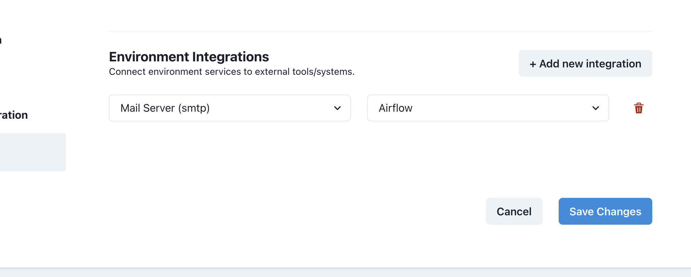

# How to send email notifications on DAG's failure

Airflow allows multiple ways to keep the users informed about the status of a DAG. You can learn more about them [here](https://www.bhavaniravi.com/apache-airflow/sending-emails-from-airflow) and [here](https://naiveskill.com/send-email-from-airflow/).

We're going to explain how you should send an email notification on DAG's failure.

## Send email notification when a task fails

### Create a new Integration

First, create a new integration of type `SMTP` by navigating to the Integrations Admin.


Click on the `+ New integration` button.

Provide a name and select `SMTP`.


Provide the required details and `Save` changes.

### Add integration to an Environment

Once you created the `SMTP` integration, it's time to add it to the Airflow service in an environment.

First, go to the `Environments` admin.


Edit the environment that has the Airflow service you want to configure, and then click on the `Integrations` tab.


Click on the `+ Add new integration` button, and then, select the integration you created previously. In the second dropdown select `Airflow` as service.



`Save` changes. The Airflow service will be restarted shortly and will now include the SMTP configuration required to send emails.

### Send email on DAG task's failure

Once you set up the SMTP integration on Airflow, it's time to modify your DAG.

Simply provide a `default_args` dict like so:

```python
from datetime import datetime
from airflow import DAG

default_args = {
    'owner': 'airflow',
    'email': '<RECIPIENT EMAIL ADDRESS>',   # Replace with recipient's email address
    'email_on_failure': True
}

dag = DAG(
    dag_id='my_dag',
    default_args=default_args,
    start_date=datetime(2020, 1, 1),
    on_failure_callback=send
)

# your tasks here...
```
