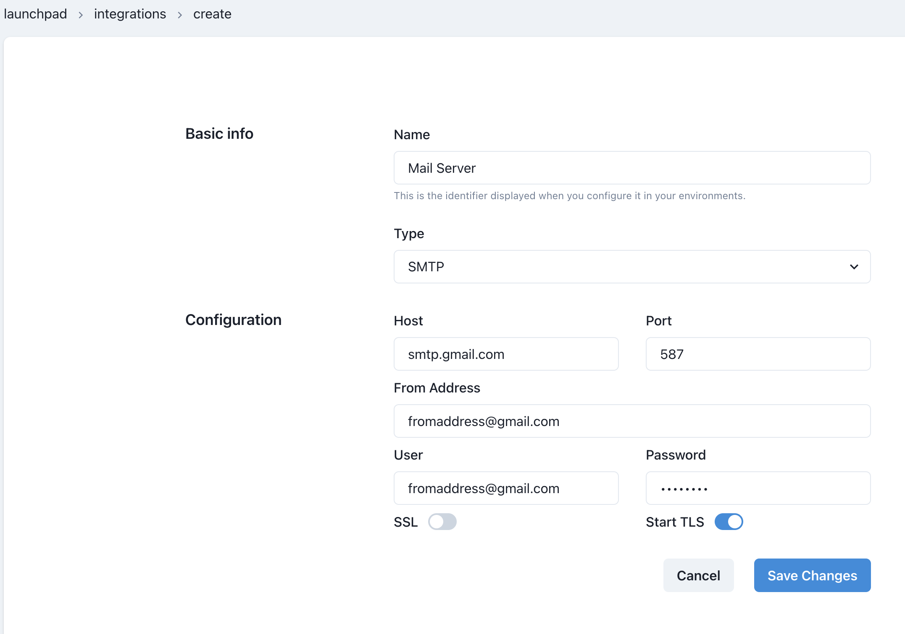

# How to send email notifications on DAG's failure

Airflow allows multiple ways to keep the users informed about the status of a DAG. You can learn more about them [here](https://www.bhavaniravi.com/apache-airflow/sending-emails-from-airflow) and [here](https://naiveskill.com/send-email-from-airflow/).

We're going to explain how you can send an email notification on DAG's failure.

## Create a new Integration

First, create a new integration of type `SMTP` by navigating to the Integrations Admin.


Click on the `+ New integration` button.

Provide a name and select `SMTP`.



Provide the required details and `Save` changes.

## Add integration to an Environment

Once you created the `SMTP` integration, it's time to add it to the Airflow service in an environment.

First, go to the `Environments` admin.


Select the Edit icon for the environment that has the Airflow service you want to configure, and then click on the `Integrations` tab.


Click on the `+ Add new integration` button, and then, select the integration you created previously. In the second dropdown select `Airflow` as service.


`Save` changes. The Airflow service will be restarted shortly and will now include the SMTP configuration required to send emails.

## Implement DAG

Once you set up the SMTP integration on Airflow, it's time to modify your DAG.

Simply provide a `default_args` dict like so:

### Python version

```python
import datetime

from airflow.decorators import dag
from operators.datacoves.dbt import DatacovesDbtOperator


@dag(
    default_args={
        "start_date": datetime.datetime(2023, 1, 1, 0, 0),
        "owner": "Noel Gomez",
        "email": "gomezn@example.com",
        "email_on_failure": True,
    },
    description="Sample DAG for dbt build",
    schedule_interval="0 0 1 */12 *",
    tags=["version_1"],
    catchup=False,
)
def dbt_run():
    build_dbt = DatacovesDbtOperator(
        task_id="build_dbt",
        bash_command="dbt run -s personal_loans",
    )


dag = dbt_run()
```

### YAML version

```yaml
description: "Sample DAG for dbt build"
schedule_interval: "0 0 1 */12 *"
tags:
  - version_1
default_args:
  start_date: 2023-01-01
  owner: Noel Gomez
  # Replace with the email of the recipient for failures
  email: gomezn@example.com
  email_on_failure: true
  catchup: false

nodes:
  build_dbt:
    type: task
    operator: operators.datacoves.dbt.DatacovesDbtOperator
    bash_command: "dbt build -s 'tag:daily_run_fivetran+'"
```
