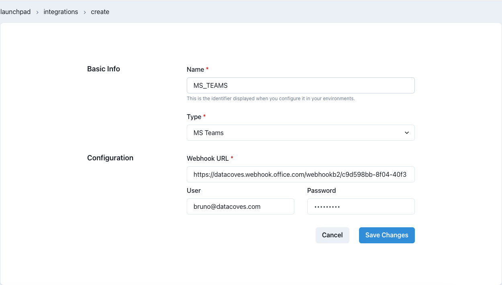

# How to send Microsoft Teams notifications on DAG's status

As stated in [how to send email notifications](/how-tos/airflow/send-emails.md), Airflow allows multiple ways to inform users about DAGs and tasks status.

Furthermore, it's important to understand Airflow handles these 4 status (`failure`, `retry`, `success` and `missed SLA`) via callbacks. You can learn more about them [here](https://airflow.apache.org/docs/apache-airflow/2.2.1/logging-monitoring/callbacks.html)

Below we explain how to use those callbacks to send Microsoft Teams notifications.

## Prepare Microsoft Teams

Sending messages through Teams is done using Webhooks. These connections can be assigned to MS Teams channels.

In the channel you want to send Airflow notifications to, click the `...` -> `Connectors` and search for `Incoming Webhook`.


Click `Configure`, give it a name, and optionally select an image to use as the sender's avatar, then click `Create` and you will be given a webhook URL.


> [!ATTENTION] Store this URL in a safe place as you will need it in a subsequent step and anyone with this link can send notification to that MS Teams channel

## Prepare Airflow

### Create a new Integration

In Datacoves, create a new integration of type `MS Teams` by navigating to the Integrations admin page.


Click on the `+ New integration` button.

Provide a name and select `MS Teams`.



Provide the required details and `Save` changes.

> [!NOTE] The name you specify will be used to create the Airflow-Teams connection. It will be uppercased and joined by underscores -> `'ms teams'` will become `MS_TEAMS`. You will need this name below.

### Add integration to an Environment

Once the `MS Teams` integration is created, it needs to be associated with the Airflow service within a Datacoves environment.

Go to the `Environments` admin screen.


Select the Edit icon for the environment that has the Airflow service you want to configure and click on the `Integrations` tab.


Click on the `+ Add new integration` button and select the integration you created previously. In the second dropdown select `Airflow` as the service.


`Save` changes. The Airflow service will be restarted and will include the Teams configuration required to send notifications.

## Implement DAG

Once MS Teams and Airflow are configured, you can start using the integration within Airflow Callbacks to send notifications to your MS Teams channel.

MS Teams will receive a message with a 'View Log' link that users can click on and go directly to the Airflow log for the Task.


### Callback Configuration

In the examples below, we will send a notification on failing tasks or when the full DAG completes successfully using our custom callbacks: `inform_failure` and `inform_success`.

> [!NOTE]In addition to `inform_failure` and `inform_success`, we support these callbacks `inform_failure`, `inform_success`, `inform_retry`, `inform_sla_miss`.

To send MS Teams notifications, in the Airflow DAG we need to import the appropriate notifier and use it with the following parameters:

- `connection_id`: the name of the Datacoves Integration created above
  - if no connection_id is specified, MSTeams Notifier will use `ms_teams`
- `message`: the body of the message
- `theme_color`: theme color of the MS Teams card

### Python version

```python
import datetime
from airflow.decorators import dag
from operators.datacoves.dbt import DatacovesDbtOperator
from notifiers.datacoves.ms_teams import MSTeamsNotifier

@dag(
    default_args={
        "start_date": datetime.datetime(2023, 1, 1, 0, 0),
        "owner": "Noel Gomez",
        "email": "gomezn@example.com",
        "email_on_failure": True,
    },
    description="Sample DAG with MS Teams notification",
    schedule_interval="0 0 1 */12 *",
    tags=["version_2", "ms_teams_notification", "blue_green"],
    catchup=False,
    on_success_callback=MSTeamsNotifier(
      connection_id="MS_TEAMS", # This is redundant if using 'ms teams' as Integration
      message="DAG {{ dag.dag_id }} Succeeded"),
    on_failure_callback=MSTeamsNotifier(message="DAG {{ dag.dag_id }} Failed"),
)
def dbt_run():
    transform = DatacovesDbtOperator(
        task_id="transform", bash_command="dbt run -s personal_loans"
    )

dag = yaml_teams_dag()
```

> [!NOTE]Quotation marks are not needed when setting the custom message. However, making use of Jinja in a YAML file requires the message to be wrapped quotations to be parsed properly. eg) "{{ dag.dag_id }} failed"

### YAML version

```yaml
description: "Sample DAG with MS Teams notification"
schedule_interval: "0 0 1 */12 *"
tags:
  - version_2
  - ms_teams_notification
default_args:
  start_date: 2023-01-01
  owner: Noel Gomez
  # Replace with the email of the recipient for failures
  email: gomezn@example.com
  email_on_failure: true
catchup: false

# Optional callbacks used to send MS Teams notifications
notifications:
  on_success_callback:
    notifier: notifiers.datacoves.ms_teams.MSTeamsNotifier
    args:
      connection_id: MS_TEAMS
      message: "DAG {{ dag.dag_id }} Succeeded"
      color: 0000FF
  on_failure_callback:
    notifier: notifiers.datacoves.ms_teams.MSTeamsNotifier
    args:
      connection_id: MS_TEAMS
      message: "DAG {{ dag.dag_id }} Failed"
      color: 9900FF

# DAG Tasks
nodes:
  transform:
    operator: operators.datacoves.dbt.DatacovesDbtOperator
    type: task

    bash_command: "dbt run -s personal_loans"
```

## Getting Started Next Steps

Start [developing DAGs](getting-started/Admin/creating-airflow-dags.md)
