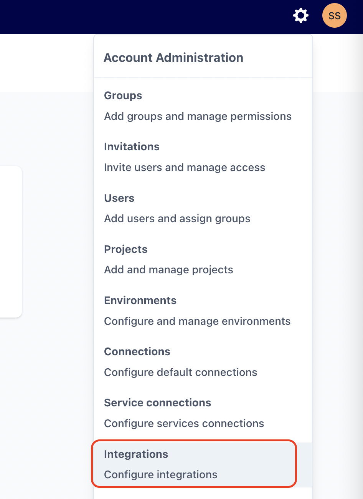
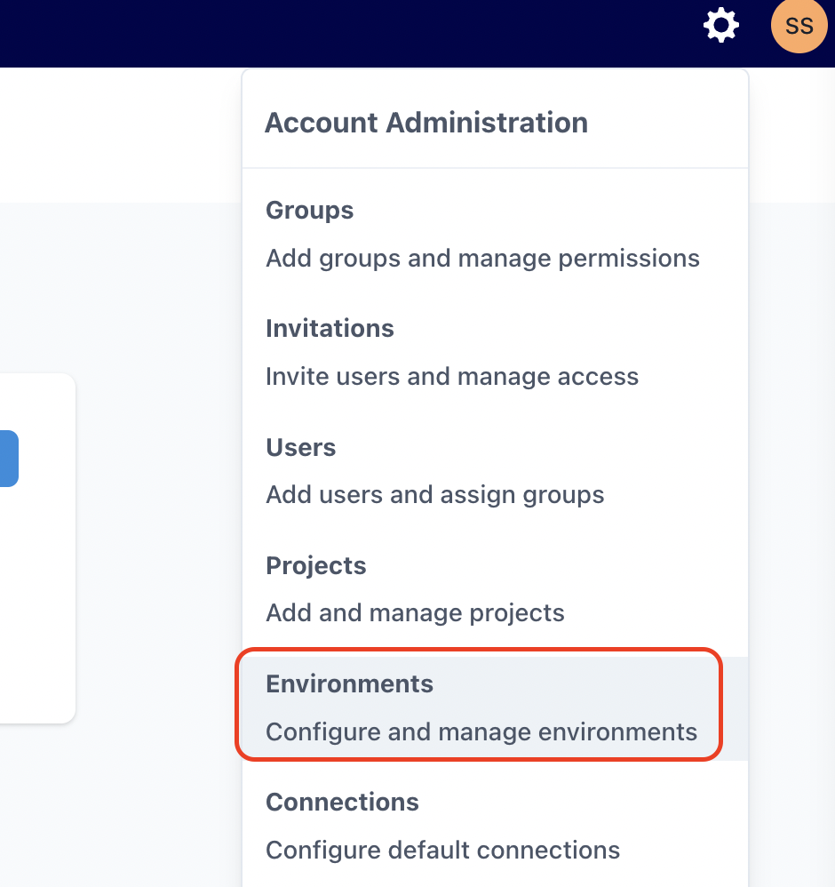

# How to send Slack notifications on DAG's status

As stated in [how to send email notifications](/how-tos/airflow/send-emails.md), Airflow allows multiple ways to inform users about DAGs and tasks status.

Furthermore, it's important to understand Airflow handles these 4 status (`failure`, `retry`, `success` and `missed SLA`) via callbacks. You can learn more about them [here](https://airflow.apache.org/docs/apache-airflow/2.2.1/logging-monitoring/callbacks.html)

Below we explain how to use those callbacks to send Slack notifications.

## Prepare Slack

First of all, you must create a Slack App, which will act as a "bot" that will send messages. Visit [https://api.slack.com/apps](https://api.slack.com/apps) to start


As it's the most basic type of application, you have to create it `from scratch`

After that, give it a `name` and assign it to your desired `workspace`


Once created, you must specify which features it will use. In order to send messages to your workspace channels, `Incoming Webhooks` is the only mandatory one.


In the `Incoming Webhooks` configuration screen, you must `toggle` the On/Off slider for the settings to appear. Once that's done, you can `Add New Webhook to Workspace`, where you will create `one webhook for each channel` you want to send messages to.


Once assigned a channel, your Incoming Webhook configuration screen will change to show your webhook `URL` and `Key`

The standard syntax of these are `url/key`, in our example: `https://hooks.slack.com/services` followed by `T05XXXXXX/XXXXXXXXX/XXXXXXXXX`


Now your Slack App is ready to send messages to `#airflow-notifications-dev` via webhooks.

## Prepare Airflow

### Create a new Integration

In Datacoves, create a new integration of type `Slack` by navigating to the Integrations admin page.



Click on the `+ New integration` button.

Provide a name and select `Slack`.


Provide the required details and `Save` changes.

?> **Important:** The name you specify will be used to create the Airflow-Slack connection. It will be uppercased and joined by underscores -> `'SLACK NOTIFICATIONS'` will become `SLACK_NOTIFICATIONS`. You will need this name below.

### Add integration to an Environment

Once the `Slack` integration is created, it needs to be associated with the Airflow service within a Datacoves environment.

Go to the `Environments` admin screen.



Edit the environment that has the Airflow service you want to configure and click on the `Integrations` tab.


Click on the `+ Add new integration` button and select the integration you created previously. In the second dropdown select `Airflow` as the service.


`Save` changes. The Airflow service will be restarted and will include the Slack configuration required to send notifications.

## Implement DAG

Once Slack and Airflow are configured, you can start using the integration within Airflow Callbacks to send notifications to your Slack channel.

Slack will receive a message with a 'Logs' link that users can click on and go directly to the Airflow log for the Task.

### Callback Configuration

In the examples below, we will send a notification on failing tasks or when the full DAG completes successfully using our custom callbacks: `inform_failure` and `inform_success`.

?> **Note:** In addition to `inform_failure` and `inform_success`, we support these callbacks `inform_failure`, `inform_success`, `inform_retry`, `inform_sla_miss`

To send Slack notifications, in the Airflow DAG we need to import the appropriate callbacks and create a method that receives the following mandatory parameters:

- `context` This is provided by Airflow
- `connection_id`: the name of the Datacoves Integration created above

Additionally, `message` can be passed to customize the message sent to Slack

### Python version

```python
from datetime import datetime

from airflow import DAG
from airflow.operators.bash import BashOperator
from callbacks.slack_messages import inform_failure, inform_success

DATACOVES_INTEGRATION_NAME = "SLACK_NOTIFICATIONS"

def run_inform_success(context):
    inform_success(
        context,
        connection_id=DATACOVES_INTEGRATION_NAME,
        # message="Custom python success message",
    )

def run_inform_failure(context):
    inform_failure(
        context,
        connection_id=DATACOVES_INTEGRATION_NAME,
        # message="Custom python failure message",
    )

default_args = {
    'owner': 'airflow',
    'email': 'some_user@example.com',
    'email_on_failure': True,
    'description': "Sample python dag with Slack notification",
}

with DAG(
    dag_id="python_sample_slack_dag",
    default_args=default_args,
    start_date=datetime(2023, 1, 1),
    catchup=False,
    tags=["version_30"],
    description="Sample python dag dbt run",
    schedule_interval="0 0 1 */12 *",
    on_success_callback=run_inform_success,
    on_failure_callback=run_inform_failure,
) as dag:

    successful_task = BashOperator(
        task_id = "successful_task",
        bash_command = "echo SUCCESS",
    )

    successful_task
```

### YAML version

```yaml
slack_notifications_test:
  description: "Sample yaml dag dbt run"
  schedule_interval: "0 0 1 1 *"
  tags:
    - version_3
  catchup: false

  default_args:
    start_date: 2023-07-12
    owner: airflow

  custom_callbacks:
    on_success_callback:
      module: callbacks.slack_messages
      callable: inform_success
      args:
        - connection_id: SLACK_NOTIFICATIONS
        #   - message: Custom YML success message
    on_failure_callback:
      module: callbacks.slack_messages
      callable: inform_failure
      args:
        - connection_id: SLACK_NOTIFICATIONS
        #   - message: Custom YML success message
  tasks:
    successful_task:
      operator: airflow.operators.bash_operator.BashOperator
      bash_command: "echo SUCCESS!"

    failing_task:
      operator: airflow.operators.bash_operator.BashOperator
      bash_command: "some_non_existant_command"
      dependencies: ["successful_task"]
```
