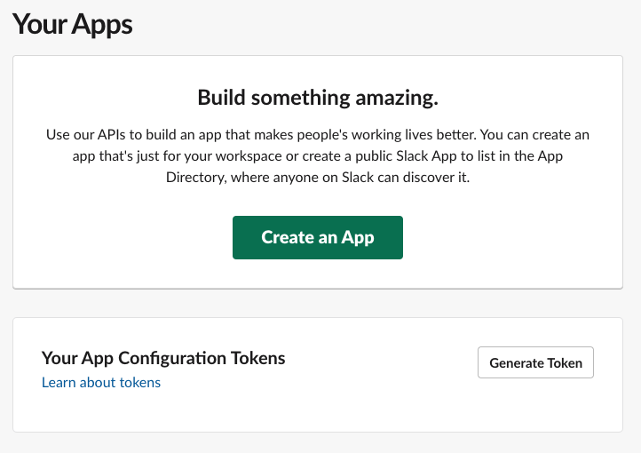
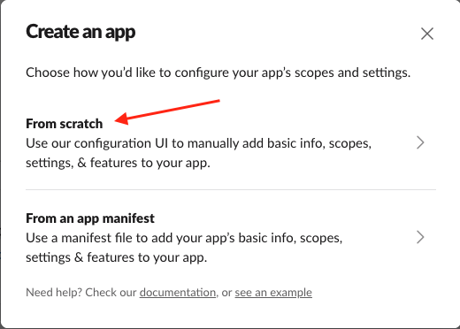
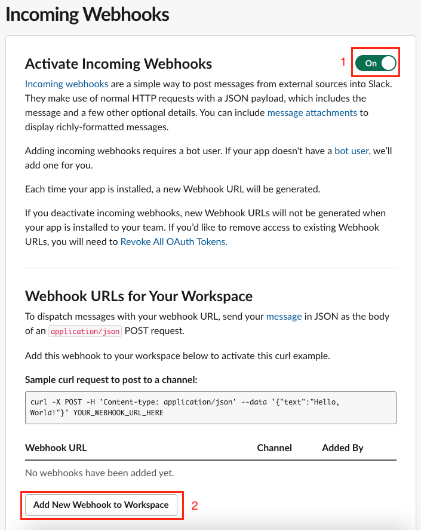
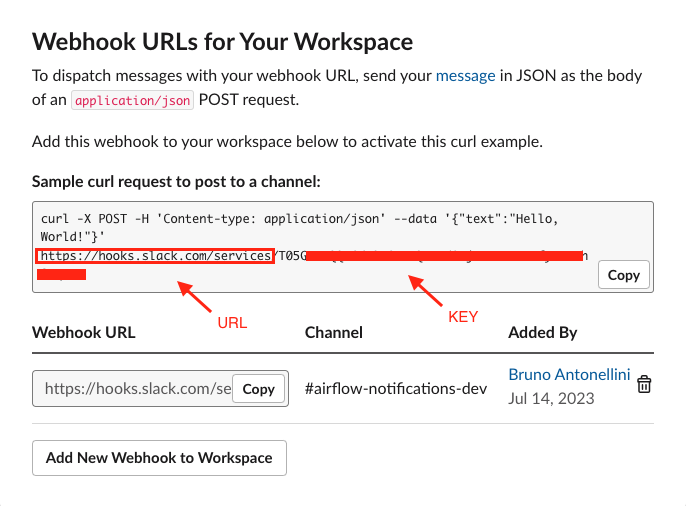
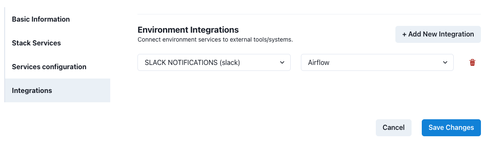

# How to send Slack notifications on DAG's status

As stated in [how to send email notifications](/how-tos/airflow/send-emails.md), Airflow allows multiple ways to inform users about DAGs and tasks status.

Furthermore, it's important to understand Airflow handles these 4 status (`failure`, `retry`, `success` and `missed SLA`) via callbacks. You can learn more about them [here](https://airflow.apache.org/docs/apache-airflow/2.2.1/logging-monitoring/callbacks.html).

Below we explain how to use those callbacks to send Slack notifications.

## Prepare Slack

To send messages in Slack, you must first create a Slack App, which will act as a "bot" that sends messages. Visit [https://api.slack.com/apps](https://api.slack.com/apps) to start.



As it's the most basic type of application, you have to create it `from scratch`

After that, give it a `name` and assign it to your desired `workspace`




Once created, you must specify which features it will use. In order to send messages to your workspace channels, `Incoming Webhooks` is the only mandatory one.


In the `Incoming Webhooks` configuration screen, you must `toggle` the On/Off slider for the settings to appear. Once that's done, you can `Add New Webhook to Workspace`, where you will create `one webhook for each channel` you want to send messages to.




Once assigned a channel, your Incoming Webhook configuration screen will change to show your webhook `URL` and `Key`

The standard syntax of these are `url/key`, in our example: `https://hooks.slack.com/services` followed by `T05XXXXXX/XXXXXXXXX/XXXXXXXXX`



Now your Slack App is ready to send messages to `#airflow-notifications-dev` via webhooks.

## Prepare Airflow

### Create a new Integration

In Datacoves, create a new integration of type `Slack` by navigating to the Integrations admin page.


Click on the `+ New integration` button.

Provide a name and select `Slack`.


Provide the required details and `Save` changes.

> [!TIP]The name you specify will be used to create the Airflow-Slack connection. It will be uppercased and joined by underscores -> `'SLACK NOTIFICATIONS'` will become `SLACK_NOTIFICATIONS`. You will need this name below.

### Add integration to an Environment

Once the `Slack` integration is created, it needs to be associated with the Airflow service within a Datacoves environment.

Go to the `Environments` admin screen.


Edit the environment that has the Airflow service you want to configure and click on the `Integrations` tab.


Click on the `+ Add new integration` button and select the integration you created previously. In the second dropdown select `Airflow` as the service.



`Save` changes. The Airflow service will be restarted and will include the Slack configuration required to send notifications.

## Implement DAG

Once Slack and Airflow are configured, you can start using the integration within Airflow Callbacks to send notifications to your Slack channel.

Slack will receive a message with a 'Logs' link that users can click on and go directly to the Airflow log for the Task.

### Callback Configuration

In the examples below, we will send a notification on failing tasks or when the full DAG completes successfully using our custom callbacks: `inform_failure` and `inform_success`.

> [!NOTE]In addition to `inform_failure` and `inform_success`, we support these callbacks `inform_failure`, `inform_success`, `inform_retry`, `inform_sla_miss`

To send Slack notifications, in the Airflow DAG we need to import the appropriate callbacks and call them with:

- `slack_webhook_conn_id`: the name of the Datacoves Integration created above
- `text`: to customize the message sent to Slack.

>[!ATTENTION] `on_failure_callback` will throw an error if using lists causing your task to fail.

### Python version

```python
from pendulum import datetime
from airflow.decorators import dag, task
from airflow.providers.slack.notifications.slack_webhook import send_slack_webhook_notification

# ✅ Define Slack notifications (These will send messages when the DAG succeeds or fails)
run_inform_success = send_slack_webhook_notification(
    slack_webhook_conn_id="SLACK_NOTIFICATIONS",  # Slack integration name slug -- double check in Datacoves integrations' admin
    text="The DAG {{ dag.dag_id }} succeeded",
)

run_inform_failure = send_slack_webhook_notification(
    slack_webhook_conn_id="SLACK_NOTIFICATIONS",
    text="The DAG {{ dag.dag_id }} failed",
)

@dag(
    default_args={
        "start_date": datetime(2024, 1, 1),
        "owner": "Noel Gomez",  # Replace with your name
        "email": "gomezn@example.com",  # Replace with your email
        "email_on_failure": True,  
    },
    description="Sample DAG with Slack notification",  
    schedule="0 0 1 */12 *",  
    tags=["version_2"], 
    catchup=False,  
    on_success_callback=[run_inform_success],  
    on_failure_callback=[run_inform_failure], 
)
def yaml_slack_dag():

    @task.datacoves_dbt(connection_id="main")  
    def transform():
        return "dbt run -s personal_loans"  

    transform()  

# Instantiate the DAG
dag = yaml_slack_dag()
```

### YAML version

```yaml
description: "Sample DAG with Slack notification, custom image, and resource requests"
schedule: "0 0 1 */12 *"
tags:
  - version_2
default_args:
  start_date: 2024-01-01
  owner: Noel Gomez
  # Replace with the email of the recipient for failures
  email: gomezn@example.com
  email_on_failure: true
catchup: false

# Optional callbacks used to send Slack notifications
callbacks:
  on_success_callback:
    callback: airflow.providers.slack.notifications.slack_webhook.send_slack_webhook_notification
    args:
      - slack_webhook_conn_id: SLACK_NOTIFICATIONS
      - text: Custom success message
  on_failure_callback:
    callback: airflow.providers.slack.notifications.slack_webhook.send_slack_webhook_notification
    args:
      - slack_webhook_conn_id: SLACK_NOTIFICATIONS
      - text: Custom error message

# DAG Tasks
nodes:
  transform:
    operator: operators.datacoves.dbt.DatacovesDbtOperator
    type: task

    bash_command: "dbt run -s personal_loans"
```

## Getting Started Next Steps

Start [developing DAGs](getting-started/Admin/creating-airflow-dags.md)
