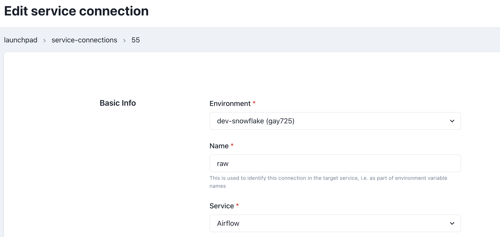
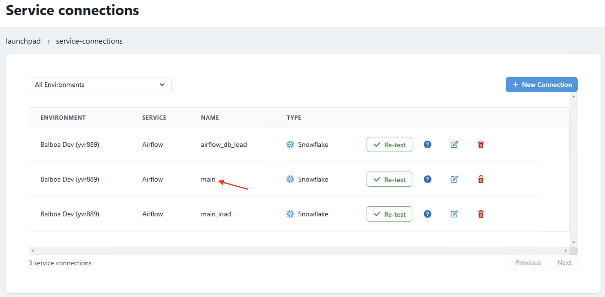

# Sync Airflow database

It is now possible to synchronize the Datacoves Airflow database to your Data Warehouse

> [!NOTE]This is currently only available for Snowflake and Redshift warehouses.

## Data Sync Decorator

To synchronize the Airflow database, we can use an Airflow DAG with the Datacoves Airflow Decorator below.

```python
@task.datacoves_airflow_db_sync
``` 

> [!NOTE]To avoid synchronizing unnecessary Airflow tables, the following Airflow tables are synced by default: `ab_permission`, `ab_role`, `ab_user`, `dag`, `dag_run`, `dag_tag`, `import_error`, `job`, `task_fail`, `task_instance`

These decorator can receive:

- `db_type`: the destination warehouse type, "snowflake" or "redshift"
- `connection_id`: the name of the Airflow Service Connection in Datacoves that will be used by the operator. 
- `tables`: a list of tables to override the default ones. _Warning:_ An empty list `[]` will perform a full-database sync.
- `additional_tables`: a list of additional tables you would want to add to the default set.
- `destination_schema`: the destination schema where the Airflow tables will end-up. By default, the schema will be named as follows: airflow-{datacoves environment slug} for example `airflow-qwe123`
  

## Example DAG

```python
import datetime

from airflow.decorators import dag, task

@dag(
    default_args={
        "start_date": datetime.datetime(2023, 1, 1, 0, 0),
        "owner": "Bruno",
        "email": "bruno@example.com",
        "email_on_failure": False,
        "retries": 3
    },
    description="Sample DAG for dbt build",
    schedule="0 0 1 */12 *",
    tags=["extract_and_load"],
    catchup=False,
)
def airflow_data_sync():
    @task.datacoves_airflow_db_sync(
        db_type="snowflake",
        destination_schema="airflow_dev",
        connection_id="main",
        # additional_tables=["additional_table_1", "additional_table_2"],
    )
    def sync_airflow_db():
        pass

    sync_airflow_db()

airflow_data_sync()
```

> [!NOTE]The example DAG above uses the service connection `main`

