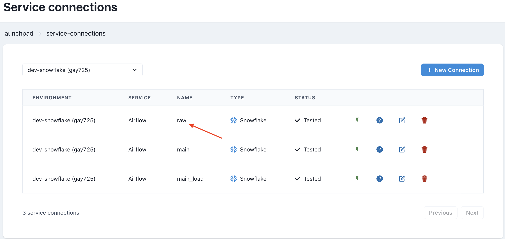

# Sync Airflow database

It is now possible to synchronize a Datacoves Airflow database to your Data Warehouse

> [!NOTE]This is only available for Snowflake and Redshift connections.

## Data Sync Operators

To synchronize the Airflow database, we can use an Airflow DAG with one of the Airflow operators below.

Datacoves has the following Airflow Data Sync Operators: `DatacovesDataSyncOperatorSnowflake` and `DatacovesDataSyncOperatorRedshift`.

Both of them receive the same arguments, so we won't differentiate examples. Select the appropriate provider for your Data Warehouse.

> [!NOTE]To avoid synchronizing unnecessary Airflow tables, the following Airflow tables are synced by default: `ab_permission`, `ab_role`, `ab_user`, `dag`, `dag_run`, `dag_tag`, `import_error`, `job`, `task_fail`, `task_instance`

These operators can receive:

- `tables`: a list of tables to override the default ones. _Warning:_ An empty list `[]` will perform a full-database sync.
- `additional_tables`: a list of additional tables you would want to add to the default set.
- `destination_schema`: the destination schema where the Airflow tables will end-up. By default, the schema will be named as follows: airflow-{datacoves environment slug} for example airflow-qwe123
- `service_connection_name`: the name of your Airflow Service Connection in Datacoves that will be used by the operator. By default it looks for a connection named `load_airflow`.
  

## Example DAG

```python
from airflow.decorators import dag
from operators.datacoves.data_sync import DatacovesDataSyncOperatorSnowflake


@dag(
    default_args={"start_date": "2021-01"},
    description="sync_airflow_db",
    schedule_interval="0 0 1 */12 *",
    tags=["version_1"],
    catchup=False,
)
def snowflake_airflow_sync():
    airflow_sync = DatacovesDataSyncOperatorSnowflake(
        additional_tables=["log", "log_template"],
        destination_schema="airflow-tables",
        service_connection_name="raw", 
    )


dag = snowflake_airflow_sync()
```

> [!NOTE]The example DAG above uses the service connection `raw`

