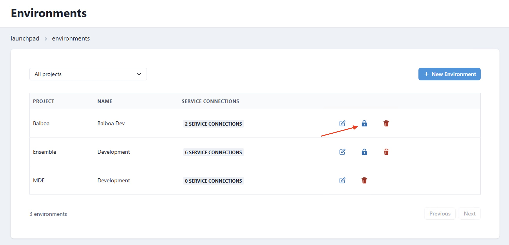
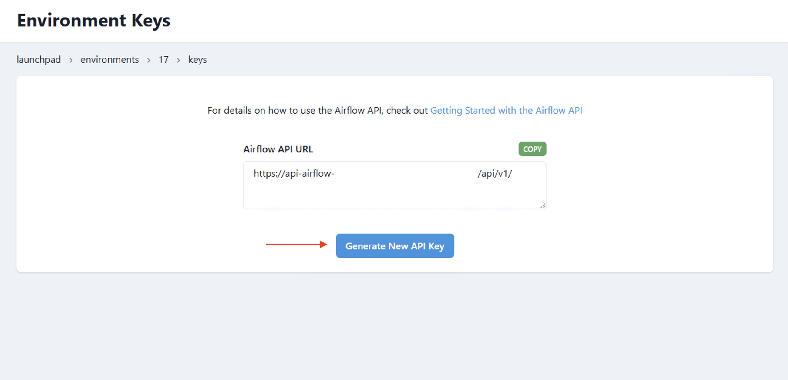

# How to use the Airflow API

>[!WARNING] Users must have Project Level Admin Group to use the Airflow API. The API will allow you to view secrets values in plain text. Always exercise the principle of least privilege. 

This how to will walk you through configuring the Airflow API and using it in a DAG.

### Step 1: Navigate to your target environment

- A user with the appropriate access can navigate to the `Environments` in the navigation menu.


- Then Select the Pad lock icon for the Airflow environment you wish to access.




### Step 2: Copy the API URL

Copy the `Airflow API URL`


### Step 3:Generate the API KEY

Generate your API key and copy it somewhere secure. Once you click away it will not be shown again.



### Step 4: Add your credentials to a .env file

Create a `.env` file inside your `orchestrate/` directory and be sure to add the file to your `.gitignore`. Add your credentials there.

```env
AIRFLOW_API_URL = "https://..."
DATACOVES_API_KEY = "...."
```

### Step 5: Use it in a python script

Below is a sample script that makes use of the Airflow API.

**This script does the following:**
- Initializes the Airflow API client using authentication details from environment variables.

- Fetches a list of all DAGs from the Airflow API.

- Prints a sorted list of DAG IDs for better readability.

- Triggers a new DAG run for a specified DAG using the API.

- Updates an Airflow dataset using the API.

- Handles API errors and retries requests if necessary.

```python
# airflow_api_call.py
import requests
import os
import json
from dotenv import load_dotenv

load_dotenv()
API_URL =  os.getenv("AIRFLOW_API_URL")
API_KEY =  os.getenv("DATACOVES_API_KEY")

def update_dataset(name):
    url=f"{API_URL}/datasets/events"

    response = requests.post(
        url=url,
        headers = {
            "Authorization": f"Token {API_KEY}",
        },
        json={"dataset_uri": "upstream_data",}
    )
    return response.json()


def trigger_dag(dag_id):
    url=f"{API_URL}/dags/{dag_id}/dagRuns"

    response = requests.post(
        url=url,
        headers = {
            "Authorization": f"Token {API_KEY}",
        },
        json={"note": "Trigger from API",}
    )
    return response.json()


def list_dags():
    url=f"{API_URL}/dags"

    response = requests.get(
        url=url,
        headers = {
            "Authorization": f"Token {API_KEY}",
             "Content-Type": "application/json",
        },
    )

    # Extract just the DAG names from the response
    dags_data = response.json()
    dag_names = [dag['dag_id'] for dag in dags_data['dags']]

    # Sort the names alphabetically for better readability
    dag_names.sort()
    return dag_names


def print_response(response):
    if response:
        msg = json.dumps(response, indent=2)
        print(f"Event posted successfully:\n{'='*30}\n\n {msg}")


if __name__ == "__main__":

    # Update an Airflow Dataset
    # dataset_name = "upstream_data"
    # response = update_dataset(dataset_name)
    # print_response(response)

    # Trigger a DAG
    # dag_id = "bad_variable_usage"
    # response = trigger_dag(dag_id)
    # print_response(response)

    # List DAGs
    response = list_dags()
    print_response(response)
```