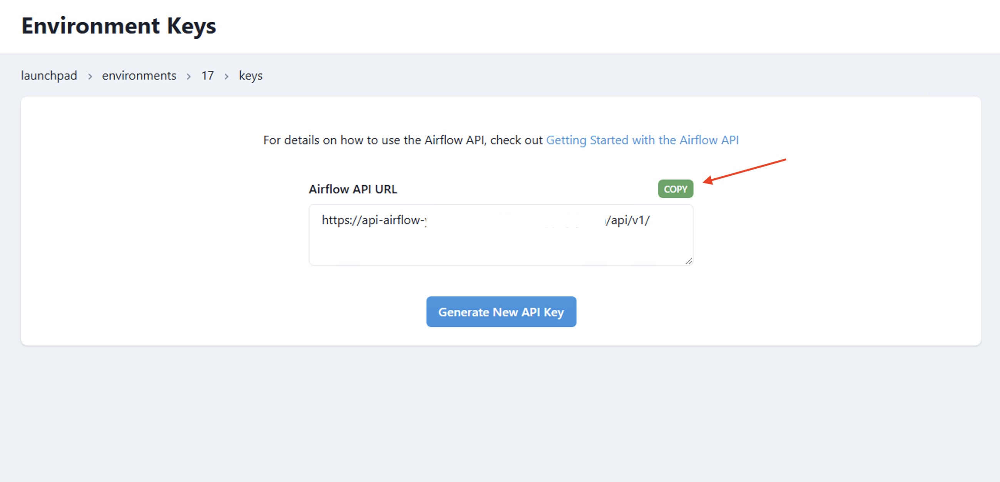

# How to use the Airflow API

>[!WARNING] Users must have Project Level Admin Group to view Airflow API. The API will allow you to view secrets values in plain text. Always exercise the principle of least privilege. 

This how to will walk you through configuring the Airflow API and using it in a DAG.

### Step 1: Navigate to your target environment

- A user with the appropriate access can navigate to the `Environments` in the navigation menu.


- Then Select the Pad lock icon for the Airflow environment you wish to access.


### Step 2: Copy the API URL

Copy the `Airflow API URL`



### Step 3:Generate the API KEY

Generate your API key and copy it somewhere secure. Once you click away it will not be shown again.


### Step 4: Add your credentials to a .env file

Create a `.env` file inside your `orchestrate/` directory and be sure to add the file to your `.gitignore`. Add your credentials there.

```env
ACCESS_TOKEN = "..."
REFRESH_TOKEN = "..."
REFRESH_URL = "https://..."
AIRFLOW_API_URL = "https://..."
```

### Step 5: Use it in a python script

Below is a sample script that makes use of the Airflow API.

**This script does the following:**
- Initializes the Airflow API client using authentication details from environment variables.
- Fetches a list of all DAGs from the Airflow API.
- Prints details of each DAG, including:
  - dag_id
  - Description
  - Whether the DAG is paused
- Fetches all DAG runs for datacoves_sample_dag and prints:
  - Run ID
  - Run state (e.g., success, failed, running)
  - Start and end timestamps
- Triggers a new DAG run for datacoves_sample_dag using the API.
- Handles token expiration by automatically refreshing the access token when needed.
- Handles API errors and retries requests if necessary.
- Uses a dynamic API method that converts function calls (e.g., get_dags()) into Airflow API requests.

```python
# airflow_api_call.py
import requests
import os
from dotenv import load_dotenv
from typing import Dict, Any

load_dotenv()

class AirflowAPIClient:
    def __init__(self, api_url: str, refresh_url: str, initial_access_token: str, refresh_token: str):
        self.api_url = api_url.rstrip('/')
        self.refresh_url = refresh_url
        self._access_token = initial_access_token
        self._refresh_token_string = refresh_token

    def _refresh_token(self) -> bool:
        try:
            response = requests.post(
                self.refresh_url,
                json={"refresh": self._refresh_token_string}
            )

            if response.status_code == 200:
                tokens = response.json()
                self._access_token = tokens['access']
                return True
            return False

        except requests.RequestException:
            return False

    def _make_request(self, method: str, endpoint: str, **kwargs) -> requests.Response:
        url = f"{self.api_url}/{endpoint.lstrip('/')}"
        headers = kwargs.pop('headers', {})
        headers['Authorization'] = f'Bearer {self._access_token}'

        response = requests.request(method, url, headers=headers, **kwargs)

        if response.status_code == 401:
            if not self._refresh_token():
                raise Exception("Token refresh failed")

            headers['Authorization'] = f'Bearer {self._access_token}'
            response = requests.request(method, url, headers=headers, **kwargs)

            if response.status_code != 200:
                raise Exception(f"Request failed after token refresh: {response.text}")

        if response.status_code != 200:
            raise Exception(f"Request failed with status {response.status_code}: {response.text}")

        return response

    def __getattr__(self, name: str) -> callable:
        parts = name.split('_', 1)
        if len(parts) < 2:
            raise AttributeError(f"'{self.__class__.__name__}' object has no attribute '{name}'")

        method, endpoint_parts = parts
        if method not in ['get', 'post', 'put', 'delete', 'patch']:
            raise AttributeError(f"Unsupported HTTP method: {method}")

        def _wrapped_request(*args, **kwargs) -> Dict[str, Any]:
            # Build the endpoint path
            path_parts = endpoint_parts.split('_')

            # If we have args, they're path parameters
            if args:
                # Insert path parameters where needed
                final_path_parts = []
                arg_index = 0
                for part in path_parts:
                    final_path_parts.append(part)
                    if arg_index < len(args):
                        final_path_parts.append(str(args[arg_index]))
                        arg_index += 1
                endpoint = '/'.join(final_path_parts)
            else:
                endpoint = '/'.join(path_parts)

            response = self._make_request(method.upper(), endpoint, **kwargs)
            try:
                return response.json()
            except requests.exceptions.JSONDecodeError:
                print(f"Raw response content: {response.content}")  # Debug print
                raise

        return _wrapped_request


# Example usage:
if __name__ == "__main__":

    client = AirflowAPIClient(
        api_url = os.getenv("AIRFLOW_API_URL"),
        refresh_url = os.getenv("REFRESH_URL"),
        initial_access_token = os.getenv("ACCESS_TOKEN"),
        refresh_token = os.getenv("REFRESH_TOKEN")
    )

    try:
        # Get list of all DAGs
        print("Getting all DAGs...")
        dags = client.get_dags()

        if 'dags' in dags:
            for dag in dags['dags']:
                print(f"\nDAG: {dag['dag_id']}")

                dag_details = client.get_dags(dag['dag_id'])
                print(f"Description: {dag_details['description']}")
                print(f"Is Paused: {dag_details['is_paused']}")

                print("="*20)

        runs = client.get_dags_dagRuns("datacoves_sample_dag")
        print("\nDAG runs for datacoves_sample_dag:\n")
        for run in runs.get('dag_runs', []):
            print(f"Run ID: {run['dag_run_id']}")
            print(f"State: {run['state']}")
            print(f"Start Date: {run['start_date']}")
            print(f"End Date: {run['end_date']}")
            print("#"*20)

        # Trigger a DAG run
        new_run = client.post_dags_dagRuns("datacoves_sample_dag", json={"conf": {}})
        print("\nNew run:", new_run)


    except Exception as e:
        print(f"Error occurred: {str(e)}")
```