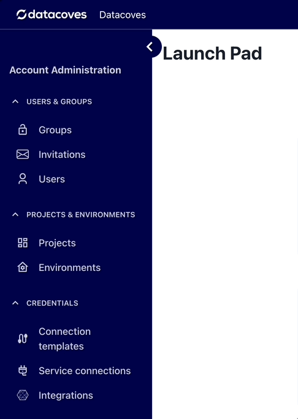
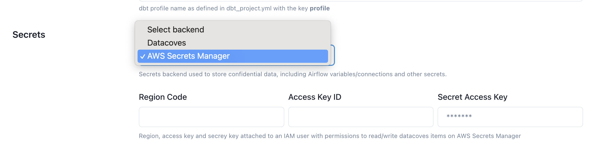
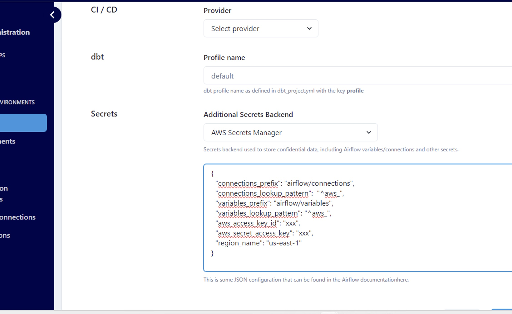
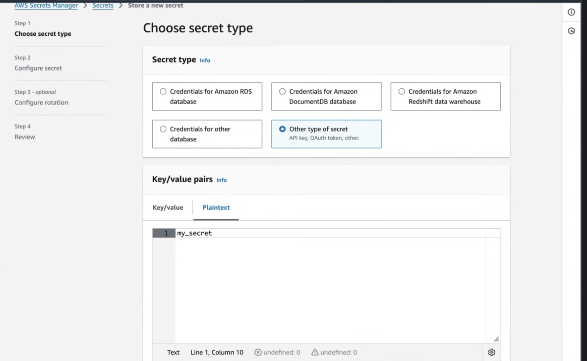
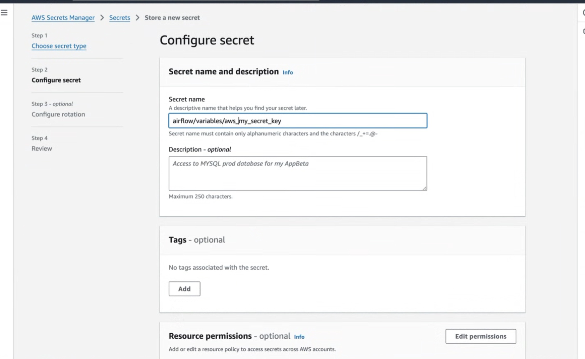

# How to use AWS Secrets Manager in Airflow

Datacoves implements the Airflow Secrets Backend Interface to support different types of secrets managers
including AWS Secrets Manager.

Secrets backends are configured at the project level, this means that you can use a different Secrets Manager for each project.

### To configure AWS Secrets Manager as the default secrets provider, you'll need:

1. Create an IAM user with permissions to manage secrets
2. Configure access to AWS Secrets Manager on the project settings page

Please follow the how to below to achieve these requirements.

## Create an IAM user with permissions to manage secrets

**Step 1:** On AWS, create an IAM User with an attached policy like this one:

>[!NOTE]Be sure to replace the ARN for the resource below to your ARN.

```json
{
    "Version": "2012-10-17",
    "Statement": [
        {
            "Effect": "Allow",
            "Action": [
                "secretsmanager:GetResourcePolicy",
                "secretsmanager:GetSecretValue",
                "secretsmanager:DescribeSecret",
                "secretsmanager:ListSecretVersionIds"
            ],
            "Resource": "arn:aws:secretsmanager:us-west-2:012345678910:secret:*" 
        },
        {
            "Effect": "Allow",
            "Action": "secretsmanager:ListSecrets",
            "Resource": "*"
        }
    ]
}
```

**Step 2:** Once you created the IAM user and the policy was correctly attached, create an access key and store it somewhere safe. You will be using it in the following step.

## Configure access to AWS Secrets Manager on the project settings page

**Step 1:** Navigate to the Projects Admin page and click on the edit icon for the desired project.



**Step 2:** Scroll down to the `backend` field select `AWS Secrets Manager`



**This secrets backend will require the following fields:**
- **connections_lookup_pattern** We recommend setting this to `"^aws_"` to lower the number of API calls made. Only connections prefixed with `aws_` will be searched for in AWS Secrets Manger. 
- **variables_lookup_pattern**  We recommend setting this to `"^aws_"` to lower the number of API calls made. Only variables prefixed with `aws_` will be searched for in AWS Secrets Manger.
(For both of the lookup patterns they can be changed to whatever RegEx expression you choose. The important thing to note is that lookup patterns are recommended to lower the amount of API calls to AWS Secrets Manager.)
- **Access Key ID** The Access Key ID you configured earlier
- **Secret Access Key** The Secret Access Key attached to the IAM User configured earlier 
- **Region Code** This is the region were the Secrets Manager is running, i.e. `us-east-1`, `us-west-1`, etc. Find a complete list [here](https://docs.aws.amazon.com/AWSEC2/latest/UserGuide/using-regions-availability-zones.html)

>[!TIP] See the [Secrets Manager documentation](https://airflow.apache.org/docs/apache-airflow-providers-amazon/stable/secrets-backends/aws-secrets-manager.html#aws-secrets-manager-backend) for more customization options. 



>[!NOTE]For security purposes, once this has been saved you will not be able to view the values. To modify the Secrets backend you will need to set the Secrets backend to `None` and save the changes. Then start the setup again. 

## Create your Secret in AWS Secrets Manager

Please, follow the [AWS Secrets Manager documentation](https://docs.aws.amazon.com/mwaa/latest/userguide/connections-secrets-manager.html#connections-sm-createsecret-variables). 

### Things to note:
1. Be sure to set your secret in **plaintext** and set it as a string or integer as seen in the image below.



2. Set the secret name to `airflow/variables/<secret_name>` where `<secret_name>` will be what you use in your DAG in the following step.



## Read variable from AWS Secrets manager

When using `Variable.get` Airflow will look in several places to find the variable. 

### The order of places it will look for are as follows:

1. AWS Secrets Manager (If this is  configured as seen above)
2. Datacoves Secrets Manager
3. Airflow environment variables

Once a variable is found Airflow will stop its search. 


Each time a variable is accessed, an API call is made to AWS Secrets Manager. If not configured properly, this API call may occur every time a DAG is parsed, not just during task execution. Since AWS is the first place Airflow looks for variables, repeated calls can significantly increase API usage and lead to a higher-than-expected AWS bill. You can read more about this [here](https://medium.com/apache-airflow/setting-up-aws-secrets-backends-with-airflow-in-a-cost-effective-way-dac2d2c43f13). 

### To solve for this there are 2 best practices to follow:

1. Always call your `Variable.get` from within the `@task` decorator
2. Make use of the `connections_lookup_pattern` and `variables_lookup_pattern` when setting up your secondary backend above. This means only variables and connections prefixed with `aws_` would be make an API call to AWS Secrets Manager. eg) `aws_mayras_secret`
   

```python
import datetime
from airflow.decorators import dag, task
from operators.datacoves.dbt import DatacovesDbtOperator

@dag(
    default_args={
        "start_date": datetime.datetime(2023, 1, 1, 0, 0),
        "owner": "Noel Gomez",
        "email": "gomezn@example.com",
        "email_on_failure": True,
    },
    description="Sample DAG for dbt build",
    schedule_interval="0 0 1 */12 *",
    tags=["version_2"],
    catchup=False,
)
def aws_dag():

    @task
    def get_variables():
        from airflow.models import Variable
        # Fetches the variable, potentially making an AWS Secrets Manager API call
        aws_var = Variable.get("aws_mayras_secret")
        datacoves_var = Variable.get("datacoves_mayras_secret")
        return [aws_var, datacoves_var]

    #
    my_variables = get_variables()
    aws_var = my_variables[0]
    datacoves_var = my_variables[1]

    # Task to run dbt using the DatacovesDbtOperator and pass the variables
    @task
    def run_dbt_task(aws_var, datacoves_var):
        # Use the fetched variables in the dbt command
        DatacovesDbtOperator(
            task_id="run_dbt",
            bash_command=f"dbt run -s personal_loans --vars '{{my_aws_variable: \"{aws_var}\", datacoves_variable: \"{datacoves_var}\"}}'"
        )

    run_dbt_task(aws_var=aws_var, datacoves_var=datacoves_var)

dag = aws_dag()


```

>[!TIP]To auto mask your secret you can use `secret` or `password` in the secret name since this will set `hide_sensitive_var_conn_fields` to True. eg) aws_mayras_password. Please see [this documentation](https://www.astronomer.io/docs/learn/airflow-variables#hide-sensitive-information-in-airflow-variables) for a full list of masking words.