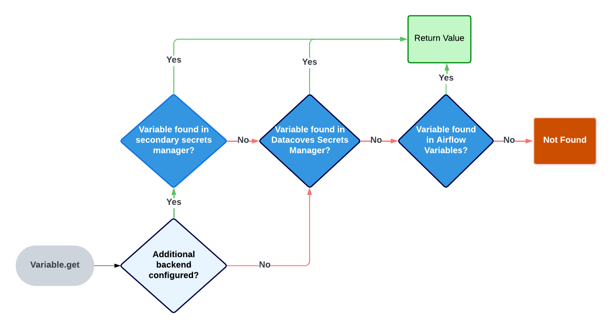

# How to use AWS Secrets Manager in Airflow

Datacoves integrates with the Airflow Secrets Backend Interface, offering seamless support for both its native Datacoves Secrets Backend and AWS Secrets Manager. If you’re interested in using additional Airflow-compatible Secrets Managers, please reach out to us.

Secrets backends are configured at the project level, this means that you can use a different Secrets Manager for each project. Please see additional documentation to [configure your AWS Secrets Manager](/how-tos/datacoves/how_to_configure_aws_secrets_manager.md)

## Read variable from AWS Secrets manager

When using `Variable.get` Airflow will look in several places to find the variable. 

### The order of places it will look for are as follows:

1. AWS Secrets Manager (If this is  configured as seen above)
2. Datacoves Secrets Manager
3. Airflow environment variables

Once a variable is found Airflow will stop its search. 



Each time a variable is accessed, an API call is made to AWS Secrets Manager. If not configured properly, this API call may occur every time a DAG is parsed (every 30 seconds), not just during task execution. Since AWS is the first place Airflow looks for variables, repeated calls can significantly increase API usage and lead to a higher-than-expected AWS bill. You can read more about this [here](https://medium.com/apache-airflow/setting-up-aws-secrets-backends-with-airflow-in-a-cost-effective-way-dac2d2c43f13). 

### To solve for this there are 2 best practices to follow:

1. Always call your `Variable.get` from within the Datacoves Task Decorator. This ensures the variable is only fetched at runtime. 
2. Make use of the `connections_lookup_pattern` and `variables_lookup_pattern` when setting up your secondary backend above. This means only variables and connections prefixed with `aws_` would be make an API call to AWS Secrets Manager. eg) `aws_mayras_secret`
   

```python
from airflow.decorators import dag, task
from pendulum import datetime
from airflow.models import Variable


# Only here for reference, this is automatically activated by Datacoves Operator
DATACOVES_VIRTUAL_ENV = "/opt/datacoves/virtualenvs/main/bin/activate"

doc = """## Datacoves Bash Operator DAG
This DAG is a sample using the Datacoves decorators with variable calls."""

@dag(
    default_args={
        "start_date": datetime(2022, 10, 10),
        "owner": "Mayra Pena",
        "email": "Mayra @example.com",
        "email_on_failure": True,
    },
    catchup=False,
    tags=["version_1"],
    description="Testing task decorators",
    schedule_interval="0 0 1 */12 *",
)
def task_decorators_example():

    @task.datacoves_bash(connection_id="main")
    def calling_vars_in_decorators() -> str:
        my_var = Variable.get("aws_mayras_secret") # Call variable within @task.datacoves_bash
        return f"My variable is: {my_var}"

    calling_vars_in_decorator() # Call task function

# Invoke Dag
dag = task_decorators_example()
dag.doc_md = doc

```

>[!TIP]To auto mask your secret you can use `secret` or `password` in the secret name since this will set `hide_sensitive_var_conn_fields` to True. eg) aws_mayras_password. Please see [this documentation](https://www.astronomer.io/docs/learn/airflow-variables#hide-sensitive-information-in-airflow-variables) for a full list of masking words.