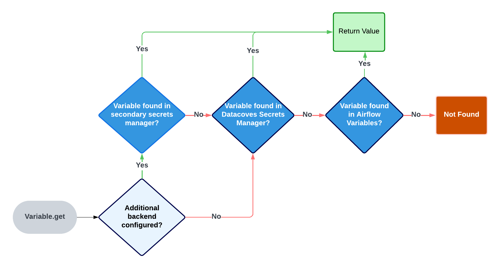

# How to use Datacoves Secrets Manager in Airflow

Datacoves includes a built-in [Secrets Manager](reference/admin-menu/secrets.md) that allows you to securely store and manage secrets for both administrators and developers. Secrets can be stored at the project or environment level and easily shared across other tools in your stack, ensuring seamless integration and enhanced security. [Creating or editing a secret](/how-tos/datacoves/how_to_secrets.md) in the Datacoves Secret Manager is straightforward. Be sure to prefix all secrets stored in Datacoves Secrets Manager with `datacoves-`

## Read variable from Datacoves Secrets manager

Once you save your variable in the Datacoves Secret Manager you are ready to use your variable in a DAG. This is done using `Variable.get`. Airflow will look in several places to find the variable. 

### The order of places it will look for are as follows:

1. AWS Secrets Manager (If configured)
2. Datacoves Secrets Manager
3. Airflow variables

Once a variable is found Airflow will stop its search. 



### Best practices to follow when using a Secrets Manager variable

There are some best practices that we recommend when using the Datacoves Secrets manager which will improve performance and cost.

1. Always call your `Variable.get` from within the Datacoves Task Decorators. This ensures the variable is only fetched at runtime.
2. Make use of prefixes based on where your variable is stored like `datacoves-`(Datacoves secrets manager will only search for secrets with this prefix), `aws_`, `airflow_` and so on to help you identify and debug your variables. eg) `datacoves-mayras_secret` seen in the example below. 


```python
from airflow.decorators import dag, task
from pendulum import datetime
from airflow.models import Variable

doc = """## Datacoves Bash Decorator DAG
This DAG is a sample using the Datacoves decorators with variable calls."""

@dag(
    default_args={
        "start_date": datetime(2024, 1, 1),
        "owner": "Mayra Pena",
        "email": "Mayra @example.com",
        "email_on_failure": True,
    },
    catchup=False,
    tags=["version_1"],
    description="Testing task decorators",
    schedule_interval="0 0 1 */12 *",
)
def task_decorators_example():

    @task.datacoves_bash
    def calling_vars_in_decorators() -> str:
        my_var = Variable.get("datacoves-mayras_secret") # Call variable within @task.datacoves_bash
        return f"My variable is: {my_var}"

    calling_vars_in_decorator() # Call task function

# Invoke Dag
dag = task_decorators_example()
dag.doc_md = doc
```

>[!TIP]To auto mask your secret you can use `secret` or `password` in the secret name since this will set `hide_sensitive_var_conn_fields` to True. eg) aws_mayras_password. Please see [this documentation](https://www.astronomer.io/docs/learn/airflow-variables#hide-sensitive-information-in-airflow-variables) for a full list of masking words.


