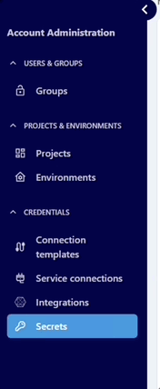

# How to use Datacoves Secrets Manager in Airflow

Datacoves includes a built-in [Secrets Manager](reference/admin-menu/secrets.md) that allows you to securely store and manage secrets for both administrators and developers. Secrets can be stored at the project or environment level and easily shared across other tools in your stack, ensuring seamless integration and enhanced security.

**Step 1:** Navigate to `Secrets` in the Admin menu



**Step 2:** Select `+ New Secret`

**Step 3:** Define the following
- **Reference Key (slug):** This is how the secret will be retrieved in your DAG. We recommend prefixing all of your secrets stored in the Datacoves Secrets Manager with `datacoves_`
- **Format:** Select what format you would like to use to store your secret. ie) key-value, JSON, or multiple key-value pairs.
- **Scope:** Select whether you want to share the secret at the project or environment level

**Step 4:** Toggle on `Share with developers` if this variable needs to be accessed by developers who do not have Admin access.

**Step 5:** Toggle on `Share with stack services`. This must be toggled on for Aiflow to have access to the variable

INSERT IMAGE WHEN FIXED. REMOVE NAME

## Read variable from Datacoves Secrets manager

Once you save your changes you are ready to use your variable in a DAG. When using `Variable.get` Airflow will look in several places to find the variable. 

### The order of places it will look for are as follows:

1. AWS Secrets Manager (If configured)
2. Datacoves Secrets Manager
3. Airflow environment variables

Once a variable is found Airflow will stop its search. 

### Best practices to follow when using a Secrets Manager varaible

1. Always call your `Variable.get` from within the `@task` decorator
2. Make use of prefixes like `datacoves_` to help you identify where your secret is stored. eg) `datacoves_mayras_secret`
3. Create a task to return your variable (This might not be right FIX ME)

```python
import datetime

from airflow.decorators import dag, task
from airflow.models import Variable
from operators.datacoves.dbt import DatacovesDbtOperator


@dag(
    default_args={
        "start_date": datetime.datetime(2023, 1, 1, 0, 0),
        "owner": "Noel Gomez",
        "email": "gomezn@example.com",
        "email_on_failure": True,
    },
    description="Sample DAG for dbt build",
    schedule_interval="0 0 1 */12 *",
    tags=["version_2"],
    catchup=False,
)
def yaml_dbt_dag():

	@task
    def print_variable():
        my_var = Variable.get("datacoves_mayras_secret")  

        print(f"aws_mayras_secret: {my_var}")

		# Return the value to be passed to the next task
        return my_var

    # Task to run dbt using the DatacovesDbtOperator and pass the variable
    @task
    def run_dbt_task(fetched_var):
        # Use the fetched variable in the dbt command
        run_dbt = DatacovesDbtOperator(
            task_id="run_dbt", 
            bash_command=f"dbt run -s personal_loans --vars '{{my_var: {fetched_var}}}'"
        )
        run_dbt.execute(context={})

dag = yaml_dbt_dag()

```

>[!TIP]To auto mask your secret you can use `secret` or `password` in the secret name since this will set `hide_sensitive_var_conn_fields` to True. eg) aws_mayras_password. Please see [this documentation](https://www.astronomer.io/docs/learn/airflow-variables#hide-sensitive-information-in-airflow-variables) for a full list of masking words.


