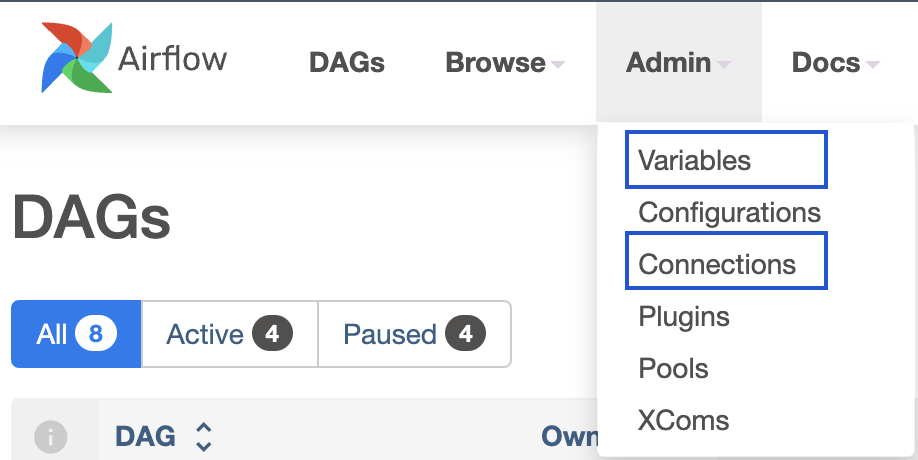
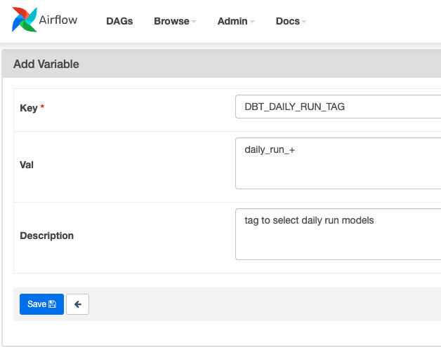

# Variables and Connections

>[!NOTE]dbt-coves generate airflow-dags does not support reading variables/connections, but you may generate the initial Python Airflow DAG and add the connection / variable information.

The best way to store and retrieve information within Airflow is to use `Variables` and `Connections`, both available on the `Admin` upper dropdown.



The main difference between them is that [Variables](https://airflow.apache.org/docs/apache-airflow/2.3.1/howto/variable.html) is a generic multi-purpose store, while [Connections](https://airflow.apache.org/docs/apache-airflow/2.3.1/howto/connection.html) are aimed at third-party providers.

>[!TIP]Rather than using connections or variables stored in Airflow’s database, we recommend using Datacove’s secrets. These secrets are encrypted and can be stored either in Datacove’s store or a third-party secrets manager like Amazon Secrets Manager. [Learn more](how-tos/airflow/use-aws-secrets-manager)

## Usage

### Variables

After creating a variable in Airflow's UI, using it is as simple as importing the `Variable` model in your DAG and `getting` it's name.



```python
from airflow.decorators import dag
from operators.datacoves.dbt import DatacovesDbtOperator
from airflow.models import Variable

daily_run_tag = Variable.get("DBT_DAILY_RUN_TAG")

@dag(
    default_args={"start_date": "2021-01"},
    description="DAG that outputs a Variable",
    schedule="0 0 1 */12 *",
    tags=["version_1"],
    catchup=False,
)
def variables_dag():
    transform = DatacovesDbtOperator(
        task_id="transform",
        bash_command=f"dbt build -s 'tag:{daily_run_tag}'",
    )

dag = variables_dag()
```

If a variable contains `SECRET` on it's name, value will be hidden:

```python
s3_password = Variable.get("S3_PASSWORD_SECRET")
[...]
transform = DatacovesDbtOperator(
    task_id="transform",
    bash_command=f"echo {s3_password}'",
)
```

```shell
Running command: ['bash', '-c', "source /opt/datacoves/virtualenvs/main/bin/activate" &&'echo ***']

```

### Connections

Consuming connections data is also straightforward, though you need to take it's attributes into consideration, as they'll vary depending on the provider.

In the following example, a connection of `type Airbyte` is created, and it's `host` is echoed in a DAG.


```python
from airflow.decorators import dag
from operators.datacoves.bash import DatacovesBashOperator
from airflow.models import Connection

airbyte_connection = Connection.get_connection_from_secrets(conn_id="AIRBYTE_CONNECTION")

@dag(
    default_args={"start_date": "2021-01"},
    description="DAG that outputs Airbyte Hostname",
    schedule="0 0 1 */12 *",
    tags=["version_1"],
    catchup=False,
)
def connections_dag():
    echo_airbyte_host = DatacovesBashOperator(
        task_id="echo_airbyte_host",
        bash_command=f"echo 'Airbyte hostname is {airbyte_connection.host}'",
    )

dag = connections_dag()
```
