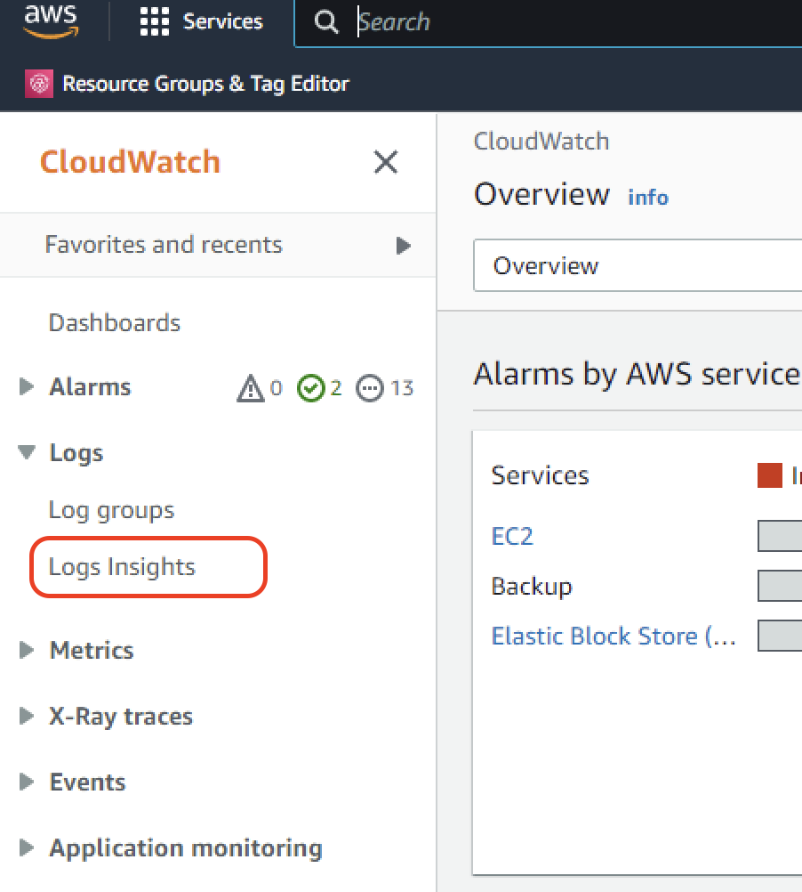
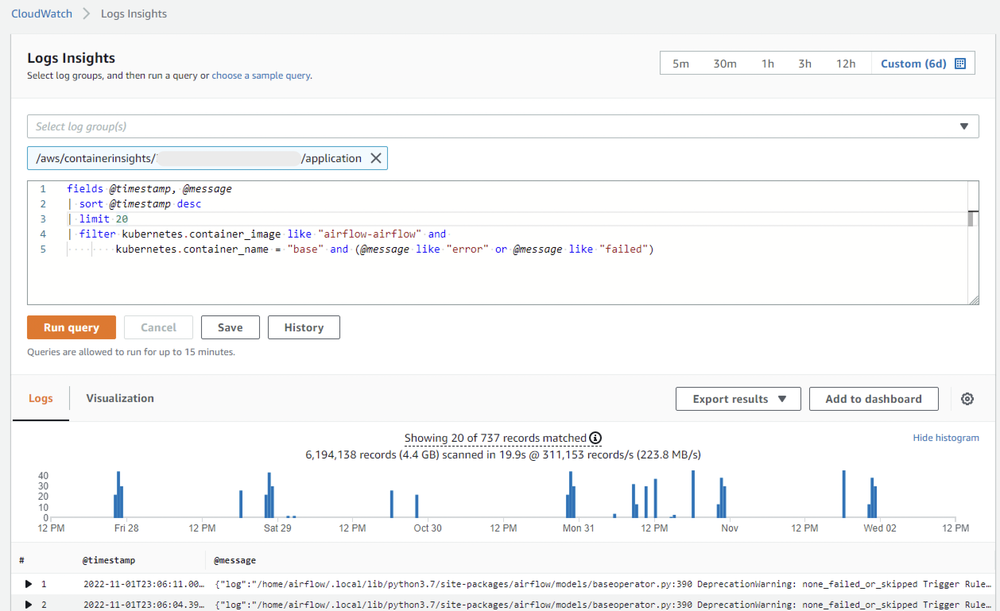

# How to monitor worker logs

Sometimes you need to know what exactly happened when DAGs ran over the weekend, but reviewing each task log through the Airflow UI could take you hours.

We offer to our On-prem customers some tips to query Airflow logs using different solutions:

## AWS Cloudwatch

Amazon CloudWatch is configured to monitor your Kubernetes cluster logs, so you can review any pod's logs, including Airflow workers.

### 1. Navigate to CloudWatch > Logs Insights



### 2. Select the log group(s) you need to query

Tyipically EKS log groups names look like `/aws/containerinsights/<cluster name>/application`.

### 3. Write the query

Write this query:

```
fields @timestamp, @message
| sort @timestamp desc
| limit 20
| filter kubernetes.container_image like "airflow-airflow" and
        kubernetes.container_name = "base" and (@message like "error" or @message like "failed")
```

Then click on "Run query".



### F.A.Q.

### Why this query is matching only airflow workers?

When using Datacoves, airflow worker images always contain the string "airflow-airflow", and the container name on airflow workers is always "base".

### Can I search for other strings in the logs?

Of course, you can replace the query part `(@message like "error" or @message like "failed")` by any other string that fits better for your usecase.

### I can't find logs for my workers

You can try extending the date range of your query in the top right corner (default is 1 hour).

Sometimes workers don't run because there are errors during the initialization process. To see those errors replace the query filter `kubernetes.container_name = "base"` by `kubernetes.container_name = "git-sync-init"`.
