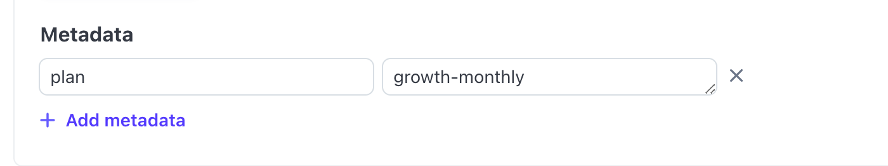

# Datacoves Billing System

This document provides comprehensive information on Datacoves’ billing integration with Stripe.

# Introduction

Datacoves integrates with Stripe to manage billing by listening to Stripe events and adjusting Datacoves data accordingly. The system also modifies subscriptions when changes occur in services, users, or tally marks.

The connection between Datacoves and Stripe begins when a user creates a subscription through the Setup Wizard, or when a Datacoves Admin sets up a subscription directly in the Stripe UI.

**Note**: Free trial accounts **are not connected** to Stripe.

# Account Setup Wizard

## Customer Types

For billing, we distinguish between three customer types:

1. Free trial customers
2. Credit card customers
3. Check / bank transfer customers

## Free trial customers

These type of customers are not connected to stripe while they're on trial. During the trial period, Stripe does not have information about these accounts.

Free trial customers will see a button on the header inviting them to finalize the trial and create a subscription. Upon subscribing, they transition to `credit card customers`.

## Credit card customers

Credit card customers workflow is completely managed by Datacoves:

1. Customer selects `Growth Plan` and after clicking on `Next` Datacoves creates the stripe customer, sets the `customer_id` and redirects them to Stripe billing page where the stripe billing process begins.

2. Once the customer enters their credit card and completes the Stripe billing process, Datacoves receives a notification and sets the `subscription` payload on the brand new account.

3. From this point, any updates to services/users/tally marks in the Datacoves account are automatically reflected in Stripe, adjusting invoices accordingly.

## Check / bank customers

For customers preferring bank transfers or checks, setup is managed manually through the Stripe UI.

### Customer Setup

1. Customer creates a Trial account as described earlier.
2. An Stripe Admin [manually creates the customer](https://dashboard.stripe.com/customers) using the Stripe UI. In order to follow the same convention used by Datacoves, please use account's `slug` as the stripe customer name, and account's `owner email` as the stripe customer email. Add an address to calculate taxes automatically.
3. Once you got a customer id on stripe, modify the Datacoves account on the admin panel and set it on the `Customer Id` field.
4. Modify the Datacoves account once more and set the right `plan` and `variant`. We typically use `growth` plan for these accounts, the `variant` will be determined by Sales depending on the pricing negotiated.

### Subscription Setup

The Stripe Admin now [creates a subscription on Stripe](https://dashboard.stripe.com/subscriptions?status=active&create=subscription) for the recently created customer. Please be cautious with the products included in the subscription, they should match exactly the products included in the plan. You can inspect them [here](https://api.east-us-a.datacoves.com/panel/billing/plan/).

You don't need to add the metered products on a new subscription, Datacoves will modify the subscription and add them later. Unless the customer prepaid for developer seats and services, you include the developers seat product specifying the total user licenes and then one product line per service (airbyte, airflow, superset, datahub).
In the following example, there are 5 user licences, 1 Airbyte, 1 Airflow and 1 Superset server:

NOTE: Certain customers (like Guitar Center) could opt to prepay the developer seats and services costs via Bank transfer / check. In those cases, you only include the metered products in the subscription.

Don't forget to set the right plan on the subscription metadata, it's usually `growth-monthly`, if you need a different one, type the `slug` field of the chosen one.

On Payment, select `Email invoice to the customer to pay manually` and uncheck `Include a stripe-hosted link to an invoice payment page in the invoice`.

Finalize by clicking on `Create subscription`.

Go to the Django admin panel and check that the account has a `JSON` dict on the field `subscription`. If it does, it means the connection is set, you can now finalize the trial by setting a past end date in the `Trial ends at` field (or by just removing trial start and end dates).

# Add credit to customer

Once the subscription was created, the customer will start generating a debt.
As soon as Datacoves receives a check or wire, a Stripe Admin needs to register it on the Django Admin, as follows:
Note that credits have a validity period, during that period the developer licences or services specified will be discounted from the invoice.

1. Go to Accounts, select the customer's account and edit it.
2. Scroll down until you see the `Credits` area.
3. Click on `Add another credit` and complete the required fields including as much information as possible in the reference field.
4. Click on `Save`.

## F.A.Q.

### How do I configure my local environment to test Stripe?

First of all, you need to set to `True` the feature `accounts_signup` on the only record you have in the `Cluster` model.

Then, if you're using `datacoveslocal.com` and you were granted permissions automatically to the `local` account, you need 
to remove all the permissions to such account, doing that the Datacoves UI will allow you creating a new account using the
setup wizard.

You should also set `setup enabled` on `True` on the admin panel for you user.

Then, navigate to https://datacoveslocal.com/account-setup/ and follow the instructions to create an account using Stripe.

### How do I run the stripe webhooks locally to test billing integration?

Run `./cli.py stripe_webhooks` and follow the instructions.

### How to sync stripe live products with test products?

Sometimes you modified the live products (prices/descriptions) and you need to update the test ones.

Just run `./cli.py copy_to_stripe_test` to run the live -> test sync process.
