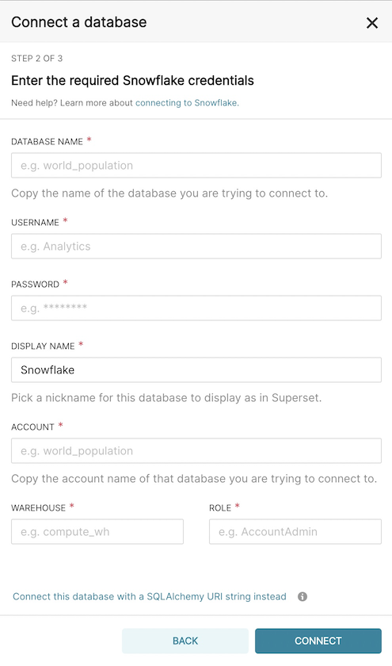

# How to Configure your Analyze tab

## Adding a Database Connection

To use Superset you will need to create a connection to your database.

On the menu bar, select **Data** -> **Databases**

On this screen you will see a listing of all your database connections.

Click **+ Database**

Here you will select the type of connection you want to create. For Snowflake, click the dropdown on the bottom.

Finally, enter your Snowflake credentials (these will be shared by all users, so use a service account that has read access to your data marts)

>[!WARNING] For the Snowflake `Account` field you will need to find your account locator and replace `.` with `-`. Check out [Snowflake Fields](how-tos/datacoves/admin/how_to_connection_template.md#for-snowflake-the-available-fields-are) on how to find your Snowflake account locator.

## Adding a Dataset

To create visualizations you will need to create a dataset which is how a specific view or table is made available to Superset.

Unlike other tools, Superset has a philosophy to not show everything in the data warehouse since there may be things you do not want analysts to see.

We are working on integration with dbt so that specific models can be marked within a dbt properties file and automatically added as a Superset dataset. If you want to see this feature, send us a note support@datacoves.com

To add a **Dataset** on the menu bar, select **Data** -> **Datasets**

On this screen you will see a listing of all your datasets.

Click **+ Dataset**

Finally, select the Database, Schema, and Table / View for this dataset then click **Add** at the bottom of the window.

