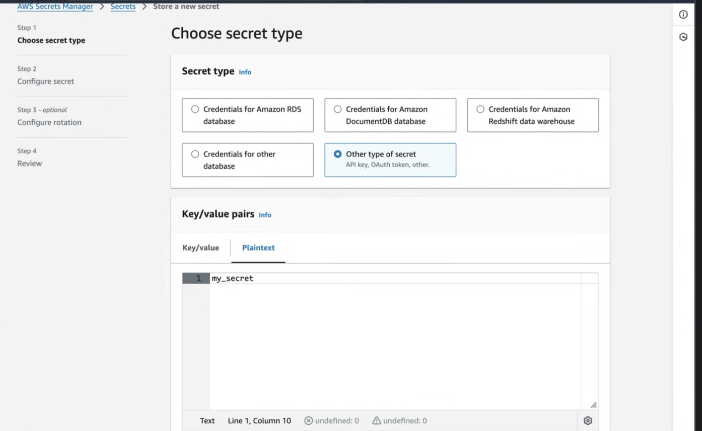
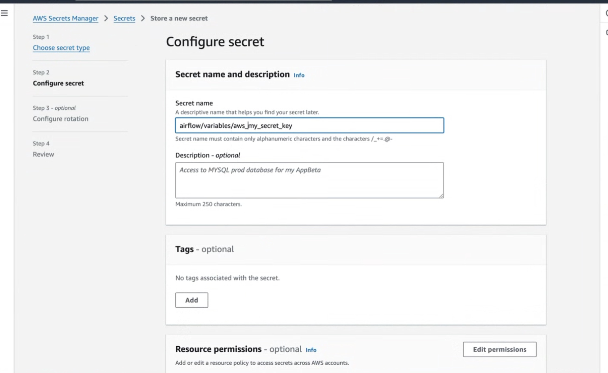
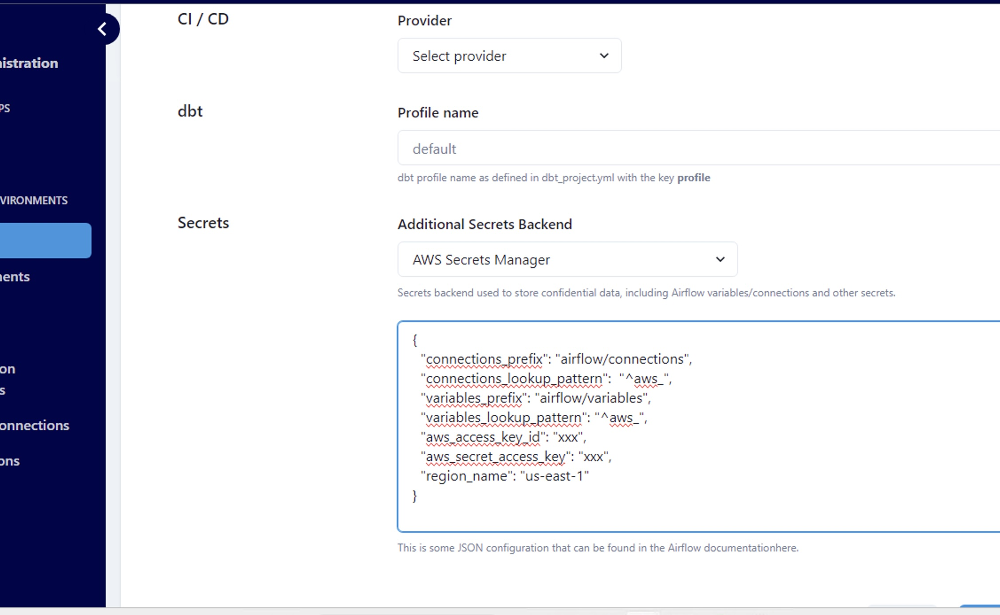

# Configuring AWS Secrets Manager

## Table of Contents
- [Prereqs](/how-tos/datacoves/how_to_configure_aws_secrets_manager.md#prereqs)
- [Create your Secret in AWS Secrets Manager](/how-tos/datacoves/how_to_configure_aws_secrets_manager.md#create-your-secret-in-aws-secrets-manager)
- [Configure your Secrets Backend in Project settings](/how-tos/datacoves/how_to_configure_aws_secrets_manager.md#configure-your-secrets-backend-in-project-settings)

## Prereqs

1. Create an IAM user with permissions to manage secrets
2. Configure access to AWS Secrets Manager on the project settings page

Please follow the how to below to achieve these requirements.

### Create an IAM user with permissions to manage secrets

**Step 1:** On AWS, create an IAM User with an attached policy like this one:

>[!NOTE]Be sure to replace the ARN for the resource below to your ARN.

```json
{
    "Version": "2012-10-17",
    "Statement": [
        {
            "Effect": "Allow",
            "Action": [
                "secretsmanager:GetResourcePolicy",
                "secretsmanager:GetSecretValue",
                "secretsmanager:DescribeSecret",
                "secretsmanager:ListSecretVersionIds"
            ],
            "Resource": "arn:aws:secretsmanager:us-west-2:012345678910:secret:*" 
        },
        {
            "Effect": "Allow",
            "Action": "secretsmanager:ListSecrets",
            "Resource": "*"
        }
    ]
}
```

**Step 2:** Once you created the IAM user and the policy was correctly attached, create an access key and store it somewhere safe. You will be using it in the following step.

### Create your Secret in AWS Secrets Manager

Please, follow the [AWS Secrets Manager documentation](https://docs.aws.amazon.com/mwaa/latest/userguide/connections-secrets-manager.html#connections-sm-createsecret-variables). 

### Things to note:
1. Be sure to set your secret in **plaintext** and set it as a string or integer as seen in the image below.



2. Set the secret name to `airflow/variables/<secret_name>` where `<secret_name>` will be what you use in your DAG in the following step.



## Configure your Secrets Backend in Project settings

**Step 1:** Navigate to the Projects Admin page and click on the edit icon for the desired project.


**Step 2:** Scroll down to the `backend` field select `AWS Secrets Manager`


**This secrets backend will require the following fields:**

- **connections_lookup_pattern** We recommend setting this to `"^aws_"` to lower the number of API calls made. Only connections prefixed with `aws_` will be searched for in AWS Secrets Manger. 
- **variables_lookup_pattern**  We recommend setting this to `"^aws_"` to lower the number of API calls made. Only variables prefixed with `aws_` will be searched for in AWS Secrets Manger.
(For both of the lookup patterns they can be changed to whatever RegEx expression you choose. The important thing to note is that lookup patterns are recommended to lower the amount of API calls to AWS Secrets Manager.)
- **Access Key ID** The Access Key ID you configured earlier
- **Secret Access Key** The Secret Access Key attached to the IAM User configured earlier 
- **Region Code** This is the region were the Secrets Manager is running, i.e. `us-east-1`, `us-west-1`, etc. Find a complete list [here](https://docs.aws.amazon.com/AWSEC2/latest/UserGuide/using-regions-availability-zones.html)

>[!TIP] See the [Secrets Manager documentation](https://airflow.apache.org/docs/apache-airflow-providers-amazon/stable/secrets-backends/aws-secrets-manager.html#aws-secrets-manager-backend) for more customization options. 



To learn how to read a variable from the AWS Secrets Manager check out our [How To](/how-tos/airflow/use-aws-secrets-manager.md)

>[!NOTE]For security purposes, once this has been saved you will not be able to view the values. To modify the Secrets backend you will need to set the Secrets backend to `None` and save the changes. Then start the setup again. 