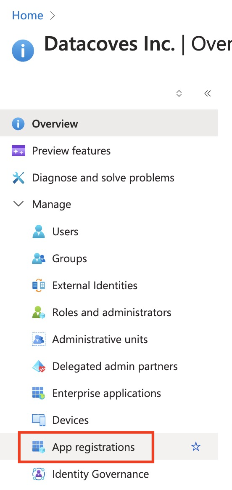
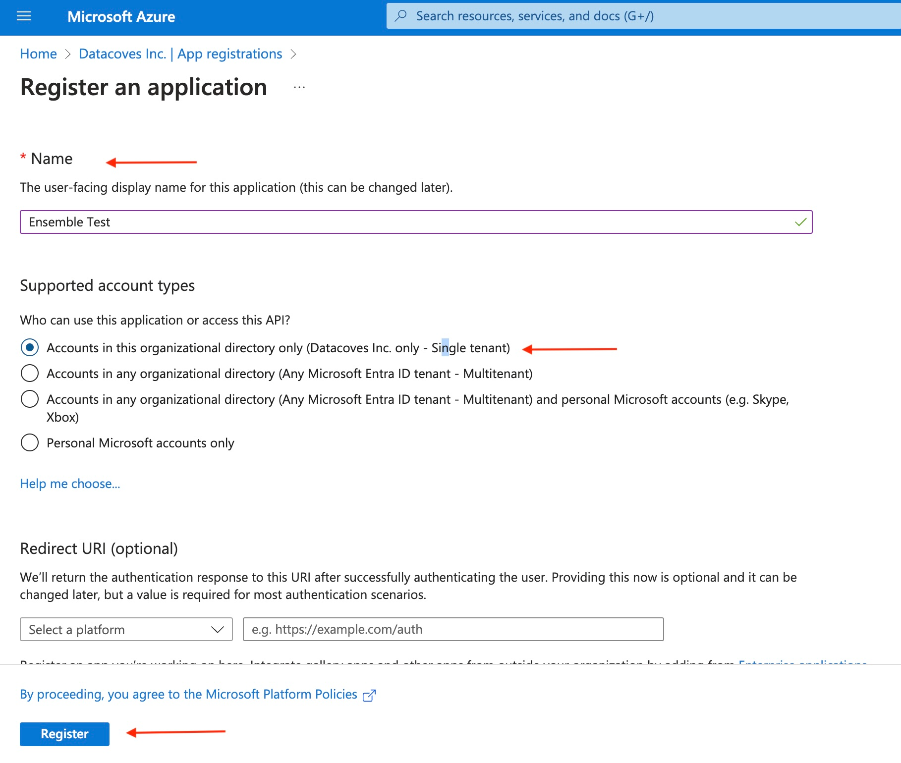
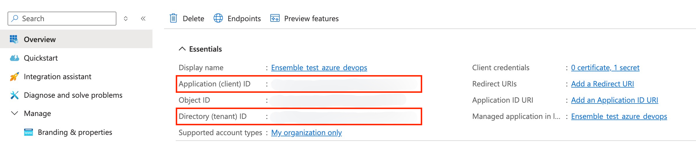

# How to clone with Azure DevOps

To enable Datacoves cloning from Azure DevOps you must complete a series of steps outlined in this how to.

- [Create your Application](how-tos/datacoves/how_to_configure_azure_DevOps.md#create-your-application)
- [Add your Application as a User in the DevOps Portal](how-tos/datacoves/how_to_configure_azure_DevOps.md#add-application-as-a-user-in-devops-portal)
- [Configure Secret or Certificate Based Authentication](how-tos/datacoves/how_to_configure_azure_DevOps.md#configure-your-secret-or-certificate-to-authenticate)
- [Gather Application Information](how-tos/datacoves/how_to_configure_azure_DevOps.md#gather-application-information)

## Create your application

If you do not have an Entra ID application created you can do so by following the following steps:

**Step 1:** From your [Azure Portal](https://portal.azure.com) search for EntraID.

**Step 2:** Select `App Registrations` from the left navigation menu.

**Step 3:** Select `+ New registration` and fill out the fields as seen below:
- **Name:** Give your application a meaningful name
- **Supported account types**: Select `Accounts in this organizational directory only`
    
**Step 4:** Click `Register`

## Add Application as a user in DevOps Portal

**Step 1:** In a another tab (You will need to return to your application later), sign in to your [Azure DevOps Portal](https://dev.azure.com) and click `Organization settings` at the bottom of the left  navigation.

**Step 2:**  Select `Users` in the left navigation menu.

**Step 3:**  Select `Add Users` to add the Application to the user list.

**Step 4:** Set the User as the application you created above, give it Basic Access and select `Send email invites`.

## Configure your secret or certificate to authenticate

You have two authentication methods available to you, secrets or certificates. Please select one and follow the steps to configure.  

**Step 1:** Navigate back to the tab where you created your application in the Azure Portal. You should be inside your newly created application.

Select the `Certificates & Secrets` option in the left navigation menu.

### Secret Based Authentication

To configure a secret: 

**Step 2:** Select `Client Secrets` in the top navigation menu and `+ New Secret`.

**Step 3:** Give it a meaningful description and set your desired expiration date.

**Step 3:** Copy the Value onto a notepad

### Certificate Based Authentication

To configure a certificate:

**Step 2:** Select `Certificates` from the top navigation menu.

**Step 3:** To generate a certificate PEM file you will need to begin [configuring your Datacoves project](how-tos/datacoves/how_to_projects.md). 

**Step 4:** Select `Azure DevOps Certificate` as your Cloning Strategy. 

**Step 5:** Copy the certificate and save it as a plain text file on your desktop with a pem extension `datacoves_cert.pem`.

**Step 6:**  Navigate back to your Azure Portal tab and select `upload certificate`. Upload the PEM file you saved in the previous step.

**Step 7:** Give it a description and select `Add`.

## Gather application information

To configure your Datacoves project which we will do in the following section, you will need to collect some information.

### Application (Client) ID and Directory (Tenant) ID

You will need to gather the following Application information to configure your project to use Azure DevOps for cloning.

**Step 1:** From your [Azure Portal](https://portal.azure.com) search for EntraID.

**Step 2:** Select `App Registrations` from the left navigation menu.

**Step 3:** Select `All Applications` and select your newly created app.

**Step 4:** Copy your Application (Client) ID and Directory (Tenant) ID.

### Secret Based Authentication

You should have the secret value you save in an [earlier section](how-tos/datacoves/how_to_configure_azure_DevOps.md#secret)

### Repo SSH and HTTP urls

**Step 1:** Log in to your [Azure DevOps Portal](dev.azure.com).

**Step 2:** Navigate to your project.

**Step 3:** Navigate to your repo and select the `Clone` button.

**Step 2:** Copy **both** the SSH **and** HTTP urls and enter in the appropriate fields in the project setup screen in Datacoves.

Congrats, you are now ready to [configure your project](how-tos/datacoves/how_to_projects.md)

