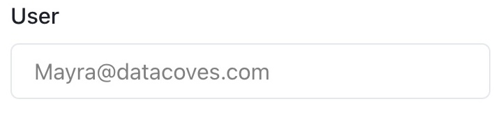
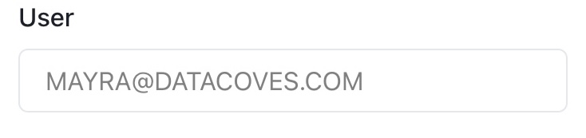
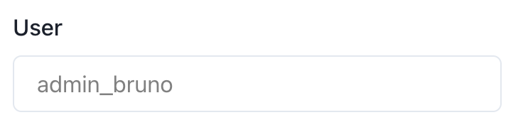
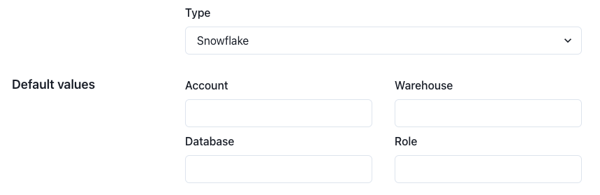
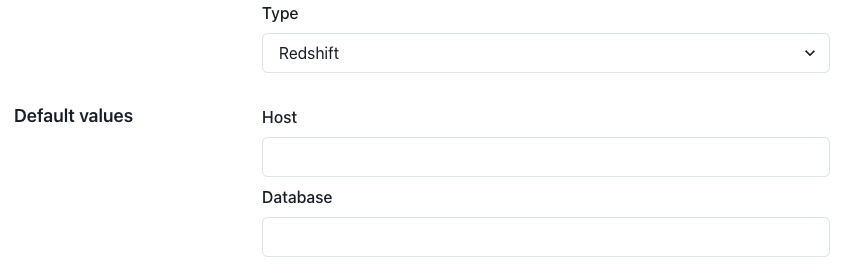

# How to Create/Edit Connection Template

Navigate to the Connection Template page

To create a new connection template click the `Create Connection Template` in the navigation menu.

### Each Connection Template consist of the following fields:

- **Name** This is the name users will see when selecting the base connection template when entering credentials for themselves or service accounts.
- **Project** This defines the Datacoves project that should be associated with this connection template.
- **Type** Defines the data warehouse provider so that users are presented the appropriate fields when entering their credentials.
- **Enabled for users** This flag indicates whether this template will be available for users or only for service accounts. To simplify the end-user experience, it is best to show them only the templates they should use when entering their database credentials. If enabled, a new field will appear:

- **User field configuration** Defines how the DB connection `Username` field will be treated. It can be `provided` by the end-user or inferred using two strategies: from their email, or based on custom templates. The difference in these approaches will be noticed when the final user creates their respective connections in `Settings -> Database connections`

  - **Email**: Use the users email as used to authenticate with Datacoves. In this case the format of the email must match in both Snowflake and Datacoves. For example, if the login in Snowflake is `Noel@example.com` but in Datacoves you authenticate with `noel@example.com` the emails will not match and authentication to Snowflake will fail. 
  
  - **Email (Uppercase)**: Use the email used to log into Datacoves, but transforms it to uppercase. 
  
  - **Provided by user** With this strategy, the user will have free to enter the desired username when creating a connection. You cannot select `provided by user` if snowflake public key is automatically added to Snowflake by datacoves using: `_alter user \<some_user\> set rsa_public_kay = '\<some_key\>';`
  
  - **Username from email** Defines the username field as read-only, pre-populating it with the user's email username (what comes before @domain.com)
  
  - **Custom template** With this last approach, you can choose a template from which the username will be generated. If selected a new field will appear to select one of those.   By default we support `Connection username for admins` template. With this template, the username will see `admin_{{username}}` when creating a DB connection. Contact us to create a custom template for your account if you have different requirements.
  
  

>[!NOTE] The templates above are to simplify the user experience and minimize errors, however the user field is simply the the username for your data warehouse.

- **Default values** Based on the Provider Type selected, available default parameters will be displayed. ie) Snowflake, Redshift etc.

### For Snowflake, the available fields are: 

- `Account`: To locate this, visit your Snowflake account > Click on the menu in the bottom left corner > Select the account > select the `Copy account identifier`. 
  
>[!ATTENTION]You must replace the `.`  with a `-` eg) `my.account` > `my-account` or you will get an error.

- `Warehouse` - The default connection template warehouse
- `Database` - The default connection template database 
- `Role`- The default connection template role
  

### For Redshift, the available fields are: 

- `Host`
- `Database`
  
