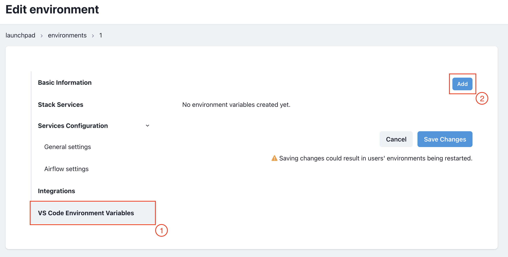
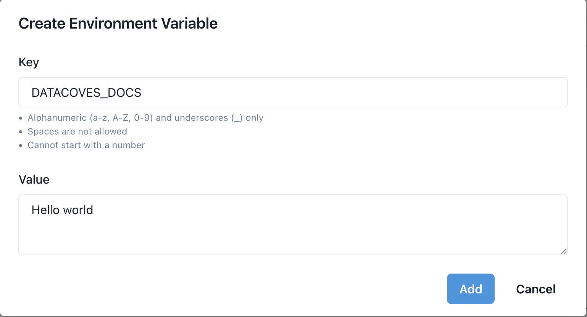
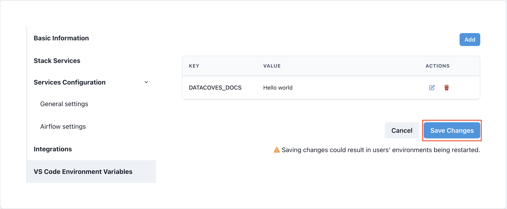
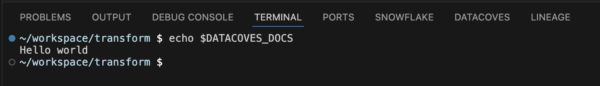

# How to use custom VSCode Environment Variables

Even though you can create environment variables in your VSCode instance by using the traditional `export` command, having your Environment configured with custom variables can be an important time-saver, as these are not cleared when your Environment restarts (due to inactivity, maintenance, or changes in its settings)

You can configure environment variables in 3 different places:

- `Project Settings`: applies to the entire Project (with all its Environment)
- `Environment Settings`: applies to the desired Environment
- `User Settings`: applies to the user's VSCode instance.

As the UI is almost the same in the 3 pages, we'll illustrate the process using the `Environment Settings` screen

To configure custom VSCode environment variables:

- Navigate to `VS Code Environment Variables` inside your Environment settings. Once there, click `Add`

- A pop-up will appear, where you must specify `Key` and `Value` for your environment variable. Once set, click `Add`

- You will be sent back to your Environment settings, where you should see the newly created environment variable.
- Once there, make sure to `Save Changes` to your Environment

That's all! Now you can use this new persistent variable in your VSCode instance.

