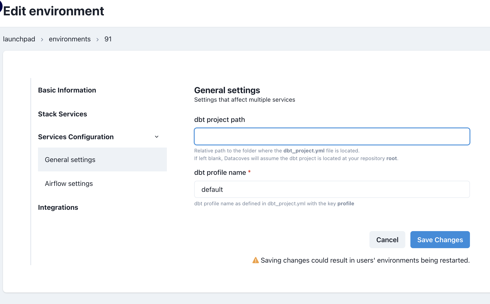

# How to Create/Edit an Environment

Navigate to the Environments page

To create a new environment click the `New Environment` button.

Environment Settings are separated into different tabs.

## Basic information

This tab has the base information for the environment.

- The `name` to be displayed on the launchpad
- The `Project` the environment should be associated with
- The `type` of environment (development, test or prod). It is best practice for users to perform their work in a development environment and production jobs to run in a production environment which is typically more governed.

## Stack Services
Define which tools will be enabled for this environment. At least one service must be enabled. 

Available services include:

- `LOAD (Airbyte)`
- `TRANSFORM (dbt and VS Code)`
- `OBSERVE (dbt docs)`
- `ORCHESTRATE (Airflow)`
- `ANALYZE (Superset)`

## Services Configuration
The services enabled for the environment may require additional configurations. This tab is where the services will be configured. 

- TRANSFORM (dbt & VS Code) requires:
  -  **dbt project path:** The path the location of the `dbt_project.yml` this allows you to either have the dbt project at the root of your git repository or in some sub-folder. If you have implemented the recommended folder structure this will be `transform`. If your dnt project is at the root, leave it blank.
  -  **dbt profile name:** dbt profile name as defined in dbt_project.yml with the key profile. The standard is `default`.
  

- ORCHESTRATE (Airflow) requires: 
  - **branch:** Determines git branch to synchronize to Airflow. This allows you to have one branch for a development environment and `main` for a production environment. In other words, in development we recommend making this field `airflow_development` and `main` in production. Please be aware that you will need to create an `airflow_development` branch in your repository. 
  - **dbt profiles path:** The location where Airflow will find dbt profiles.yml file to use during a dbt run. This should be `automate/dbt`. Please be aware that you will need to create the `automate` and`dbt` folders as well as the `profiles.yml` in your repository. 
  - **YAML DAGs path:** When using yml based Airflow DAGs Airflow will look for the yml files in this location. We recommend this be set to `orchestrate/dags`. Please be aware that you will need to create the `orchestrate` and `dags` folders in your repository.
  - **Python DAGs path:** This is the location Airflow will look for the DAG definition files.  We recommend this be set to `orchestrate/dag_yml_definitions`. Please be aware that you will need to create the `orchestrate` and `dag_yml_definitions` folders in your repository.
- OBSERVE (Docs) requires:
  -  **branch:** Here we specify the branch that will be synchronized for production dbt docs. This branch must exist in your git repository.

