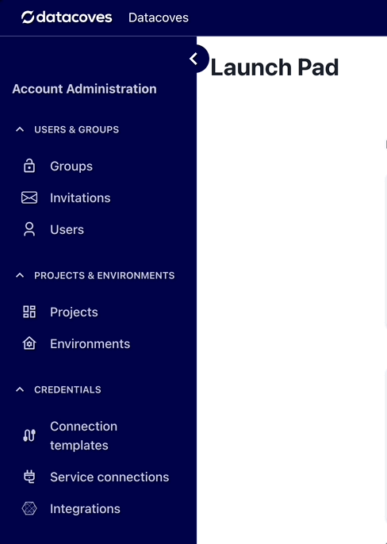
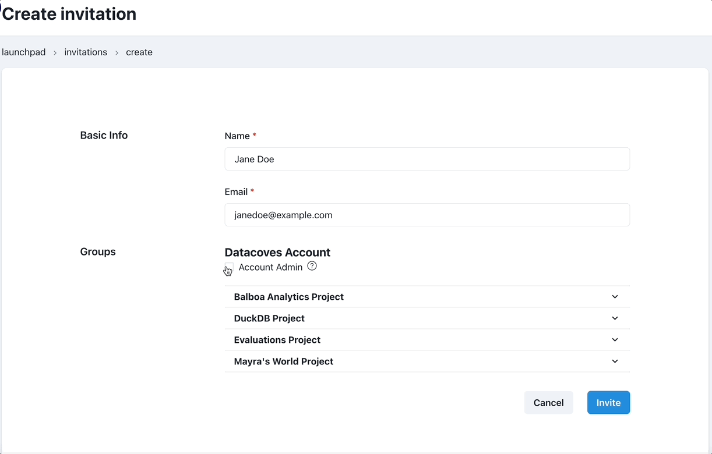

# How to Invite a User to your Account 

Navigate to the invitations page

Select the `+ invite user` button 

You will need the user's:

- Name
- Email

Using the checkboxes below you can select the Security Groups the user should belong to for Development and Production Environments

>[!TIP]See [Groups](reference/admin-menu/groups.md) for more information.

