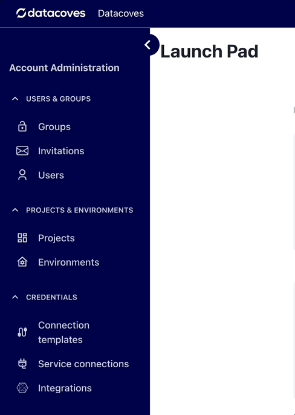

# How to Manage Users

Navigate to the Users page

## Edit a User

When you edit a user record, you can modify the users `Name`, `Email` and the assigned `Permission Groups`

>[!NOTE]Access is sorted at the project level. Select the project to edit.

## Delete a User

On the User listings page, clicking on the trash can will delete the user from your account.

