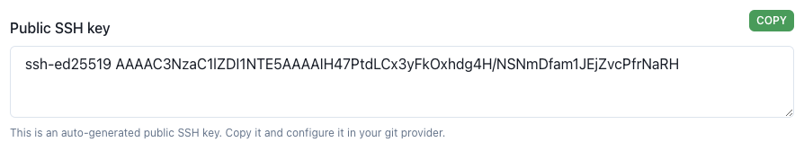
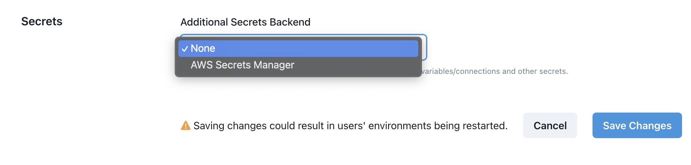

# How to Create/Edit a Project
Navigate to the Projects page

A Project configuration consists of the following fields:

- **Name** This is what will be displayed in the Datacoves landing page.
- **Git Repo** This is the git repository associated with this project
  - **Clone strategy** determines how Datacoves will communicate with your git repository(SSH, HTTPS, or Azure DevoOps Secret/Certificate). Select your desired cloning strategy to see configuration instructions:
  
    <!-- tabs:start -->
    #### **SSH**
    When SSH is selected, an SSH public Key will be automatically generated for you to configure in your git provider as a deployment key.

    

    #### **HTTPS**

    When HTTPS is selected, the following fields must be filled in `Git HTTPS url`, `Username` and `Password`
    

    #### **Azure DataOps Secret**

    When it comes to Azure DataOps it can be a bit complex to set up, however this documentation will help walk you through the process. This assumes that you have already [created your EntraID](/how-tos/datacoves/create_your_entraid_application.md) application and went through the steps to [add your EntraID as a user](/how-tos/datacoves/add_entraid_app_as_user.md) to the project.

    There are two authentication options for you to chose from: `secrets`  or `certificates`.
    
    -  **Azure DataOps Secret** When Azure DataOps Secret is selected, a secret key is required for authentication. See this [how-to guide on configuring Azure DevOps](/how-tos/datacoves/how_to_configure_azure_DevOps) for detailed configuration information or simply follow the links for each field.
        -  **Git SSH url:** [Cloning url](/how-tos/datacoves/gather_azure_devops_auth_details.md#repo-ssh-and-http-urls) found in Azure DevOps Portal
        -  **Azure HTTPS Clone url** [Cloning url](/how-tos/datacoves/gather_azure_devops_auth_details.md#repo-ssh-and-http-urls) found in Azure DevOps Portal
        -  **Tenant ID:** [ID found in Azure Portal](/how-tos/datacoves/gather_azure_devops_auth_details.md#application-client-id-and-directory-tenant-id)
        -  **Application ID:** [ID found in Azure Portal](/how-tos/datacoves/gather_azure_devops_auth_details.md#application-client-id-and-directory-tenant-id)
        -  **Client Secret:** This will be the [secret value](/how-tos/datacoves/authenticate_azure_devops.md#secret-or-certificate-authentification-method) found in Azure Portal.
        -  **Release Branch:** This will be the branch you would like to clone. It should be `main`
      
    - **Azure DataOps Certificate** When Azure DataOps Certificate is selected, a certificate is needed for secure communication. See this [how-to guide on configuring Azure DevOps](/how-tos/datacoves/how_to_configure_azure_DevOps) for detailed configuration information.
      -  **Certificate PEM file**: You will need to copy the PEM file to your desktop and [upload in Azure](how-tos/datacoves/authenticate_azure_devops.md#secret-or-certificate-authentification-method).
      -  **Git SSH url:**  [Cloning url](/how-tos/datacoves/gather_azure_devops_auth_details.md#repo-ssh-and-http-urls) found in Azure DevOps Portal
      -  **Azure HTTPS Clone url** [Cloning url](/how-tos/datacoves/gather_azure_devops_auth_details.md#repo-ssh-and-http-urls) found in Azure DevOps Portal
      -  **Tenant ID:** [ID found in Azure Portal](/how-tos/datacoves/gather_azure_devops_auth_details.md#application-client-id-and-directory-tenant-id)
      -  **Application ID:** [ID found in Azure Portal](/how-tos/datacoves/gather_azure_devops_auth_details.md#application-client-id-and-directory-tenant-id)
      - **Release branch** defines the default branch in your repository. This is typically `main` or `master`
    <!-- tabs:end -->
    
- **CI/CD Provider** when provided, this will display a link to your CI/CD jobs on the Observe tab of a Datacoves environment. Once you choose your provider, you will be able to specify your `CI jobs home url`
- **Secrets Backend:** Datacoves provides a Secrets Backend out of the box however, you can configure additional Secrets Backends for your projects such as [AWS Secrets Manager](/how-tos/datacoves/how_to_configure_aws_secrets_manager.md)
  
