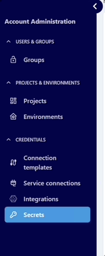
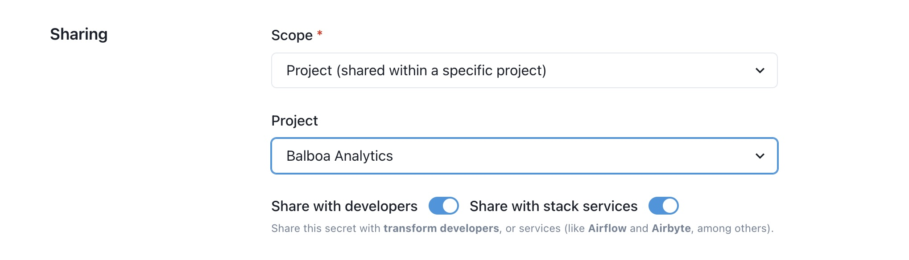

# How to Create/Edit a Secret

Datacoves includes a built-in [Secrets Manager](reference/admin-menu/secrets.md) that allows you to securely store and manage secrets for both administrators and developers. Secrets can be stored at the project or environment level and easily shared across other tools in your stack, ensuring seamless integration and enhanced security. Follow this guide to create/edit a secret in the Datacoves Secrets Manager.

>[!NOTE] Datacoves Secret Manager will ONLY look for variables that are prefixed with `datacoves-`

**Step 1:** Navigate to `Secrets` in the Admin menu

**Step 2:** Select `+ New Secret`

**Step 3:** Define the following
- **Reference Key (slug):** This is how the secret will be retrieved in your DAG. Prefix all of your secrets stored in the Datacoves Secrets Manager with `datacoves-`.
- **Format:** Select what format you would like to use to store your secret. ie) key-value, JSON, or multiple key-value pairs.
- **Scope:** Select whether you want to share the secret at the project or environment level.
- **Project** Select what project this variable belongs to.

**Step 4:** Toggle on `Share with developers` if this variable needs to be accessed by developers who do not have Admin access.

**Step 5:** Toggle on `Share with stack services`. This must be toggled on for Airflow to have access to the variable

To learn how to read a variable from the Datacoves secrets manager check out our [How To](how-tos/airflow/use-datacoves-secrets-manager.md)

>[!NOTE] If the secret isn’t shared with the developers or services, only the author can use it.
